# MCPJam Inspector - Technical Architecture

This document provides a deep technical dive into the MCPJam Inspector architecture for developers who want to understand the system internals.

## Table of Contents

- [System Overview](#system-overview)
- [Multi-Mode Architecture](#multi-mode-architecture)
- [Server Architecture](#server-architecture)
- [Electron Integration](#electron-integration)
- [MCP Client Management](#mcp-client-management)
- [State Management](#state-management)
- [Real-time Communication](#real-time-communication)
- [Authentication Flow](#authentication-flow)
- [Data Flow](#data-flow)

## System Overview

MCPJam Inspector is a sophisticated multi-platform application that can run as:
1. A standalone web application (client + server)
2. An Electron desktop application (embedded server)
3. A Docker container

### Tech Stack

```mermaid
graph TB
    subgraph "Frontend Stack"
        React[React 19]
        Vite[Vite]
        TanStack[TanStack Query]
        Zustand[Zustand]
        Shadcn[Shadcn UI]
    end

    subgraph "Backend Stack"
        Hono[Hono.js]
        MCP[@mastra/mcp]
        Convex[Convex]
    end

    subgraph "Desktop Stack"
        Electron[Electron 37]
        Forge[Electron Forge]
    end

    subgraph "DevOps"
        Docker[Docker]
        GitHub[GitHub Actions]
        Sentry[Sentry]
    end
```

## Multi-Mode Architecture

### Mode Detection Flow

The application determines its runtime mode through a series of environment checks:

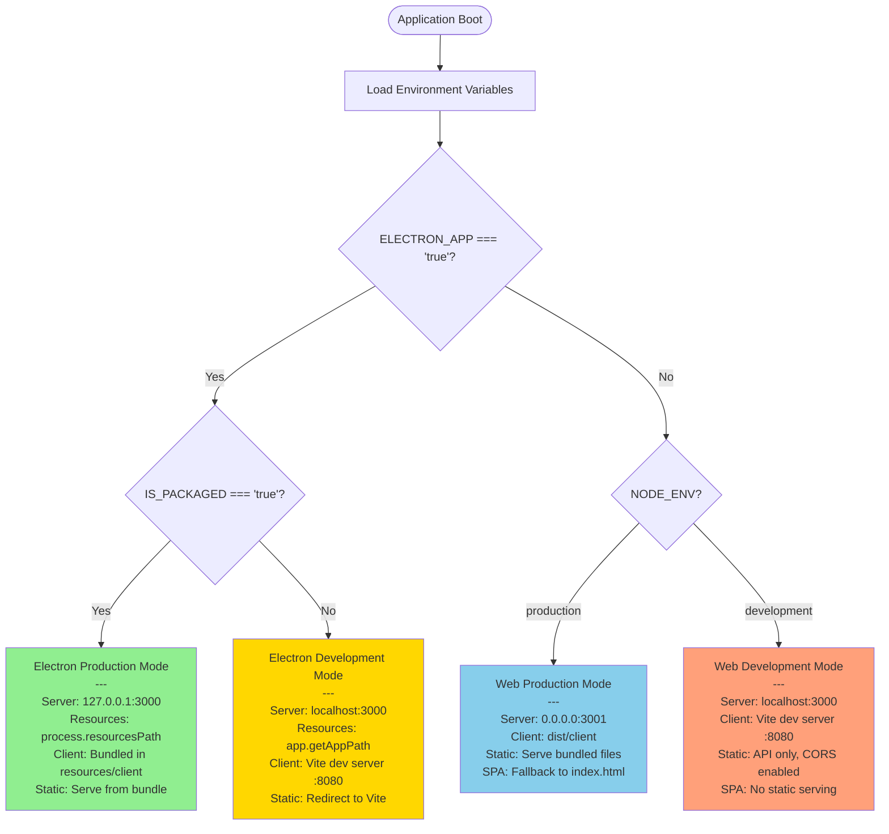
```mermaid
flowchart TD
    Boot([Application Boot])

    Boot --> EnvCheck[Load Environment Variables]
    EnvCheck --> ElectronCheck{ELECTRON_APP === 'true'?}

    ElectronCheck -->|Yes| PackagedCheck{IS_PACKAGED === 'true'?}
    ElectronCheck -->|No| NodeEnvCheck{NODE_ENV?}

    PackagedCheck -->|Yes| EProd[Electron Production Mode<br/>---<br/>Server: 127.0.0.1:3000<br/>Resources: process.resourcesPath<br/>Client: Bundled in resources/client<br/>Static: Serve from bundle]

    PackagedCheck -->|No| EDev[Electron Development Mode<br/>---<br/>Server: localhost:3000<br/>Resources: app.getAppPath<br/>Client: Vite dev server :8080<br/>Static: Redirect to Vite]

    NodeEnvCheck -->|production| WProd[Web Production Mode<br/>---<br/>Server: 0.0.0.0:3001<br/>Client: dist/client<br/>Static: Serve bundled files<br/>SPA: Fallback to index.html]

    NodeEnvCheck -->|development| WDev[Web Development Mode<br/>---<br/>Server: localhost:3000<br/>Client: Vite dev server :8080<br/>Static: API only, CORS enabled<br/>SPA: No static serving]

    style EProd fill:#90EE90
    style EDev fill:#FFD700
    style WProd fill:#87CEEB
    style WDev fill:#FFA07A
```

### File Serving Strategy

Different modes have different file serving strategies:

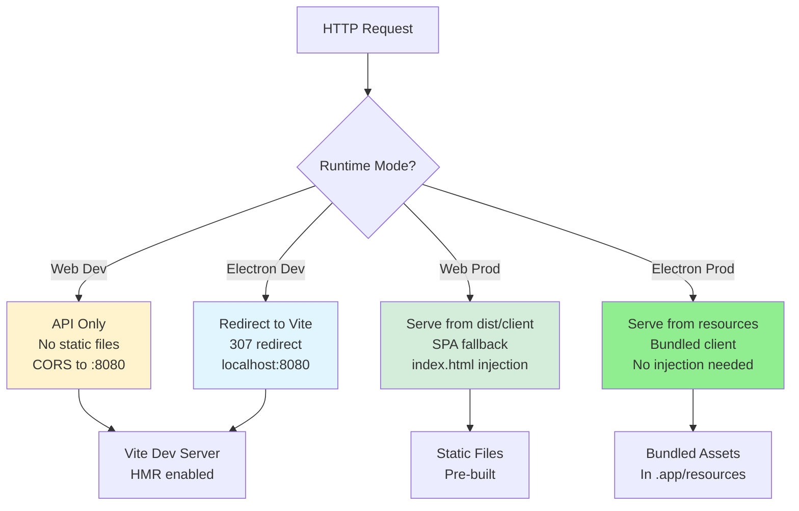
```mermaid
graph TB
    Request[HTTP Request]

    Request --> Mode{Runtime Mode?}

    Mode -->|Web Dev| DevServer[API Only<br/>No static files<br/>CORS to :8080]
    Mode -->|Web Prod| ProdServer[Serve from dist/client<br/>SPA fallback<br/>index.html injection]
    Mode -->|Electron Dev| ElectronDevServer[Redirect to Vite<br/>307 redirect<br/>localhost:8080]
    Mode -->|Electron Prod| ElectronProdServer[Serve from resources<br/>Bundled client<br/>No injection needed]

    DevServer --> Vite[Vite Dev Server<br/>HMR enabled]
    ProdServer --> Static[Static Files<br/>Pre-built]
    ElectronDevServer --> Vite
    ElectronProdServer --> Bundled[Bundled Assets<br/>In .app/resources]

    style DevServer fill:#fff3cd
    style ProdServer fill:#d4edda
    style ElectronDevServer fill:#e1f5ff
    style ElectronProdServer fill:#90EE90
```

## Server Architecture

### Hono Application Factory

The server uses a factory pattern (`server/app.ts`) to create the Hono app, allowing it to be used in multiple contexts (standalone server, Electron, Docker).

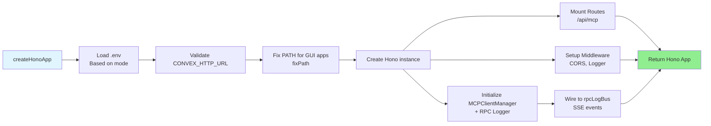
```mermaid
flowchart LR
    Factory[createHonoApp]

    Factory --> EnvLoad[Load .env<br/>Based on mode]
    EnvLoad --> Validate[Validate CONVEX_HTTP_URL]
    Validate --> FixPath[Fix PATH for GUI apps<br/>fixPath]
    FixPath --> CreateApp[Create Hono instance]

    CreateApp --> MCPManager[Initialize MCPClientManager<br/>+ RPC Logger]
    CreateApp --> Middleware[Setup Middleware<br/>CORS, Logger]
    CreateApp --> Routes[Mount Routes<br/>/api/mcp]

    MCPManager --> Bus[Wire to rpcLogBus<br/>SSE events]

    Routes --> App[Return Hono App]
    Middleware --> App
    Bus --> App

    style Factory fill:#e1f5ff
    style App fill:#90EE90
```

### API Routes Structure

```mermaid
graph TB
    API[/api]

    API --> MCP[/mcp]

    MCP --> Servers[/servers]
    MCP --> Health[/health]

    Servers --> List[GET / - List servers]
    Servers --> Connect[POST /:id/connect]
    Servers --> Disconnect[POST /:id/disconnect]
    Servers --> Tools[/servers/:id/tools]
    Servers --> Resources[/servers/:id/resources]
    Servers --> Prompts[/servers/:id/prompts]

    Tools --> ListTools[GET / - List tools]
    Tools --> CallTool[POST /:name/call]

    Resources --> ListResources[GET / - List resources]
    Resources --> ReadResource[GET /:uri]

    Prompts --> ListPrompts[GET / - List prompts]
    Prompts --> GetPrompt[POST /:name/get]

    style API fill:#e1f5ff
    style MCP fill:#fff3cd
    style Servers fill:#d4edda
```

### Request Lifecycle

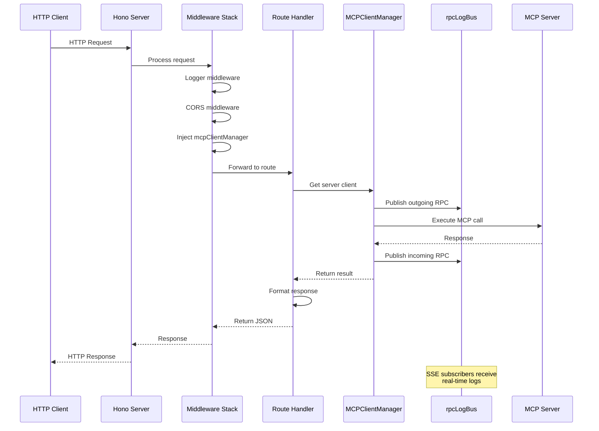
```mermaid
sequenceDiagram
    participant Client as HTTP Client
    participant Hono as Hono Server
    participant Middleware as Middleware Stack
    participant Route as Route Handler
    participant Manager as MCPClientManager
    participant RPC as rpcLogBus
    participant MCP as MCP Server

    Client->>Hono: HTTP Request
    Hono->>Middleware: Process request
    Middleware->>Middleware: Logger middleware
    Middleware->>Middleware: CORS middleware
    Middleware->>Middleware: Inject mcpClientManager
    Middleware->>Route: Forward to route

    Route->>Manager: Get server client
    Manager->>RPC: Publish outgoing RPC
    Manager->>MCP: Execute MCP call
    MCP-->>Manager: Response
    Manager->>RPC: Publish incoming RPC
    Manager-->>Route: Return result

    Route->>Route: Format response
    Route-->>Middleware: Return JSON
    Middleware-->>Hono: Response
    Hono-->>Client: HTTP Response

    Note over RPC: SSE subscribers receive<br/>real-time logs
```

## Electron Integration

### Process Architecture

Electron uses a multi-process architecture:

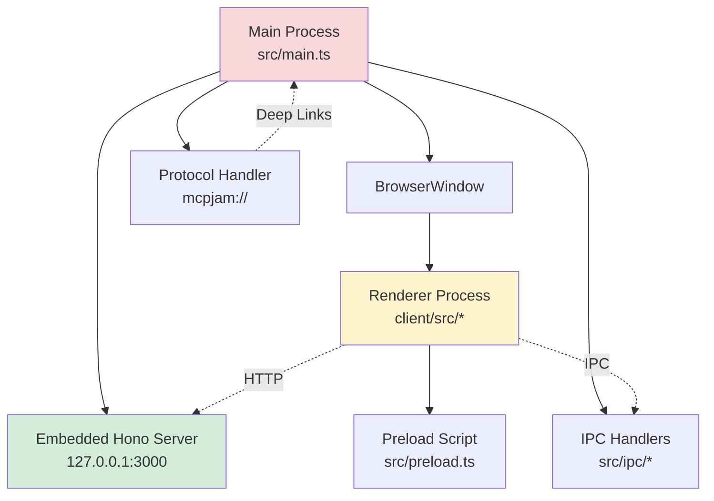
```mermaid
graph TB
    Main[Main Process<br/>src/main.ts]

    Main --> Server[Embedded Hono Server<br/>127.0.0.1:3000]
    Main --> Window[BrowserWindow]
    Main --> IPC[IPC Handlers<br/>src/ipc/*]
    Main --> Protocol[Protocol Handler<br/>mcpjam://]

    Window --> Renderer[Renderer Process<br/>client/src/*]
    Renderer --> Preload[Preload Script<br/>src/preload.ts]

    Renderer -.HTTP.-> Server
    Renderer -.IPC.-> IPC
    Protocol -.Deep Links.-> Main

    style Main fill:#f8d7da
    style Renderer fill:#fff3cd
    style Server fill:#d4edda
```

### Startup Sequence

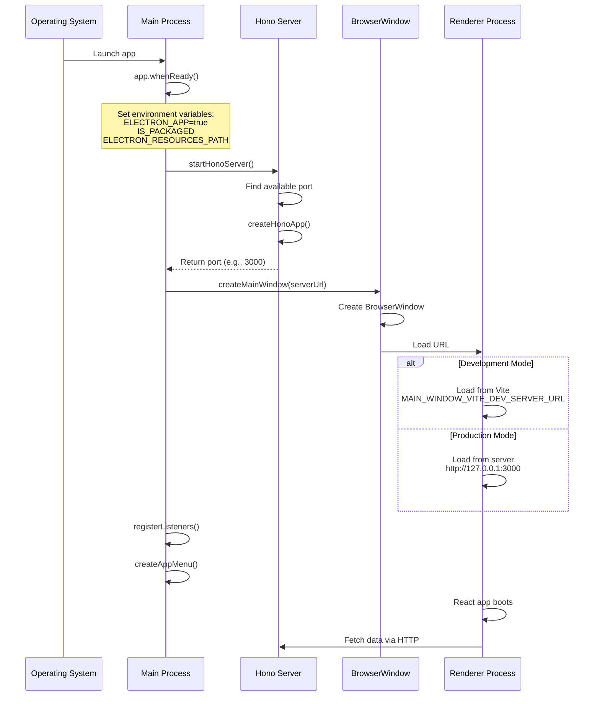
```mermaid
sequenceDiagram
    participant OS as Operating System
    participant Main as Main Process
    participant Server as Hono Server
    participant Window as BrowserWindow
    participant Renderer as Renderer Process

    OS->>Main: Launch app
    Main->>Main: app.whenReady()

    Note over Main: Set environment variables:<br/>ELECTRON_APP=true<br/>IS_PACKAGED<br/>ELECTRON_RESOURCES_PATH

    Main->>Server: startHonoServer()
    Server->>Server: Find available port
    Server->>Server: createHonoApp()
    Server-->>Main: Return port (e.g., 3000)

    Main->>Window: createMainWindow(serverUrl)
    Window->>Window: Create BrowserWindow
    Window->>Renderer: Load URL

    alt Development Mode
        Renderer->>Renderer: Load from Vite<br/>MAIN_WINDOW_VITE_DEV_SERVER_URL
    else Production Mode
        Renderer->>Renderer: Load from server<br/>http://127.0.0.1:3000
    end

    Main->>Main: registerListeners()
    Main->>Main: createAppMenu()

    Renderer->>Renderer: React app boots
    Renderer->>Server: Fetch data via HTTP
```

### OAuth Deep Linking

The Electron app uses a custom protocol (`mcpjam://`) to handle OAuth callbacks:

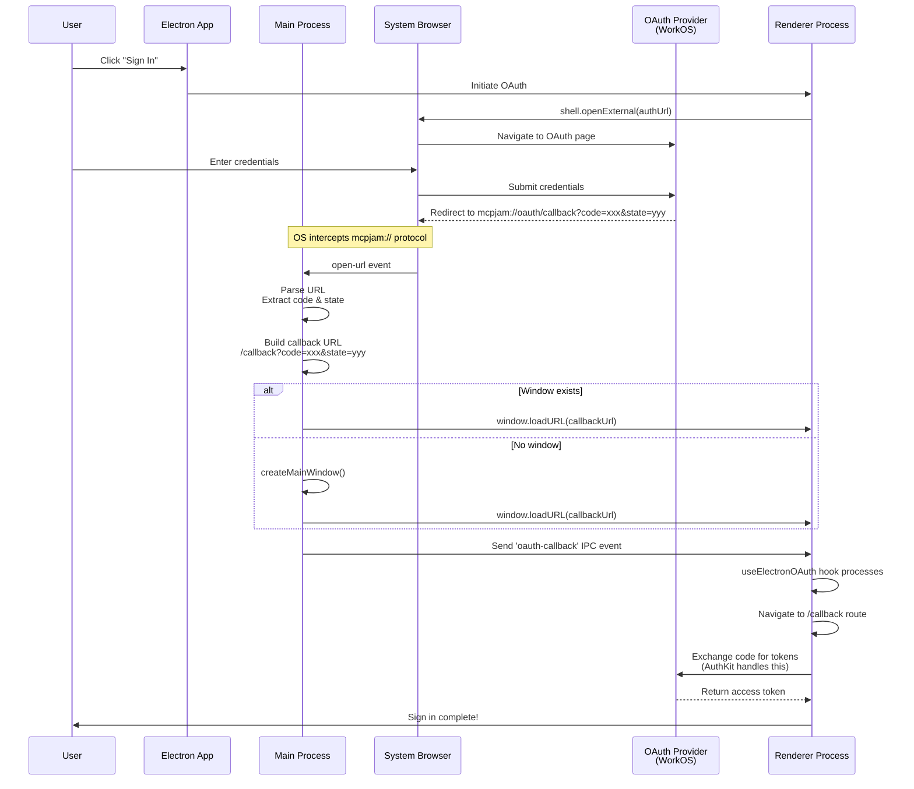
```mermaid
sequenceDiagram
    participant User
    participant App as Electron App
    participant Main as Main Process
    participant Browser as System Browser
    participant OAuth as OAuth Provider<br/>(WorkOS)
    participant Renderer as Renderer Process

    User->>App: Click "Sign In"
    App->>Renderer: Initiate OAuth
    Renderer->>Browser: shell.openExternal(authUrl)
    Browser->>OAuth: Navigate to OAuth page

    User->>Browser: Enter credentials
    Browser->>OAuth: Submit credentials
    OAuth-->>Browser: Redirect to mcpjam://oauth/callback?code=xxx&state=yyy

    Note over Browser,Main: OS intercepts mcpjam:// protocol

    Browser->>Main: open-url event
    Main->>Main: Parse URL<br/>Extract code & state

    Main->>Main: Build callback URL<br/>/callback?code=xxx&state=yyy

    alt Window exists
        Main->>Renderer: window.loadURL(callbackUrl)
    else No window
        Main->>Main: createMainWindow()
        Main->>Renderer: window.loadURL(callbackUrl)
    end

    Main->>Renderer: Send 'oauth-callback' IPC event
    Renderer->>Renderer: useElectronOAuth hook processes

    Renderer->>Renderer: Navigate to /callback route
    Renderer->>OAuth: Exchange code for tokens<br/>(AuthKit handles this)
    OAuth-->>Renderer: Return access token

    Renderer->>User: Sign in complete!
```

#### Key Implementation Details

**Protocol Registration** (`src/main.ts:31-33`):
```typescript
if (!app.isDefaultProtocolClient("mcpjam")) {
  app.setAsDefaultProtocolClient("mcpjam");
}
```

**Deep Link Handler** (`src/main.ts:273-313`):
```typescript
app.on("open-url", (event, url) => {
  event.preventDefault();

  if (!url.startsWith("mcpjam://oauth/callback")) {
    return;
  }

  const parsed = new URL(url);
  const code = parsed.searchParams.get("code") ?? "";
  const state = parsed.searchParams.get("state") ?? "";

  // Build callback URL for renderer
  const callbackUrl = new URL("/callback", baseUrl);
  if (code) callbackUrl.searchParams.set("code", code);
  if (state) callbackUrl.searchParams.set("state", state);

  // Load callback URL and emit IPC event
  mainWindow.loadURL(callbackUrl.toString());
  mainWindow.webContents.send("oauth-callback", url);
});
```

**React Hook** (`client/src/hooks/useElectronOAuth.ts`):
```typescript
useEffect(() => {
  if (!window.isElectron || !window.electronAPI?.oauth) {
    return;
  }

  const handleOAuthCallback = (url: string) => {
    const urlObj = new URL(url);
    const params = new URLSearchParams(urlObj.search);
    const code = params.get("code");
    const state = params.get("state");

    if (code) {
      const callbackUrl = new URL("/callback", window.location.origin);
      callbackUrl.searchParams.set("code", code);
      if (state) callbackUrl.searchParams.set("state", state);

      // Redirect to AuthKit's callback handler
      window.location.href = callbackUrl.toString();
    }
  };

  window.electronAPI.oauth.onCallback(handleOAuthCallback);
  return () => window.electronAPI.oauth.removeCallback();
}, []);
```

## MCP Client Management

### MCPClientManager Architecture

The MCPClientManager is the heart of MCP server integration:

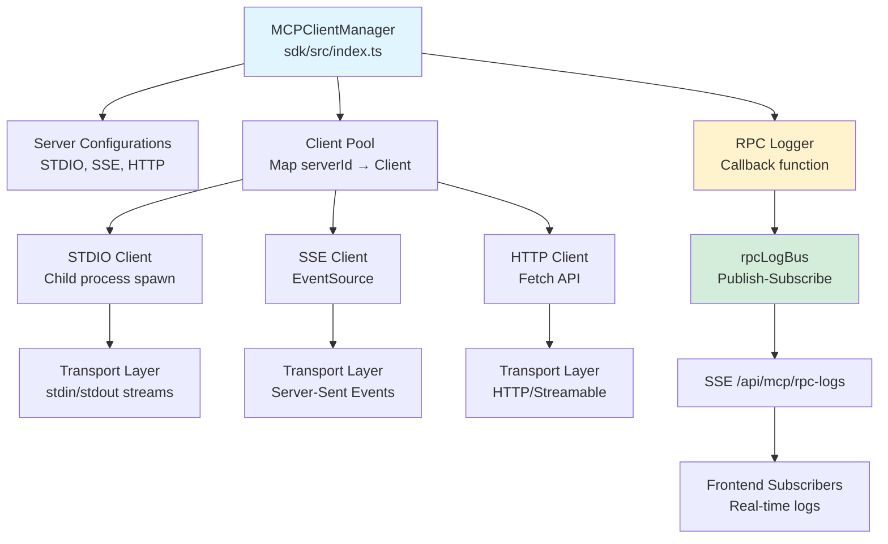
```mermaid
graph TB
    Manager[MCPClientManager<br/>sdk/src/index.ts]

    Manager --> Config[Server Configurations<br/>STDIO, SSE, HTTP]
    Manager --> Pool[Client Pool<br/>Map serverId → Client]
    Manager --> Logger[RPC Logger<br/>Callback function]

    Pool --> STDIO[STDIO Client<br/>Child process spawn]
    Pool --> SSE[SSE Client<br/>EventSource]
    Pool --> HTTP[HTTP Client<br/>Fetch API]

    STDIO --> Transport1[Transport Layer<br/>stdin/stdout streams]
    SSE --> Transport2[Transport Layer<br/>Server-Sent Events]
    HTTP --> Transport3[Transport Layer<br/>HTTP/Streamable]

    Logger --> Bus[rpcLogBus<br/>Publish-Subscribe]
    Bus --> SSEStream[SSE /api/mcp/rpc-logs]
    SSEStream --> Frontend[Frontend Subscribers<br/>Real-time logs]

    style Manager fill:#e1f5ff
    style Logger fill:#fff3cd
    style Bus fill:#d4edda
```

### Client Lifecycle

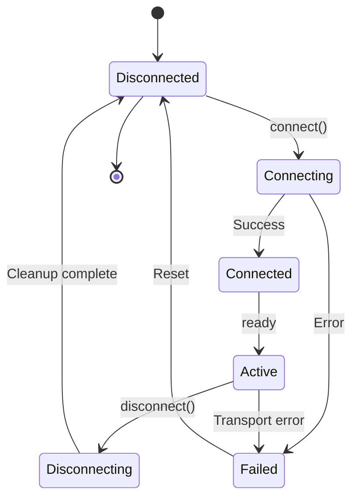
```mermaid
stateDiagram-v2
    [*] --> Disconnected

    Disconnected --> Connecting: connect()
    Connecting --> Connected: Success
    Connecting --> Failed: Error

    Connected --> Active: ready
    Active --> Disconnecting: disconnect()
    Active --> Failed: Transport error

    Disconnecting --> Disconnected: Cleanup complete
    Failed --> Disconnected: Reset

    Disconnected --> [*]
```

### Transport Selection

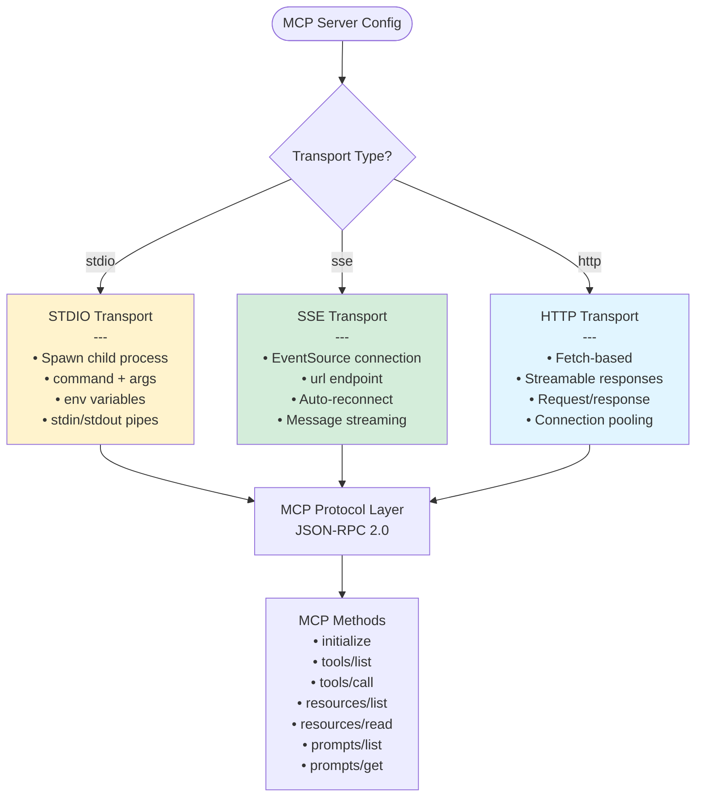
```mermaid
flowchart TD
    Start([MCP Server Config])

    Start --> Type{Transport Type?}

    Type -->|stdio| STDIO[STDIO Transport<br/>---<br/>• Spawn child process<br/>• command + args<br/>• env variables<br/>• stdin/stdout pipes]

    Type -->|sse| SSE[SSE Transport<br/>---<br/>• EventSource connection<br/>• url endpoint<br/>• Auto-reconnect<br/>• Message streaming]

    Type -->|http| HTTP[HTTP Transport<br/>---<br/>• Fetch-based<br/>• Streamable responses<br/>• Request/response<br/>• Connection pooling]

    STDIO --> Protocol[MCP Protocol Layer<br/>JSON-RPC 2.0]
    SSE --> Protocol
    HTTP --> Protocol

    Protocol --> Methods[MCP Methods<br/>• initialize<br/>• tools/list<br/>• tools/call<br/>• resources/list<br/>• resources/read<br/>• prompts/list<br/>• prompts/get]

    style STDIO fill:#fff3cd
    style SSE fill:#d4edda
    style HTTP fill:#e1f5ff
```

## State Management

### Frontend State Architecture

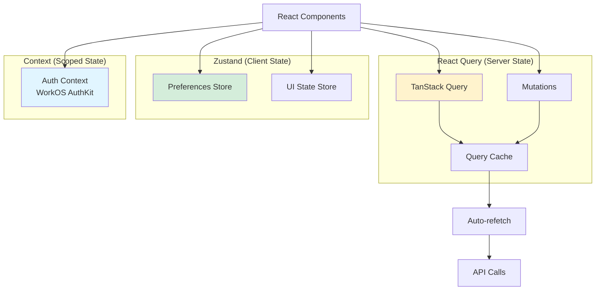
```mermaid
graph TB
    subgraph "React Query (Server State)"
        Queries[TanStack Query]
        Cache[Query Cache]
        Mutations[Mutations]
    end

    subgraph "Zustand (Client State)"
        Preferences[Preferences Store]
        UI[UI State Store]
    end

    subgraph "Context (Scoped State)"
        Auth[Auth Context<br/>WorkOS AuthKit]
    end

    Components[React Components]

    Components --> Queries
    Components --> Mutations
    Components --> Preferences
    Components --> UI
    Components --> Auth

    Queries --> Cache
    Mutations --> Cache

    Cache --> Refetch[Auto-refetch]
    Refetch --> API[API Calls]

    style Queries fill:#fff3cd
    style Preferences fill:#d4edda
    style Auth fill:#e1f5ff
```

### Data Synchronization

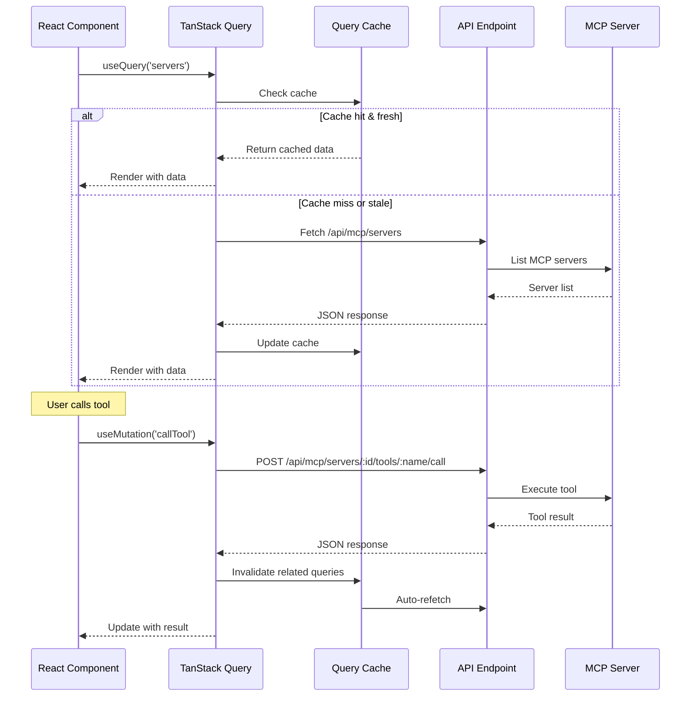
```mermaid
sequenceDiagram
    participant UI as React Component
    participant Query as TanStack Query
    participant Cache as Query Cache
    participant API as API Endpoint
    participant Server as MCP Server

    UI->>Query: useQuery('servers')
    Query->>Cache: Check cache

    alt Cache hit & fresh
        Cache-->>Query: Return cached data
        Query-->>UI: Render with data
    else Cache miss or stale
        Query->>API: Fetch /api/mcp/servers
        API->>Server: List MCP servers
        Server-->>API: Server list
        API-->>Query: JSON response
        Query->>Cache: Update cache
        Query-->>UI: Render with data
    end

    Note over UI: User calls tool

    UI->>Query: useMutation('callTool')
    Query->>API: POST /api/mcp/servers/:id/tools/:name/call
    API->>Server: Execute tool
    Server-->>API: Tool result
    API-->>Query: JSON response
    Query->>Cache: Invalidate related queries
    Cache->>API: Auto-refetch
    Query-->>UI: Update with result
```

## Real-time Communication

### SSE Event Bus

The application uses Server-Sent Events for real-time RPC logging:

```mermaid
graph TB
    subgraph "Backend"
        Manager[MCPClientManager]
        Logger[RPC Logger Callback]
        Bus[rpcLogBus<br/>Publish-Subscribe]
        Route[/api/mcp/rpc-logs<br/>SSE Endpoint]
    end

    subgraph "Transport"
        SSEStream[Server-Sent Events<br/>event: message]
    end

    subgraph "Frontend"
        EventSource[EventSource API]
        Subscribers[Log Subscribers<br/>React components]
    end

    Manager --> Logger
    Logger --> Bus
    Bus --> Route
    Route --> SSEStream
    SSEStream --> EventSource
    EventSource --> Subscribers

    style Bus fill:#d4edda
    style SSEStream fill:#fff3cd
```

### RPC Log Flow

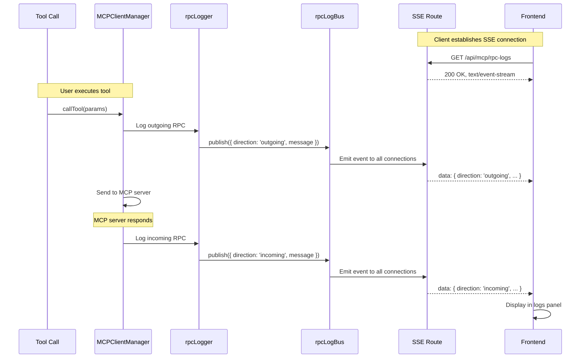
```mermaid
sequenceDiagram
    participant Tool as Tool Call
    participant Manager as MCPClientManager
    participant Logger as rpcLogger
    participant Bus as rpcLogBus
    participant SSE as SSE Route
    participant Client as Frontend

    Note over Client,SSE: Client establishes SSE connection

    Client->>SSE: GET /api/mcp/rpc-logs
    SSE-->>Client: 200 OK, text/event-stream

    Note over Tool,Manager: User executes tool

    Tool->>Manager: callTool(params)

    Manager->>Logger: Log outgoing RPC
    Logger->>Bus: publish({ direction: 'outgoing', message })
    Bus->>SSE: Emit event to all connections
    SSE-->>Client: data: { direction: 'outgoing', ... }

    Manager->>Manager: Send to MCP server

    Note over Manager: MCP server responds

    Manager->>Logger: Log incoming RPC
    Logger->>Bus: publish({ direction: 'incoming', message })
    Bus->>SSE: Emit event to all connections
    SSE-->>Client: data: { direction: 'incoming', ... }

    Client->>Client: Display in logs panel
```

## Authentication Flow

### WorkOS AuthKit Integration

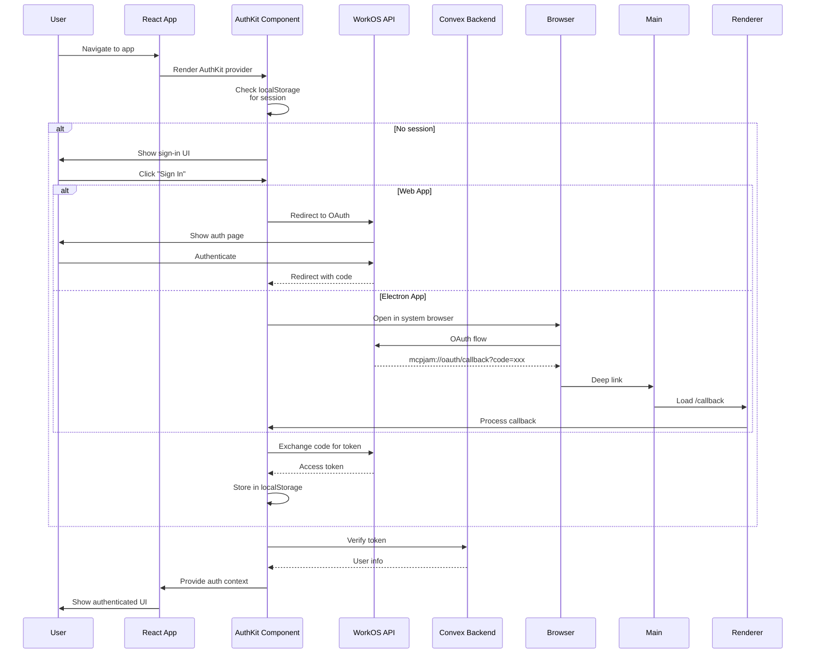
```mermaid
sequenceDiagram
    participant User
    participant App as React App
    participant AuthKit as AuthKit Component
    participant WorkOS as WorkOS API
    participant Convex as Convex Backend

    User->>App: Navigate to app
    App->>AuthKit: Render AuthKit provider
    AuthKit->>AuthKit: Check localStorage<br/>for session

    alt No session
        AuthKit->>User: Show sign-in UI
        User->>AuthKit: Click "Sign In"

        alt Web App
            AuthKit->>WorkOS: Redirect to OAuth
            WorkOS->>User: Show auth page
            User->>WorkOS: Authenticate
            WorkOS-->>AuthKit: Redirect with code
        else Electron App
            AuthKit->>Browser: Open in system browser
            Browser->>WorkOS: OAuth flow
            WorkOS-->>Browser: mcpjam://oauth/callback?code=xxx
            Browser->>Main: Deep link
            Main->>Renderer: Load /callback
            Renderer->>AuthKit: Process callback
        end

        AuthKit->>WorkOS: Exchange code for token
        WorkOS-->>AuthKit: Access token
        AuthKit->>AuthKit: Store in localStorage
    end

    AuthKit->>Convex: Verify token
    Convex-->>AuthKit: User info
    AuthKit->>App: Provide auth context
    App->>User: Show authenticated UI
```

## Data Flow

### Complete Request-Response Cycle

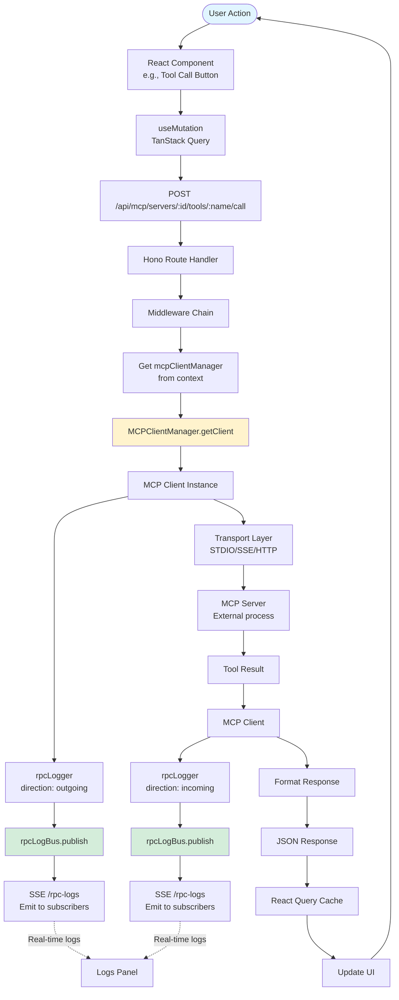
```mermaid
flowchart TD
    User([User Action])

    User --> UI[React Component<br/>e.g., Tool Call Button]
    UI --> Mutation[useMutation<br/>TanStack Query]
    Mutation --> API[POST /api/mcp/servers/:id/tools/:name/call]

    API --> Hono[Hono Route Handler]
    Hono --> Middleware[Middleware Chain]
    Middleware --> Context[Get mcpClientManager<br/>from context]

    Context --> Manager[MCPClientManager.getClient]
    Manager --> Client[MCP Client Instance]

    Client --> LogOut[rpcLogger<br/>direction: outgoing]
    LogOut --> Bus1[rpcLogBus.publish]
    Bus1 --> SSE1[SSE /rpc-logs<br/>Emit to subscribers]

    Client --> Transport[Transport Layer<br/>STDIO/SSE/HTTP]
    Transport --> MCPServer[MCP Server<br/>External process]

    MCPServer --> Response[Tool Result]
    Response --> Client2[MCP Client]

    Client2 --> LogIn[rpcLogger<br/>direction: incoming]
    LogIn --> Bus2[rpcLogBus.publish]
    Bus2 --> SSE2[SSE /rpc-logs<br/>Emit to subscribers]

    Client2 --> Format[Format Response]
    Format --> JSON[JSON Response]
    JSON --> React[React Query Cache]
    React --> Update[Update UI]
    Update --> User

    SSE1 -.Real-time logs.-> LogPanel[Logs Panel]
    SSE2 -.Real-time logs.-> LogPanel

    style User fill:#e1f5ff
    style Manager fill:#fff3cd
    style Bus1 fill:#d4edda
    style Bus2 fill:#d4edda
```

## Performance Considerations

### Caching Strategy

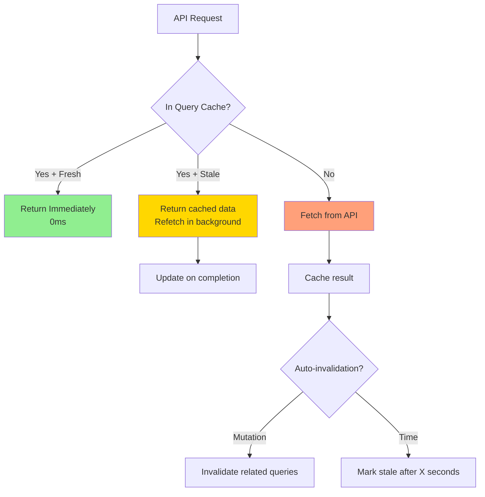
```mermaid
graph TB
    Request[API Request]

    Request --> QueryCache{In Query Cache?}

    QueryCache -->|Yes + Fresh| Instant[Return Immediately<br/>0ms]
    QueryCache -->|Yes + Stale| Background[Return cached data<br/>Refetch in background]
    QueryCache -->|No| Fetch[Fetch from API]

    Background --> Update[Update on completion]
    Fetch --> Cache[Cache result]

    Cache --> Invalidation{Auto-invalidation?}
    Invalidation -->|Mutation| InvalidateRelated[Invalidate related queries]
    Invalidation -->|Time| StaleTime[Mark stale after X seconds]

    style Instant fill:#90EE90
    style Background fill:#FFD700
    style Fetch fill:#FFA07A
```

### Connection Pooling

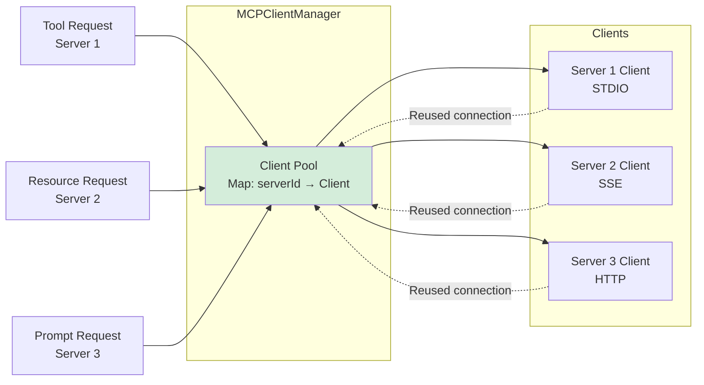
```mermaid
graph LR
    subgraph "MCPClientManager"
        Pool[Client Pool<br/>Map: serverId → Client]
    end

    subgraph "Clients"
        Client1[Server 1 Client<br/>STDIO]
        Client2[Server 2 Client<br/>SSE]
        Client3[Server 3 Client<br/>HTTP]
    end

    Request1[Tool Request<br/>Server 1]
    Request2[Resource Request<br/>Server 2]
    Request3[Prompt Request<br/>Server 3]

    Request1 --> Pool
    Request2 --> Pool
    Request3 --> Pool

    Pool --> Client1
    Pool --> Client2
    Pool --> Client3

    Client1 -.Reused connection.-> Pool
    Client2 -.Reused connection.-> Pool
    Client3 -.Reused connection.-> Pool

    style Pool fill:#d4edda
```

## Error Handling

### Error Propagation

```mermaid
flowchart TD
    Error([Error Occurs])

    Error --> Layer{Where?}

    Layer -->|MCP Server| MCPError[MCP Server Error<br/>- Invalid parameters<br/>- Server crash<br/>- Timeout]

    Layer -->|Transport| TransportError[Transport Error<br/>- Connection failed<br/>- Network timeout<br/>- Protocol error]

    Layer -->|Client Manager| ManagerError[Manager Error<br/>- Server not found<br/>- Client not connected<br/>- Invalid config]

    Layer -->|API| APIError[API Error<br/>- Invalid request<br/>- Auth failure<br/>- Rate limit]

    MCPError --> Log[Log to console]
    TransportError --> Log
    ManagerError --> Log
    APIError --> Log

    Log --> Sentry[Report to Sentry<br/>If production]

    Sentry --> Response[Format Error Response]

    Response --> Client[Return to client<br/>with error details]

    Client --> UI[Display error in UI<br/>Toast/Alert]

    style Error fill:#f8d7da
    style Sentry fill:#e1f5ff
```

## Deployment Architecture

### Build Artifacts

```mermaid
graph TB
    Source[Source Code]

    Source --> BuildClient[npm run build:client]
    Source --> BuildServer[npm run build:server]
    Source --> BuildSDK[npm run build:sdk]

    BuildClient --> ClientDist[dist/client/<br/>- index.html<br/>- assets/js/*.js<br/>- assets/css/*.css]

    BuildServer --> ServerDist[dist/server/<br/>- index.js<br/>- app.js<br/>- routes/**/*.js]

    BuildSDK --> SDKDist[sdk/dist/<br/>- index.js<br/>- types.d.ts]

    ClientDist --> WebDeploy[Web Deployment<br/>Serve via Hono]
    ServerDist --> WebDeploy

    ClientDist --> ElectronBuild[Electron Forge Build]
    ServerDist --> ElectronBuild
    SDKDist --> ElectronBuild

    ElectronBuild --> ElectronArtifacts[Electron Artifacts<br/>- .app for macOS<br/>- .exe for Windows<br/>- .deb for Linux]

    ClientDist --> DockerBuild[Docker Build]
    ServerDist --> DockerBuild

    DockerBuild --> DockerImage[Docker Image<br/>mcpjam/inspector:latest]

    style ClientDist fill:#fff3cd
    style ServerDist fill:#d4edda
    style SDKDist fill:#e1f5ff
```

### Electron Packaging

```mermaid
flowchart LR
    Start([npm run electron:make])

    Start --> Icons1[Generate Icons<br/>Windows .ico]
    Icons1 --> Icons2[Generate Icons<br/>macOS .icns]

    Icons2 --> Forge[Electron Forge]

    Forge --> Package[Package Step<br/>- Bundle app code<br/>- Include resources<br/>- Sign binaries]

    Package --> Make[Make Step<br/>Platform-specific]

    Make --> MacOS[macOS<br/>- DMG installer<br/>- ZIP archive<br/>- Code signing]

    Make --> Windows[Windows<br/>- Squirrel installer<br/>- NSIS installer<br/>- Code signing]

    Make --> Linux[Linux<br/>- DEB package<br/>- RPM package<br/>- AppImage]

    MacOS --> Output[/out directory]
    Windows --> Output
    Linux --> Output

    style Start fill:#e1f5ff
    style Output fill:#90EE90
```

## Security Architecture

### Security Layers

```mermaid
graph TB
    subgraph "Frontend Security"
        CSP[Content Security Policy]
        XSS[XSS Protection]
        HTTPS[HTTPS Only]
    end

    subgraph "Transport Security"
        CORS[CORS Configuration]
        Auth[WorkOS Authentication]
        RateLimit[Rate Limiting]
    end

    subgraph "Backend Security"
        Validation[Input Validation]
        Sanitization[Data Sanitization]
        Secrets[Secret Management]
    end

    subgraph "Electron Security"
        NoNodeInt[No Node Integration<br/>in renderer]
        ContextIso[Context Isolation]
        Preload[Secure Preload Script]
    end

    Request[User Request]

    Request --> CSP
    Request --> XSS
    Request --> HTTPS

    CSP --> CORS
    XSS --> CORS
    HTTPS --> CORS

    CORS --> Auth
    Auth --> RateLimit

    RateLimit --> Validation
    Validation --> Sanitization
    Sanitization --> Secrets

    NoNodeInt --> Safe[Safe Execution]
    ContextIso --> Safe
    Preload --> Safe

    style Auth fill:#90EE90
    style Secrets fill:#f8d7da
```

## Monitoring & Observability

### Telemetry Pipeline

```mermaid
flowchart LR
    App[Application Events]

    App --> Console[Console Logs<br/>Development]
    App --> Sentry[Sentry<br/>Error Tracking]
    App --> Metrics[Performance Metrics<br/>TanStack Query DevTools]

    Console --> Dev[Developers<br/>Local debugging]

    Sentry --> Dashboard[Sentry Dashboard<br/>Production errors]

    Metrics --> Analysis[Performance Analysis<br/>Query timing<br/>Cache hit rates]

    Dashboard --> Alerts[Slack Alerts<br/>Critical errors]

    style Sentry fill:#f8d7da
    style Console fill:#fff3cd
    style Metrics fill:#d4edda
```

---

## Quick Reference

### Environment Variables

| Variable | Purpose | Set By |
|----------|---------|--------|
| `CONVEX_HTTP_URL` | Convex backend URL | User (required) |
| `ELECTRON_APP` | Indicates Electron runtime | Electron main process |
| `IS_PACKAGED` | Indicates packaged Electron app | Electron main process |
| `ELECTRON_RESOURCES_PATH` | Path to Electron resources | Electron main process |
| `NODE_ENV` | Runtime environment | Build scripts / user |
| `PORT` | Server port | User (default: 3001) |
| `DEBUG_MCP_SELECTION` | Enable MCP debug logs | User (optional) |

### Key File Locations

| Path | Purpose |
|------|---------|
| `server/index.ts:180-192` | MCPClientManager initialization (npm package) |
| `server/app.ts:67-79` | MCPClientManager setup (Electron) |
| `src/main.ts:62-92` | Hono server startup in Electron |
| `src/main.ts:273-313` | OAuth deep link handler |
| `client/src/hooks/useElectronOAuth.ts` | React OAuth hook |
| `server/routes/mcp/index.ts` | MCP API routes |
| `server/services/rpc-log-bus.ts` | SSE event bus |
| `sdk/src/index.ts` | MCP SDK wrapper |

### Common Patterns

**Adding a new MCP endpoint:**
1. Add route in `server/routes/mcp/`
2. Use `c.mcpClientManager` from context
3. Handle errors and log via `rpcLogBus`
4. Return JSON response

**Adding a new React feature:**
1. Create component in `client/src/components/`
2. Use TanStack Query for server state
3. Use Zustand for client state
4. Follow Shadcn UI patterns

**Testing in Electron:**
1. Run `npm run electron:dev`
2. Open DevTools with `Cmd+Option+I` (Mac) or `Ctrl+Shift+I` (Windows)
3. Check main process logs in terminal
4. Check renderer logs in DevTools

---

For more information, see:
- [CONTRIBUTING.md](./CONTRIBUTING.md) - Contribution guidelines
- [CLAUDE.md](./CLAUDE.md) - AI assistant instructions
- [README.md](./README.md) - User-facing documentation
