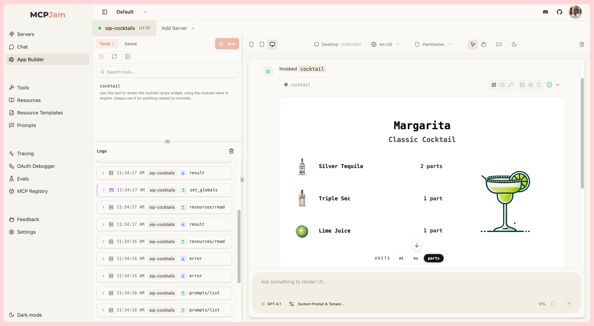
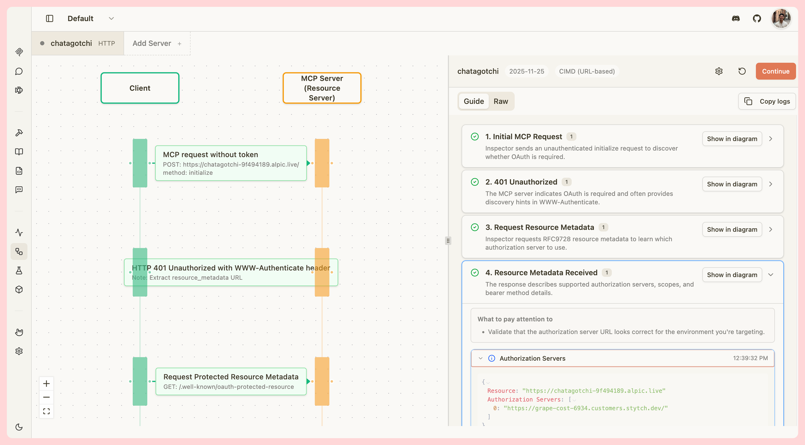
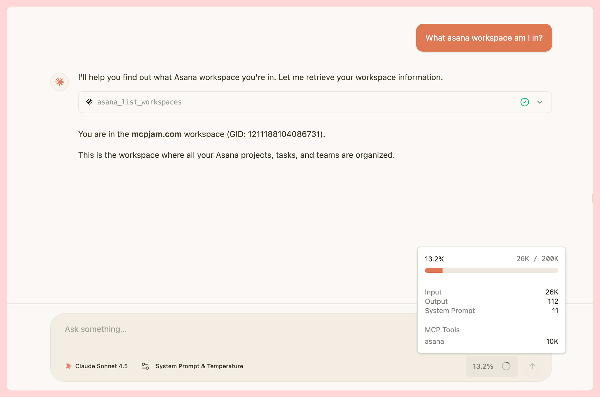
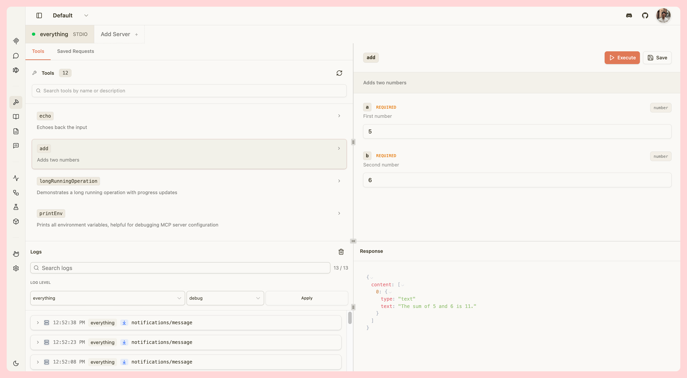

<div align="center">

<picture>
  <source media="(prefers-color-scheme: dark)" srcset="./client/public/mcp_jam_dark.png">
  <source media="(prefers-color-scheme: light)" srcset="./client/public/mcp_jam_light.png">
  
</picture>

<br/>

www.mcpjam.com

[](https://www.npmjs.com/package/@mcpjam/inspector)
[](https://opensource.org/licenses/Apache-2.0)
[](https://discord.gg/JEnDtz8X6z)

</div>

MCPJam Inspector is the local development client for ChatGPT apps, MCP apps (Claude), and MCP servers. Build and test your apps with a full widget emulator, chat with any LLM, and inspect your server’s tools, resources, prompts, and OAuth flows.

No more ngrok or ChatGPT subscription needed. MCPJam is the fastest way to iterate on any MCP project.

### 🚀 Quick Start

Start up the MCPJam inspector:

```bash
npx @mcpjam/inspector@latest
```



# Table of contents

- [Installation Guides](#installation-guides)
- [Key Features](#key-features)
  - [ChatGPT / MCP Apps Builder](#openai-apps--mcp-ui)
  - [OAuth Debugger](#oauth-debugger)
  - [LLM Playground](#llm-playground)
- [Contributing](#contributing-)
- [Links](#links-)
- [Community](#community-)
- [Shoutouts](#shoutouts-)
- [License](#-license)

# Installation Guides

### Requirements

[](https://nodejs.org/)
[](https://www.typescriptlang.org/)

## Install via NPM

We recommend starting MCPJam inspector via `npx`:

```bash
npx @mcpjam/inspector@latest
```

We also have a Mac and Windows desktop app:

- [Install Mac](https://github.com/MCPJam/inspector/releases/latest/download/MCPJam.Inspector.dmg)
- [Install Windows](https://github.com/MCPJam/inspector/releases/latest/download/MCPJam-Inspector-Setup.exe)

# Key features

| Capability           | Description                                                                                                                                                                                                                                                                                        |
| -------------------- | -------------------------------------------------------------------------------------------------------------------------------------------------------------------------------------------------------------------------------------------------------------------------------------------------- |
| ChatGPT Apps SDK     | Local development for ChatGPT Apps SDK support. Full support for the `windows.openai` API: `widgetState`, `callTool`, `structuredContent`, `sendFollowUpMessage`, `displayMode`, CSP, and more. No more ngrok or ChatGPT subscription needed. [Read more](https://www.mcpjam.com/blog/app-builder) |
| MCP Apps (Claude)    | Full local development for MCP Apps (SEP-1865). Support for all JSON-RPC message types, such as `tools/call`, `ui/initialize`, `ui/message`, `ui/open-link`, and more. [Read more](https://www.mcpjam.com/blog/mcp-apps-preview)                                                                   |
| OAuth Debugger       | Debug your MCP server's OAuth implementation at every step. Visually inspect every network message. Supports all protocol versions (03-26, 06-18, and 11-25). Support for client pre-registration, DCR, and CIMD. [Read more](https://www.mcpjam.com/blog/oauth-debugger)                          |
| LLM playground       | Chat with your MCP server against any LLM in the playground. We provide frontier models such as GPT-5 and Claude Sonnet for free, or bring your own API key. Playground supports ChatGPT apps and MCP Apps. [Read more](https://www.mcpjam.com/blog/frontier-models)                               |
| MCP server debugging | Connect to and test any MCP server local or remote. Manually invoke MCP tools, resources, resource templates, and elicitation flows. View all JSON-RPC logs. Support for all features from the official MCP inspector.                                                                             |
| Server info          | View server icons, version, capabilities, instructions, and ChatGPT widget metadata exposed by the server. [Read more](https://www.mcpjam.com/blog/server-instructions)                                                                                                                            |

## ChatGPT Apps / MCP Apps Builder

Develop [ChatGPT apps](https://developers.openai.com/apps-sdk/) and [MCP apps (Claude)](https://github.com/modelcontextprotocol/modelcontextprotocol/pull/1865) in MCPJam's Apps Builder. Apps Builder is a local emulator to quickly view and iterate on your widgets.

- Manually invoke a tool to instantly view the widget, or chat with your server using an LLM.
- View all JSON-RPC messages, `window.openai` messages in the logs.
- Change emulator device to Desktop, Tablet, or Mobile views.
- Test your app's locale change, CSP permissions, light / dark mode, hover & touch, and safe area insets.


## OAuth Debugger

View every step of the OAuth handshake in detail, with guided explanations. Test with every version of the OAuth spec (03-26, 06-18, and 11-25). Support for client pre-registration, Dynamic Client Registration (DCR), and Client ID Metadata Documents (CIMD).



## LLM Playground

Try your server against any LLM model. We provide frontier models like GPT-5, Claude Sonnet, Gemini 2.5 for free, or bring your own API key. View your server's token usage.



## MCP Inspector

MCPJam contains all of the tooling to test your MCP server. Test your server's tools, resources, prompts, templates, with full JSON-RPC observability. MCPJam has all features from the original inspector and more.



# Contributing 👨‍💻

We're grateful for you considering contributing to MCPJam. Please read our [contributing guide](CONTRIBUTING.md).

Join our [Discord community](https://discord.gg/JEnDtz8X6z) where the contributors hang out at.

# Links 🔗

- [Website](https://www.mcpjam.com/)
- [Blog](https://www.mcpjam.com/blog)
- [Pricing](https://www.mcpjam.com/pricing)
- [Docs](https://docs.mcpjam.com/)

# Community 🌍

- [Discord](https://discord.gg/JEnDtz8X6z)
- [𝕏 (Twitter)](https://x.com/mcpjams)
- [LinkedIn](https://www.linkedin.com/company/mcpjam)

# Shoutouts 📣

Some of our partners and favorite frameworks:

- [Stytch](https://stytch.com) - Our favorite MCP OAuth provider
- [xMCP](https://xmcp.dev/) - The Typescript MCP framework. Ship on Vercel instantly.
- [Alpic](https://alpic.ai/) - Host MCP servers. Try their new [Skybridge framework](https://github.com/alpic-ai/skybridge) for ChatGPT apps!

---

# License 📄

This project is licensed under the **Apache License 2.0** - see the [LICENSE](LICENSE).
