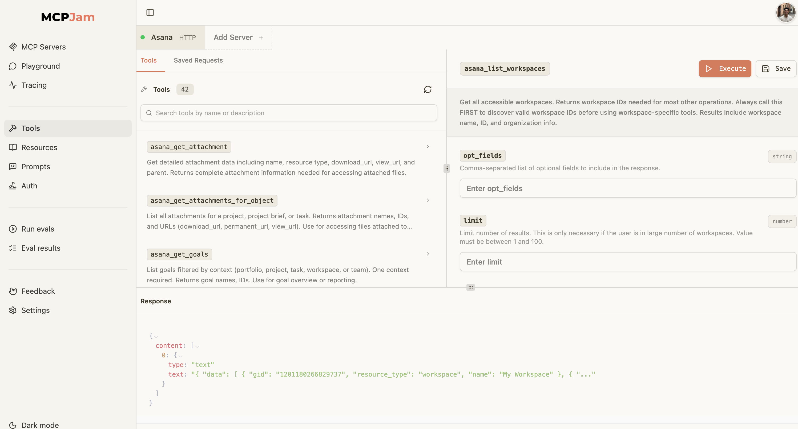
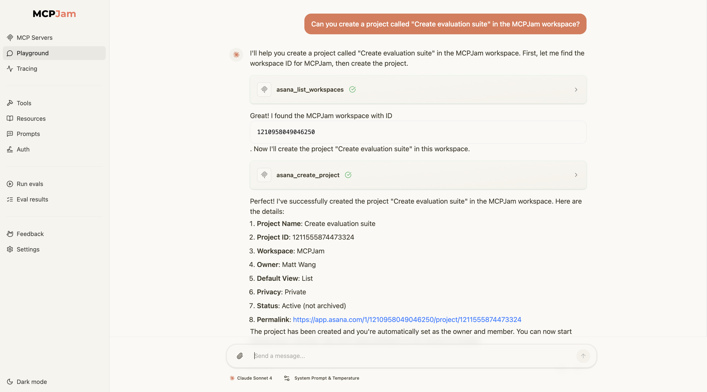
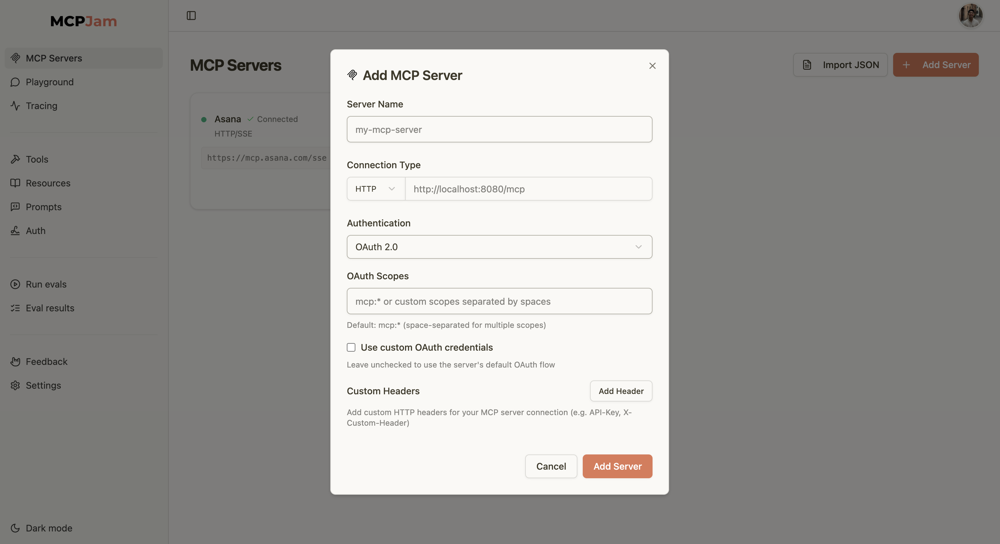
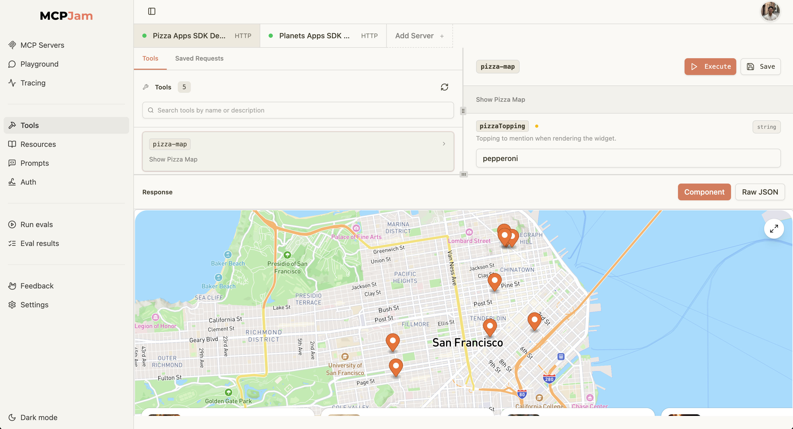

<div align="center">

<picture>
  <source media="(prefers-color-scheme: dark)" srcset="./client/public/mcp_jam_dark.png">
  <source media="(prefers-color-scheme: light)" srcset="./client/public/mcp_jam_light.png">
  
</picture>

<br/>

www.mcpjam.com

[](https://www.npmjs.com/package/@mcpjam/inspector)
[](https://opensource.org/licenses/Apache-2.0)
[](https://discord.gg/JEnDtz8X6z)

<br/>
<br/>
</div>

MCPJam inspector is the local-first development platform for MCP servers. Visually test your server's tools, resources, and prompts. Try your server against different models in the LLM playground. Now with support for OpenAI Apps SDK.

## 📸 Screenshots



<details>
<summary><strong>LLM Playground</strong></summary>



</details>

<details>
<summary><strong>Evals and pen testing</strong></summary>


</details>

<details>
<summary><strong>Connect with OAuth</strong></summary>



</details>

## 🚀 Quick Start

Start up the MCPJam inspector:

```bash
npx @mcpjam/inspector@latest
```

## Key Features

| Feature                        | Description                                                                                                                                             |
| ------------------------------ | ------------------------------------------------------------------------------------------------------------------------------------------------------- |
| **Protocol handshake testing** | Visually test your MCP server's tools, resources, prompts, elicitation, and OAuth 2. MCPJam is compliant with the latest MCP specs.                     |
| **All transports**             | Connect to any MCP server. MCPJam inspector supports STDIO, SSE, and Streamable HTTP transports.                                                        |
| **LLM Playground**             | Integrated chat playground with OpenAI, Anthropic Claude, Google Gemini, and Ollama model support. Test how your MCP server would behave against an LLM |
| **Test OAuth**                 | Test your server's OAuth and Dynamic Client Registration implementation.                                                                                |
| **View JSON-RPC**              | View every JSON-RPC message sent over network. Provides granular observability and debugging.                                                           |
| **MCP-UI and OpenAI Apps SDK** | Test your MCP server's implementation of MCP-UI or OpenAI Apps SDK                                                                                      |

## 🎉 Now with OpenAI Apps SDK support!



Developing with Apps SDK is pretty restricted right now as it requires ChatGPT developer mode access and an OpenAI partner to approve access. We wanted to make that more accessible for developers today by putting it in an open source project, give y’all a head start.

Test your Apps SDK app with:

- Tools tab. Deterministically call tools and view your UI
- LLM playground to see your Apps SDK UI in a chat environment

The feature is in beta, and still needs polishing. Please report any bugs in the issues tab. We encourage the community to contibute!

# Installation Guides

We recommend starting MCPJam inspector via `npx`:

```bash
npx @mcpjam/inspector@latest
```

or download the Mac / Windows desktop app [on our site](https://www.mcpjam.com/).

## 🐳 Docker

Run MCPJam Inspector using Docker:

```bash
# Run the latest version from Docker Hub
docker run -p 3001:3001 mcpjam/mcp-inspector:latest

# Or run in the background
docker run -d -p 3001:3001 --name mcp-inspector mcpjam/mcp-inspector:latest
```

The application will be available at `http://localhost:3001`.

## Open commands

```bash
# Launch with custom port
npx @mcpjam/inspector@latest --port 4000

# Shortcut for starting MCPJam and an Ollama model
npx @mcpjam/inspector@latest --ollama llama3.2

# Local FastMCP STDIO example
npx @mcpjam/inspector@latest uv run fastmcp run /Users/matt8p/demo/src/server.py

# Local Node example
npx @mcpjam/inspector@latest npx -y /Users/matt8p/demo-ts/dist/index.js
```

## Connecting to MCP servers

### mcp.json

You can import your `mcp.json` MCP server configs from Claude Desktop and Cursor with the command:

```
npx @mcpjam/inspector@latest --config mcp.json
```

### SSE / Streamable HTTP

Spin up the MCPJam inspector

```
npx @mcpjam/inspector@latest
```

In the UI "MCP Servers" tab, click add server, select HTTP, then paste in your server URL. Support for OAuth 2.0 testing.

## Requirements

[](https://nodejs.org/)
[](https://www.typescriptlang.org/)

## 🛠️ Development

### Local Development Setup

```bash
# Clone the repository
git clone https://github.com/mcpjam/inspector.git
cd inspector

# Install dependencies
npm install

# Start development server
npm run dev
```

The development server will start at `http://localhost:6274` with hot reloading enabled.

### Build for Production

```bash
# Build the application
npm run build

# Start production server
npm run start
```

## 🤝 Contributing

We welcome contributions to MCPJam Inspector V1! Please read our [Contributing Guide](https://docs.mcpjam.com/CONTRIBUTING) for development guidelines and best practices.

## 📚 Resources

- **💬 Discord**: [Join the MCPJam Community](https://discord.gg/JEnDtz8X6z)
- **📖 MCP Protocol**: [Model Context Protocol Documentation](https://modelcontextprotocol.io/)
- **🤖 AI SDK**: [Vercel AI SDK](https://sdk.vercel.ai/)

---

## 📄 License

This project is licensed under the **Apache License 2.0** - see the [LICENSE](LICENSE) file for details.

---

<div align="center">

**MCPJam Inspector V1** • Built with Hono.js and ❤️ for the MCP community

[🌐 Website](https://mcpjam.com) • [📖 Docs](https://modelcontextprotocol.io/) • [🐛 Issues](https://github.com/MCPJam/inspector/issues)

</div>
