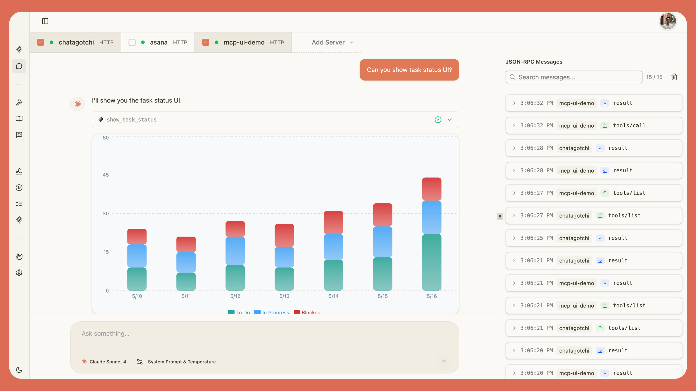
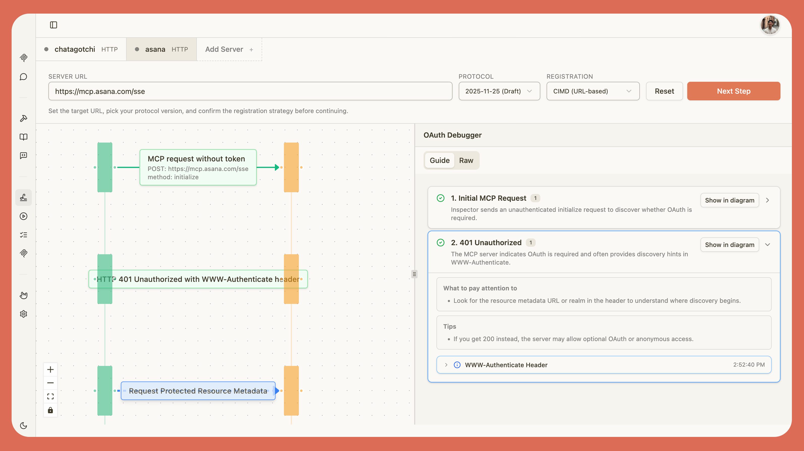
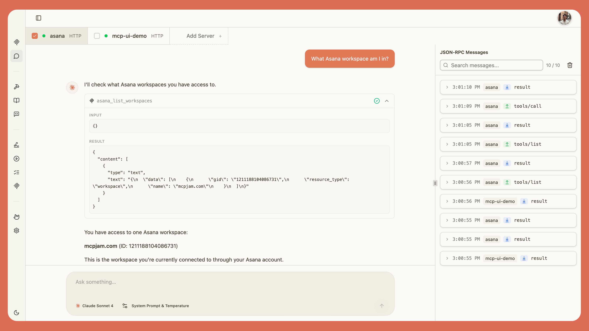

<div align="center">

<picture>
  <source media="(prefers-color-scheme: dark)" srcset="./client/public/mcp_jam_dark.png">
  <source media="(prefers-color-scheme: light)" srcset="./client/public/mcp_jam_light.png">
  
</picture>

<br/>

www.mcpjam.com

[](https://www.npmjs.com/package/@mcpjam/inspector)
[](https://opensource.org/licenses/Apache-2.0)
[](https://discord.gg/JEnDtz8X6z)

</div>

MCPJam Inspector is the local development platform for ChatGPT apps, MCP apps (Claude), and MCP servers. Build and test your apps with a full widget emulator, chat with any LLM, and inspect your server’s tools, resources, prompts, and OAuth flows. MCPJam is the fastest way to iterate on any MCP project.

### 🚀 Quick Start

Start up the MCPJam inspector:

```bash
npx @mcpjam/inspector@latest
```


# Table of contents

- [Installation Guides](#installation-guides)
- [Key Features](#key-features)
  - [OpenAI Apps & MCP-UI](#openai-apps--mcp-ui)
  - [OAuth Debugger](#oauth-debugger)
  - [LLM Playground](#llm-playground)
- [Contributing](#contributing-)
- [Links](#links-)
- [Community](#community-)
- [Shoutouts](#shoutouts-)
- [License](#-license)

# Installation Guides

### Requirements

[](https://nodejs.org/)
[](https://www.typescriptlang.org/)

## Install via NPM

We recommend starting MCPJam inspector via `npx`:

```bash
npx @mcpjam/inspector@latest
```

We also have a Mac and Windows desktop app:

- [Install Mac](https://github.com/MCPJam/inspector/releases/latest/download/MCPJam.Inspector.dmg)
- [Install Windows](https://github.com/MCPJam/inspector/releases/latest/download/MCPJam-Inspector-Setup.exe)

# Key features

| Capability             | Description                                                                                                |
| ---------------------- | ---------------------------------------------------------------------------------------------------------- |
| Multi-protocol servers | Connect to STDIO, SSE, and streamable HTTP MCP servers.                                                    |
| Flexible auth          | Supports OAuth 2.1 and bearer tokens, including custom scopes and client credentials.                      |
| Rich configuration     | Configure environment variables, custom headers, and timeouts.                                             |
| Manual tool invocation | Manually invoke MCP tools, resources, resource templates, and elicitation flows.                           |
| Server info            | View server icons, version, capabilities, instructions, and ChatGPT widget metadata exposed by the server. |

## OpenAI Apps & MCP-UI

Develop [OpenAI apps](https://developers.openai.com/apps-sdk/) or [MCP-UI](https://mcpui.dev/) apps locally. No ngrok needed. MCPJam is the only local-first OpenAI app emulator.



## OAuth Debugger

View every step of the OAuth handshake in detail, with guided explanations.



## LLM Playground

Try your server against any LLM model. We provide frontier models like GPT-5, Claude Sonnet, Gemini 2.5. No API key needed, it's on us.



# Contributing 👨‍💻

We're grateful for you considering contributing to MCPJam. Please read our [contributing guide](CONTRIBUTING.md).

You can also reach out to the contributors that hang out in our [Discord channel](https://discord.gg/JEnDtz8X6z).

# Links 🔗

- Roadmap (TBD)
- [Website](https://www.mcpjam.com/)
- [Blog](https://www.mcpjam.com/blog)
- [Pricing](https://www.mcpjam.com/pricing)
- [Docs](https://docs.mcpjam.com/)

# Community 🌍

- [Discord](https://discord.gg/JEnDtz8X6z)
- [𝕏 (Twitter)](https://x.com/mcpjams)
- [Blog](https://www.mcpjam.com/blog)
- [LinkedIn](https://www.linkedin.com/company/mcpjam)

# Shoutouts 📣

Some of our partners and favorite frameworks:

- [Stytch](https://stytch.com) - Our favorite MCP OAuth provider
- [DooiLabs/FastApps](https://github.com/DooiLabs/FastApps) - The Python framework to build OpenAI Apps.
- [xMCP](https://xmcp.dev/) - The Typescript MCP framework. Ship on Vercel instantly.
- [Alpic](https://alpic.ai/) - Host MCP servers

---

# License 📄

This project is licensed under the **Apache License 2.0** - see the [LICENSE](LICENSE).
