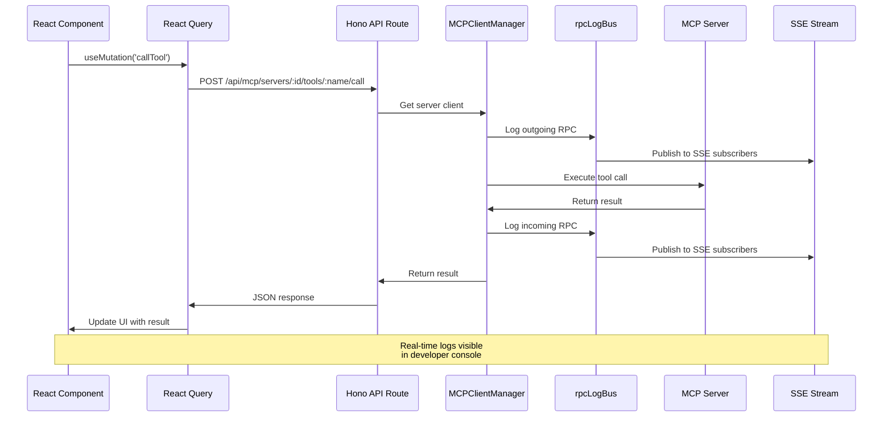
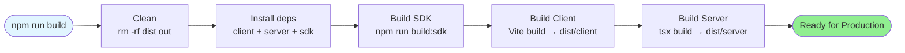
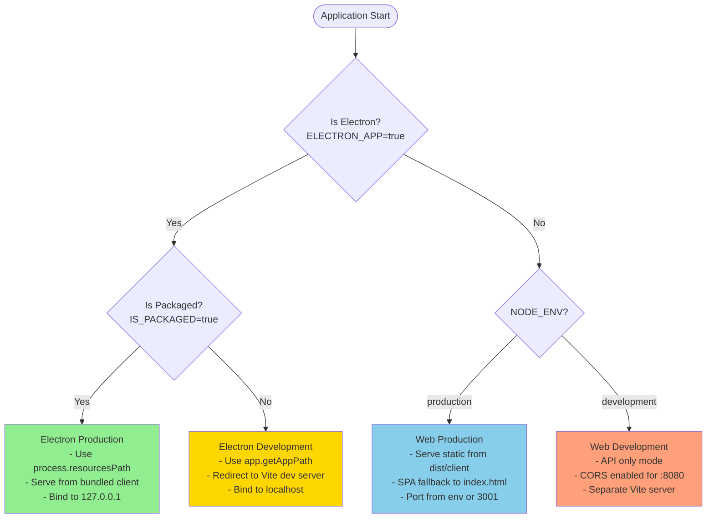
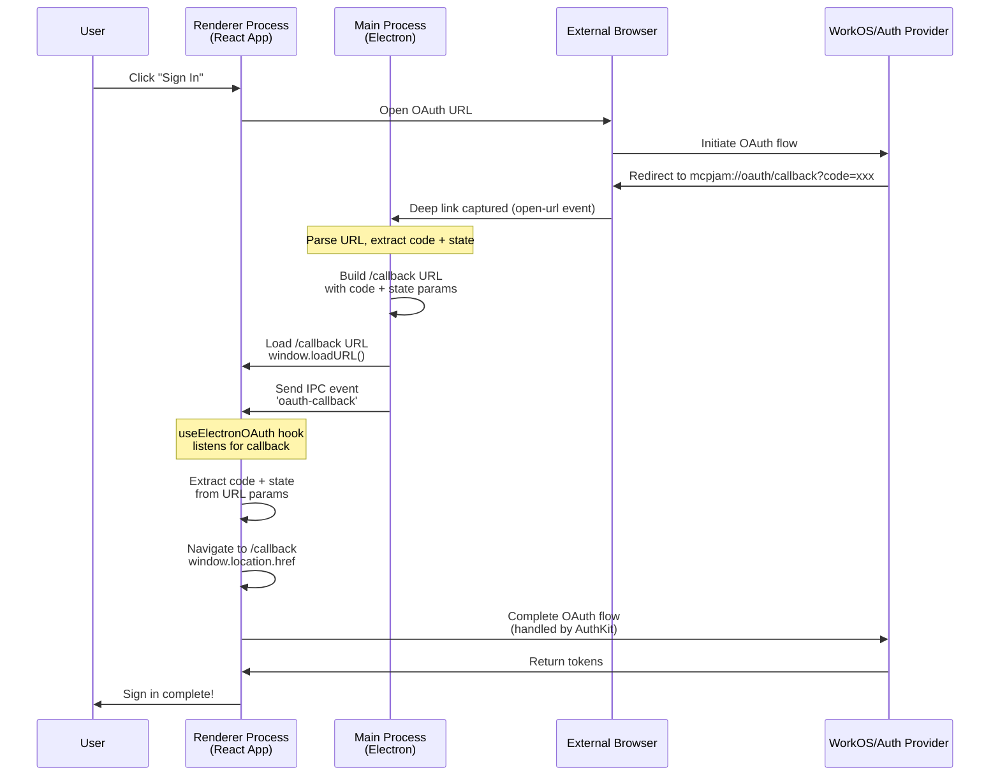
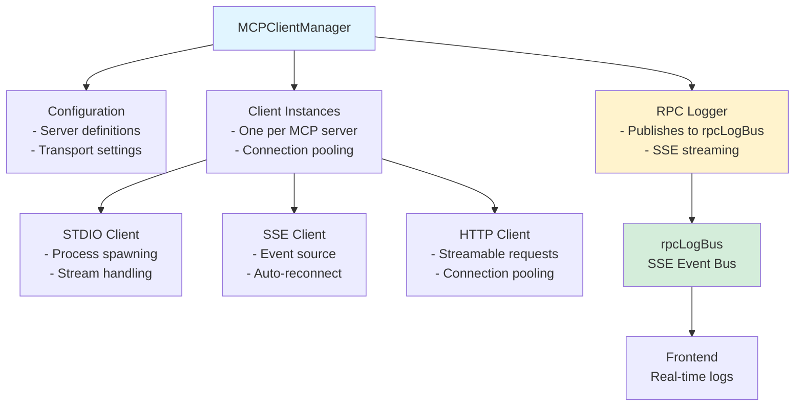
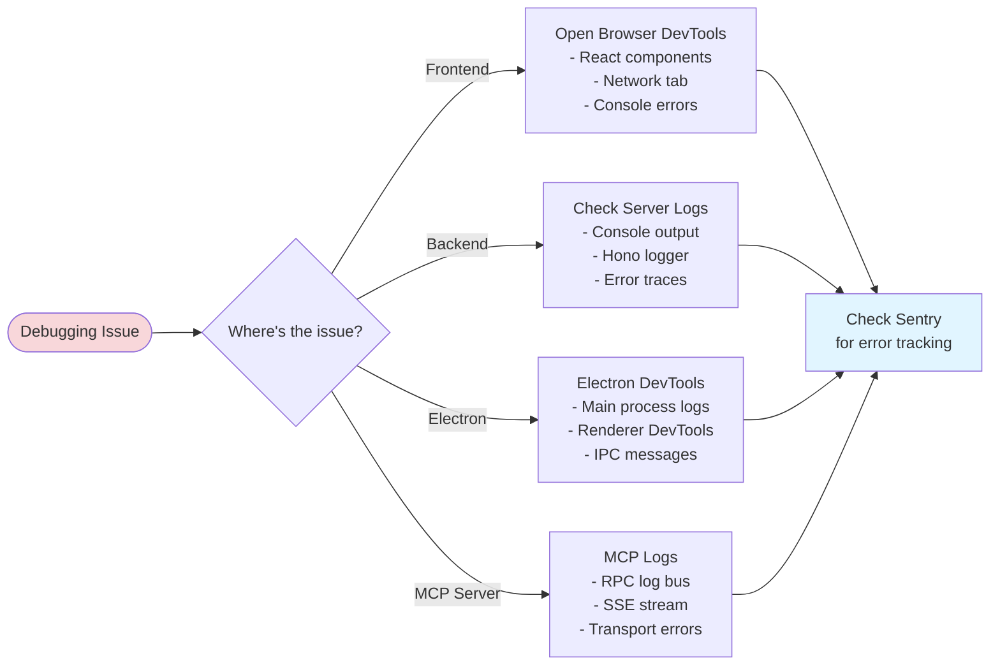
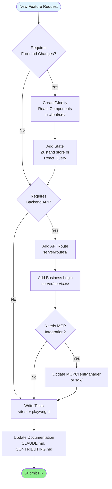

# Contributing to MCPJam Inspector

First off, thank you for considering contributing to MCPJam Inspector! It's people like you that make the open source community such a great place.

## Finding an issue to work on

1. You can find things to work on in our [issues tab](https://github.com/MCPJam/inspector/issues).
2. Look for issues labelled `good first issue` and `very easy`. These are great starter tasks that are low commitment
3. Once you find an issue you like to work on, comment on the issue and tag @matteo8p. Then assign yourself the issue. This helps avoid multiple contributors working on the same issue.

## Getting Started

Before you get started, please consider giving the project a star ⭐. It helps grow the project and gives your contributions more recognition.

Also join our [Discord channel](https://discord.com/invite/JEnDtz8X6z). That's where the community and other open source contributors communicate on.

### Prerequisites

Make sure to have the following:

- [Node.js](https://nodejs.org/) (LTS version recommended)
- [npm](https://www.npmjs.com/) (comes with Node.js)

### Fork, Clone, and Branch

1.  **Fork** the repository on GitHub.
2.  **Clone** your fork locally:
    ```bash
    git clone https://github.com/YOUR_USERNAME/inspector.git
    cd inspector
    ```
3.  Create a new **branch** for your changes:
    ```bash
    git checkout -b my-feature-branch
    ```

### Setup

Install the dependencies for all workspaces:

```bash
npm install
```

## Architecture Overview

Understanding the system architecture will help you contribute more effectively.

### High-Level Component Architecture

```mermaid
graph TB
    subgraph "Client Layer"
        React[React Frontend<br/>Vite + React 19]
        UI[UI Components<br/>Shadcn/Radix]
        Stores[State Management<br/>Zustand + React Query]
    end

    subgraph "Server Layer"
        Hono[Hono.js Backend<br/>API Server]
        MCPManager[MCPClientManager<br/>SDK Integration]
        Routes[API Routes<br/>/api/mcp/*]
    end

    subgraph "MCP Integration"
        SDK[@mastra/mcp SDK]
        Transports[Transport Protocols<br/>STDIO | SSE | HTTP]
        MCPServers[MCP Servers<br/>External Tools]
    end

    subgraph "External Services"
        Convex[Convex Backend<br/>Auth + Data]
        LLMs[LLM Providers<br/>OpenAI, Anthropic, etc.]
        Sentry[Sentry<br/>Error Tracking]
    end

    React --> Hono
    UI --> React
    Stores --> React
    Hono --> Routes
    Hono --> MCPManager
    MCPManager --> SDK
    SDK --> Transports
    Transports --> MCPServers
    Hono --> Convex
    MCPManager --> LLMs
    Hono --> Sentry
    React --> Sentry
```

### Project Structure

```mermaid
graph LR
    Root[/inspector]

    Root --> Client[/client<br/>React Frontend]
    Root --> Server[/server<br/>Hono Backend]
    Root --> Src[/src<br/>Electron Main]
    Root --> SDK[/sdk<br/>MCP SDK]
    Root --> Shared[/shared<br/>Common Utils]

    Client --> ClientSrc[/src<br/>Components, Hooks]
    Client --> ClientPublic[/public<br/>Assets]

    Server --> ServerRoutes[/routes<br/>API Endpoints]
    Server --> ServerServices[/services<br/>Business Logic]

    Src --> IPC[/ipc<br/>IPC Handlers]

    style Root fill:#e1f5ff
    style Client fill:#fff3cd
    style Server fill:#d4edda
    style Src fill:#f8d7da
    style SDK fill:#d1ecf1
```

### Deployment Modes

MCPJam Inspector supports three deployment modes:

```mermaid
graph TB
    subgraph "Development Mode"
        DevClient[Vite Dev Server<br/>:8080]
        DevServer[Hono Server<br/>:3000]
        DevClient -.HTTP.-> DevServer
    end

    subgraph "Web Production"
        WebServer[Hono Server<br/>:3001]
        WebStatic[Static Files<br/>dist/client]
        WebServer --> WebStatic
    end

    subgraph "Electron App"
        ElectronMain[Electron Main<br/>Process]
        ElectronRenderer[Renderer<br/>BrowserWindow]
        EmbeddedHono[Embedded Hono<br/>127.0.0.1:3000]

        ElectronMain --> EmbeddedHono
        ElectronMain --> ElectronRenderer
        ElectronRenderer -.HTTP.-> EmbeddedHono
    end

    subgraph "Docker"
        DockerContainer[Container]
        DockerHono[Hono Server<br/>:3001]
        DockerContainer --> DockerHono
    end

    style DevClient fill:#fff3cd
    style DevServer fill:#d4edda
    style ElectronMain fill:#f8d7da
    style ElectronRenderer fill:#fff3cd
    style EmbeddedHono fill:#d4edda
```



### Request Flow: Client to MCP Server

Understanding how a request flows through the system:



## Development

### Quick Start

To run the client and server in development mode with hot-reloading, use:

```bash
npm run dev
```

This runs:

- **Client**: Vite dev server on `:8080`
- **Server**: Hono dev server on `:3000`

For Windows users, there's a specific script:

```bash
npm run dev:windows
```

### Electron Development

To run the Electron app in development mode:

```bash
npm run electron:dev
```

This runs:

- Electron main process
- Embedded Hono server
- Vite dev server for renderer

### Building the Project

To build all parts of the project (client, server, and SDK), run:

```bash
npm run build
```

Build process flow:



You can also build each part individually:

- `npm run build:client` - Build React frontend
- `npm run build:server` - Build Hono backend
- `npm run build:sdk` - Build MCP SDK wrapper

## Testing

Before submitting your changes, please run the tests to ensure everything is working correctly.

```bash
npm test
```

This command will also check for any code formatting issues.

## Electron Architecture Deep Dive

One of the unique aspects of MCPJam Inspector is its Electron integration. Understanding this architecture is crucial for contributing to desktop app features.

### How Deployment Mode is Determined



### OAuth Flow in Electron

One of the most complex features is handling OAuth authentication in Electron. Here's how it works:



**Key OAuth Files:**

- `src/main.ts:31-33` - Protocol registration
- `src/main.ts:273-313` - Deep link handler
- `client/src/hooks/useElectronOAuth.ts` - React hook for OAuth events

### Environment Configuration

Different modes require different environment setups:

```mermaid
flowchart TD
    Start([Application Start])

    Start --> CheckMode{Deployment Mode?}

    CheckMode -->|Electron Packaged| ElectronProd[Load from:<br/>process.resourcesPath/<br/>.env.production]
    CheckMode -->|Electron Dev| ElectronDev[Load from:<br/>app.getAppPath()/<br/>.env.development]
    CheckMode -->|Web/Docker| WebMode[Load from:<br/>packageRoot/<br/>.env.production or .env.development]

    ElectronProd --> Validate{CONVEX_HTTP_URL<br/>exists?}
    ElectronDev --> Validate
    WebMode --> Validate

    Validate -->|No| Error[Throw Error<br/>Show env path + debug info]
    Validate -->|Yes| SetEnv[Set Environment:<br/>- ELECTRON_APP<br/>- IS_PACKAGED<br/>- ELECTRON_RESOURCES_PATH<br/>- NODE_ENV]

    SetEnv --> FixPath[Fix PATH<br/>fixPath() for GUI apps]
    FixPath --> Ready([Ready to Start])

    style Error fill:#f8d7da
    style Ready fill:#90EE90
```

## Key Components

### MCPClientManager

The central manager for all MCP server connections lives in the SDK.



### Key Files Reference

| File                         | Purpose                         | Line Numbers to Know                    |
| ---------------------------- | ------------------------------- | --------------------------------------- |
| `server/index.ts`            | Main server entry (npm package) | 180-192 (MCPClientManager init)         |
| `server/app.ts`              | Hono app factory (shared)       | 67-79 (MCPClientManager setup)          |
| `src/main.ts`                | Electron main process           | 62-92 (Server startup), 273-313 (OAuth) |
| `client/src/App.tsx`         | React app entry point           | -                                       |
| `server/routes/mcp/index.ts` | MCP API routes                  | -                                       |
| `sdk/src/index.ts`           | MCP SDK integration             | -                                       |
| `CLAUDE.md`                  | AI assistant instructions       | -                                       |
| `forge.config.ts`            | Electron build config           | -                                       |

## Code Style

We use [Prettier](https://prettier.io/) to maintain a consistent code style. Before you commit your changes, please format your code by running:

```bash
npm run prettier-fix
```

## Commit Messages

We follow the [Conventional Commits](https://www.conventionalcommits.org/en/v1.0.0/) specification. This helps us automate changelog generation and keep the commit history clean and readable.

Your commit messages should be structured as follows:

```
<type>[optional scope]: <description>

[optional body]

[optional footer(s)]
```

**Example:**
`feat(client): add new button to the main component`
`fix(server): resolve issue with API endpoint`

## Common Development Tasks

### Running Different Modes

```bash
# Web development (most common for API/UI work)
npm run dev
# Runs: client dev server (:8080) + server dev (:3000)

# Electron development (for desktop app features)
npm run electron:dev
# Runs: Electron app with embedded server + Vite renderer

# Docker development (for testing containerized deployment)
npm run docker:up:dev
# Runs: Docker container with hot reload

# Production build
npm run build
npm start
```

### Debugging Strategies



### Adding a New Feature

Here's the typical workflow for adding a new feature:



## Environment Variables

To run the project, you'll need to set up environment variables. Create a `.env.development` file in the root:

```bash
# Required
CONVEX_HTTP_URL=https://your-convex-url.convex.cloud

# Optional (set automatically by the app)
ELECTRON_APP=true              # Set by Electron main process
IS_PACKAGED=true               # Set by Electron when packaged
ELECTRON_RESOURCES_PATH=/path  # Set by Electron for resource location
NODE_ENV=production|development # Determines build mode
PORT=3001                      # Server port (default: 3001)

# Debug flags
DEBUG_MCP_SELECTION=1          # Enable MCP selection debugging
```

## Pull Request Process

1.  Ensure all tests are passing (`npm test`).
2.  Make sure your code is formatted (`npm run prettier-fix`).
3.  Push your branch to your fork: `git push origin my-feature-branch`
4.  Open a **Pull Request** to the `main` branch of the original repository.
5.  In your PR description:
    - Explain the changes you've made
    - Link any relevant issues (e.g., "Fixes #123")
    - Include screenshots/videos for UI changes
    - Describe how you tested the changes

## Documentation

For more detailed information, see our comprehensive documentation:

- **[System Architecture](./ARCHITECTURE.md)** - Complete technical architecture guide
- **[Online Docs](https://docs.mcpjam.com)** - Full documentation site
  - [System Architecture](https://docs.mcpjam.com/contributing/system-architecture) - Multi-mode architecture guide
  - [Engineering Onboarding](https://docs.mcpjam.com/contributing/onboarding) - Get started guide
  - [MCP Client Manager](https://docs.mcpjam.com/contributing/mcp-client-manager) - MCP integration details
  - [OAuth Architecture](https://docs.mcpjam.com/contributing/oauth-architecture) - Authentication flow
  - [Playground Architecture](https://docs.mcpjam.com/contributing/playground-architecture) - LLM playground
  - [Evals Architecture](https://docs.mcpjam.com/contributing/evals-architecture) - Evaluation framework

## Getting Help

- **GitHub Issues**: https://github.com/MCPJam/inspector/issues
- **Discord**: https://discord.com/invite/JEnDtz8X6z
- **Discussions**: Use GitHub Discussions for questions
- **Documentation**: https://docs.mcpjam.com

Thank you for your contribution!
