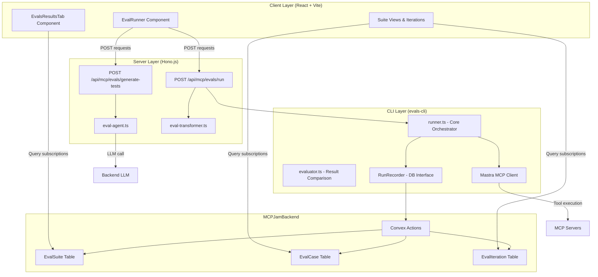
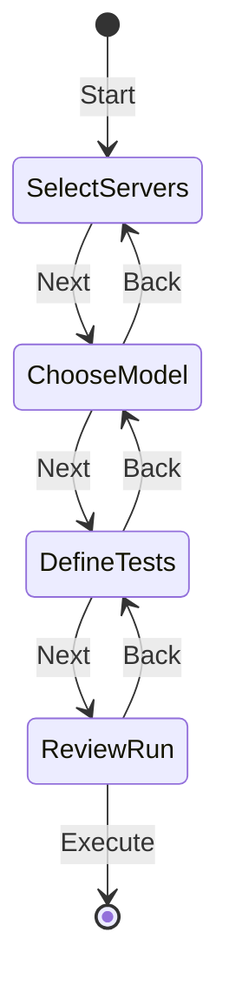
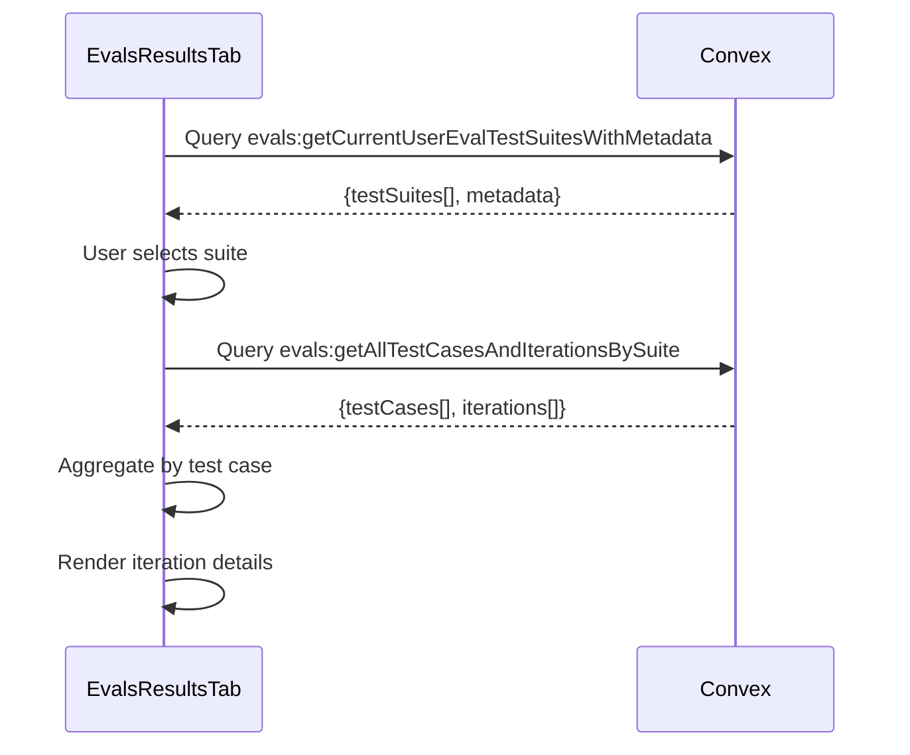
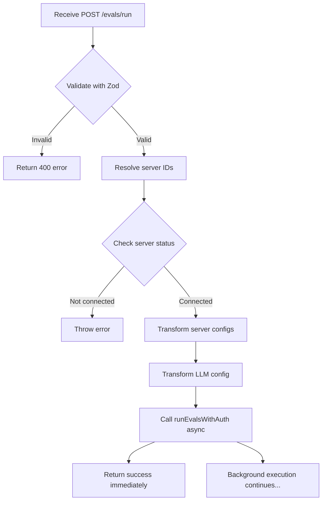
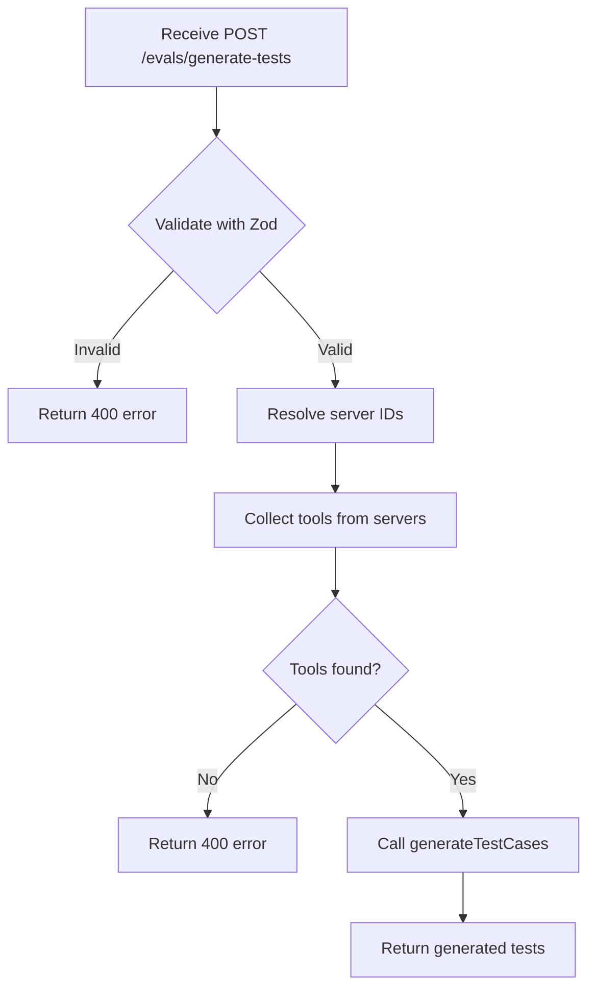
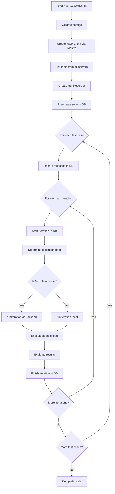
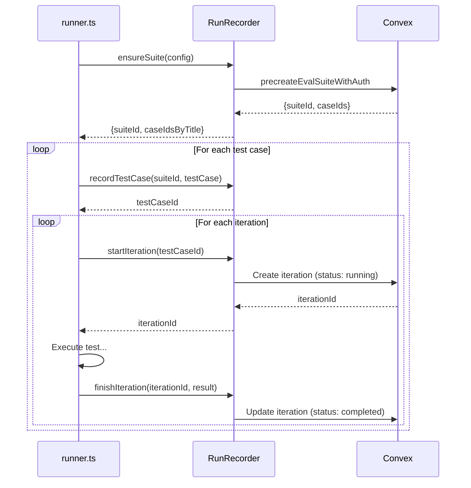
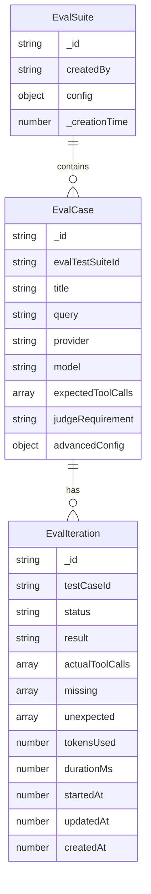
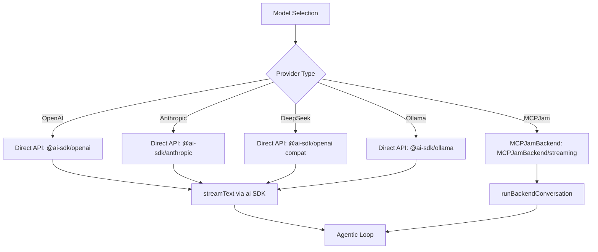
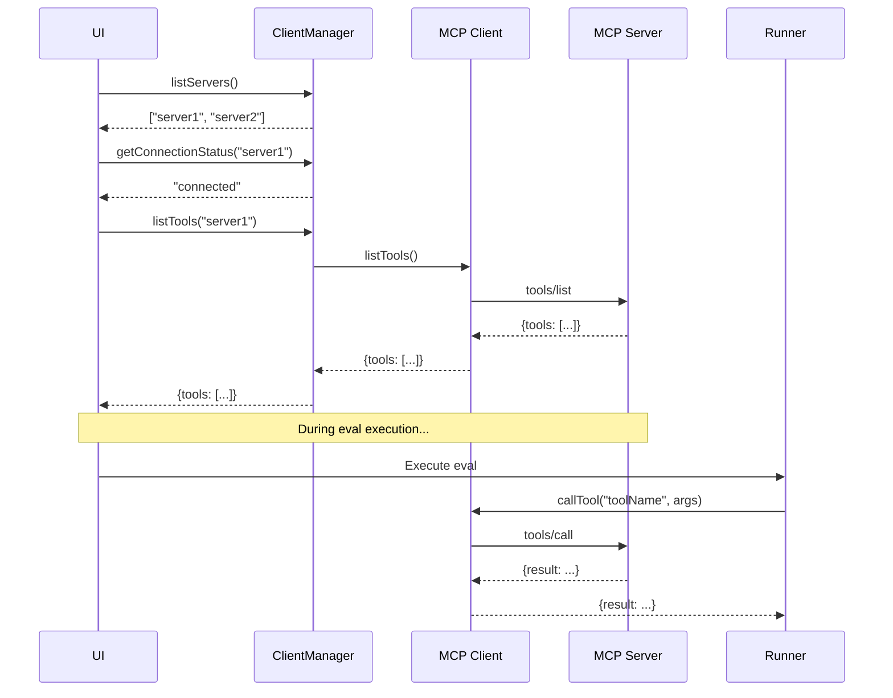

# Evals System Architecture

The Evals system in MCPJam Inspector is a comprehensive testing framework designed to evaluate MCP (Model Context Protocol) server implementations. This guide provides a deep dive into the architecture, data flows, and key components to help you contribute effectively.

## Overview

The Evals system allows developers to:

- **Run automated tests** against MCP servers to validate tool implementations
- **Generate test cases** using AI based on available server tools
- **Track results** in real-time with detailed metrics and analytics
- **Compare expected vs actual behavior** using agentic LLM loops

### Key Features

- Multi-step wizard UI for test configuration
- Support for multiple LLM providers (OpenAI, Anthropic, DeepSeek, Ollama)
- Real-time result tracking via MCPJamBackend
- AI-powered test case generation
- Agentic execution with up to 20 conversation turns
- Token usage and performance metrics

---

## Architecture Overview

The Evals system is composed of three main layers:



---

## System Components

### 1. Client Layer (UI)

#### **EvalRunner Component** (`client/src/components/evals/eval-runner.tsx`)

The primary UI for configuring and launching evaluation runs.

**Architecture: 4-Step Wizard**



**Step Details:**

1. **Select Servers**: Choose from connected MCP servers
   - Filters: Only shows connected servers
   - Validation: At least one server required

2. **Choose Model**: Select LLM provider and model
   - Providers: OpenAI, Anthropic, DeepSeek, Ollama, MCPJam
   - Credential check: Validates API keys via `hasToken()`

3. **Define Tests**: Create or generate test cases
   - Manual entry: Title, query, expected tool calls, number of runs
   - AI generation: Click "Generate Tests" to create 6 test cases (2 easy, 2 medium, 2 hard)

4. **Review & Run**: Confirm and execute
   - Displays summary of configuration
   - POST to `/api/mcp/evals/run`

#### **Results Components** (`client/src/components/evals/*`)

Real-time display of evaluation results.

**Component Hierarchy:**

```
EvalsResultsTab
├─ SuitesOverview (List of all suites)
│  └─ SuiteRow (Individual suite card)
│
└─ SuiteIterationsView (Detailed view)
   ├─ Test case aggregates
   └─ IterationCard (Individual run results)
      └─ IterationDetails (Expandable details)
```

**Data Flow:**



---

### 2. Server Layer (API)

#### **Evals Routes** (`server/routes/mcp/evals.ts`)

HTTP API endpoints for eval execution and test generation.

##### **Endpoint: POST `/api/mcp/evals/run`**

**Request Schema:**

```typescript
{
  tests: Array<{
    title: string
    query: string
    runs: number
    model: string
    provider: string
    expectedToolCalls: string[]
    judgeRequirement?: string
    advancedConfig?: {
      system?: string
      temperature?: number
      toolChoice?: string
    }
  }>
  serverIds: string[]
  llmConfig: {
    provider: string
    apiKey: string
  }
  convexAuthToken: string
}
```

**Processing Flow:**



**Key Functions:**

- `resolveServerIdsOrThrow()`: Case-insensitive server ID matching
- `transformServerConfigsToEnvironment()`: Converts server manager format to CLI format
- `transformLLMConfigToLlmsConfig()`: Routes API keys appropriately

##### **Endpoint: POST `/api/mcp/evals/generate-tests`**

**Request Schema:**

```typescript
{
  serverIds: string[]
  convexAuthToken: string
}
```

**Processing Flow:**



#### **Test Generation Agent** (`server/services/eval-agent.ts`)

Generates test cases using backend LLM.

**Algorithm:**

1. Groups tools by server ID
2. Creates system prompt with MCP agent instructions
3. Creates user prompt with tool definitions and requirements
4. Calls backend LLM (meta-llama/llama-3.3-70b-instruct)
5. Parses JSON response
6. Returns 6 test cases (2 easy, 2 medium, 2 hard)

**LLM Prompt Structure:**

```
System: You are an MCP agent testing assistant...

User:
Available tools:
[Tool definitions with schemas]

Requirements:
- 2 EASY test cases (single tool, straightforward)
- 2 MEDIUM test cases (2-3 tools, some complexity)
- 2 HARD test cases (3+ tools, complex workflows)

Return JSON array of test cases.
```

---

### 3. CLI Layer (Execution Engine)

#### **Runner** (`evals-cli/src/evals/runner.ts`)

The core orchestrator that executes evaluation tests.

**Entry Points:**

1. `runEvalsWithApiKey()`: CLI mode with API key authentication
2. `runEvalsWithAuth()`: UI mode with Convex authentication

**Execution Flow:**



**Agentic Loop (Local Models):**

```mermaid
sequenceDiagram
    participant Runner as runner.ts
    participant LLM as LLM Provider
    participant MCP as MCP Client
    participant DB as Database

    Runner->>LLM: streamText(prompt, tools)

    loop Up to 20 turns
        LLM-->>Runner: Response with tool calls
        Runner->>Runner: Extract tool names & inputs

        loop For each tool call
            Runner->>MCP: Execute tool
            MCP-->>Runner: Tool result
            Runner->>Runner: Add to message history
        end

        Runner->>LLM: Continue with tool results
        LLM-->>Runner: Next response

        alt finishReason !== "tool-calls"
            break Exit loop
        end
    end

    Runner->>Runner: Evaluate: expected vs actual
    Runner->>DB: Update iteration with results
```

**Key Features:**

- Max 20 conversation turns to prevent infinite loops
- Token usage tracking (prompt + completion)
- Duration measurement
- Tool call recording

#### **Evaluator** (`evals-cli/src/evals/evaluator.ts`)

Compares expected vs actual tool calls to determine pass/fail status.

**Logic:**

```typescript
function evaluateResults(
  expectedToolCalls: string[],
  actualToolCalls: string[],
): {
  passed: boolean;
  missing: string[];
  unexpected: string[];
} {
  const passed = expectedToolCalls.every((tool) =>
    actualToolCalls.includes(tool),
  );

  const missing = expectedToolCalls.filter(
    (tool) => !actualToolCalls.includes(tool),
  );

  const unexpected = actualToolCalls.filter(
    (tool) => !expectedToolCalls.includes(tool),
  );

  return { passed, missing, unexpected };
}
```

**Pass Criteria:**

- ✅ All expected tools must be called
- ⚠️ Additional unexpected tools are allowed (marked but don't fail)

#### **RunRecorder** (`evals-cli/src/db/tests.ts`)

Database interface for persisting evaluation results.

**Two Modes:**

1. **API Key Mode** (`createRunRecorder`): Uses CLI-based database client
2. **Auth Mode** (`createRunRecorderWithAuth`): Uses Convex HTTP client

**Methods:**

```typescript
interface RunRecorder {
  ensureSuite(config: EvalConfig): Promise<{
    suiteId: string;
    caseIdsByTitle: Map<string, string>;
  }>;

  recordTestCase(
    suiteId: string,
    testCase: TestCase,
  ): Promise<string | undefined>;

  startIteration(testCaseId: string): Promise<string | undefined>;

  finishIteration(
    iterationId: string,
    result: {
      result: "passed" | "failed" | "cancelled";
      actualToolCalls: string[];
      tokensUsed: number;
      durationMs: number;
    },
  ): Promise<void>;
}
```

**Database Flow:**



---

## Data Models

### Database Schema



### TypeScript Interfaces

```typescript
// Suite configuration
type EvalSuite = {
  _id: string;
  createdBy: string; // User ID from auth
  config: {
    tests: EvalCase[];
    environment: {
      servers: string[];
    };
  };
  _creationTime: number;
};

// Individual test case
type EvalCase = {
  _id: string;
  evalTestSuiteId: string; // FK to EvalSuite
  title: string;
  query: string;
  provider: string;
  model: string;
  expectedToolCalls: string[];
  judgeRequirement?: string;
  advancedConfig?: {
    system?: string;
    temperature?: number;
    toolChoice?: string;
  };
};

// Single test run result
type EvalIteration = {
  _id: string;
  testCaseId: string; // FK to EvalCase
  status: "pending" | "running" | "completed" | "failed" | "cancelled";
  result: "pending" | "passed" | "failed" | "cancelled";
  actualToolCalls: string[];
  missing: string[]; // Expected tools not called
  unexpected: string[]; // Unexpected tools called
  tokensUsed: number;
  durationMs: number;
  startedAt?: number;
  updatedAt: number;
  createdAt: number;
};
```

---

## Integration Points

### LLM Providers

The system supports multiple execution paths based on the selected model:



**Provider Configuration:**

```typescript
// OpenAI
{
  provider: "openai",
  apiKey: "sk-...",
  model: "gpt-4"
}

// Anthropic
{
  provider: "anthropic",
  apiKey: "sk-ant-...",
  model: "claude-3-5-sonnet-20241022"
}

// MCPJam (Backend)
{
  provider: "@mcpjam/meta-llama",
  model: "@mcpjam/llama-3.3-70b-instruct"
  // Uses Convex auth token instead of API key
}
```

### MCP Server Integration

**Connection Workflow:**



**Transport Support:**

1. **STDIO**: Command execution with stdin/stdout

   ```typescript
   {
     transport: "stdio",
     command: "node",
     args: ["server.js"]
   }
   ```

2. **HTTP/SSE**: Server-Sent Events

   ```typescript
   {
     transport: "sse",
     endpoint: "http://localhost:3000/sse"
   }
   ```

3. **Streamable HTTP**: Custom streaming protocol
   ```typescript
   {
     transport: "streamable-http",
     endpoint: "http://localhost:3000/stream"
   }
   ```

### MCPJam Backend

**Database Actions:**

```typescript
// Pre-create suite with all test cases and iterations
evals:precreateEvalSuiteWithAuth(
  config: EvalConfig,
  userId: string
): Promise<{
  suiteId: string
  caseIdsByTitle: Map<string, string>
}>

// Update iteration results
evals:updateEvalTestIterationResultWithAuth(
  iterationId: string,
  result: {
    result: "passed" | "failed" | "cancelled"
    actualToolCalls: string[]
    missing: string[]
    unexpected: string[]
    tokensUsed: number
    durationMs: number
  }
): Promise<void>

// Query user's suites
evals:getCurrentUserEvalTestSuitesWithMetadata(): Promise<{
  testSuites: EvalSuite[]
  metadata: {
    iterationsPassed: number
    iterationsFailed: number
  }
}>

// Query suite details
evals:getAllTestCasesAndIterationsBySuite(
  suiteId: string
): Promise<{
  testCases: EvalCase[]
  iterations: EvalIteration[]
}>
```

---

## Contributing Guide

### Adding a New LLM Provider

1. **Update LLM config schema** in `evals-cli/src/utils/validators.ts`:

```typescript
const LlmsConfigSchema = z.object({
  // Add your provider
  myProvider: z
    .object({
      apiKey: z.string(),
      model: z.string(),
    })
    .optional(),
});
```

2. **Add provider case** in `evals-cli/src/evals/runner.ts`:

```typescript
function getModelForProvider(
  llms: LlmsConfig,
  provider: string,
  modelId: string,
) {
  switch (provider) {
    case "myProvider":
      return myProvider.chat(modelId, {
        apiKey: llms.myProvider?.apiKey,
      });
    // ...
  }
}
```

3. **Add to UI model list** in `client/src/hooks/use-chat.tsx`:

```typescript
const availableModels: ModelDefinition[] = [
  {
    provider: "MyProvider",
    providerId: "myProvider",
    models: [{ name: "My Model", id: "my-model-v1" }],
  },
];
```

### Adding a New MCP Transport

1. **Update server definition schema** in `evals-cli/src/utils/validators.ts`:

```typescript
const MyTransportSchema = z.object({
  type: z.literal("my-transport"),
  endpoint: z.string().url(),
  // Add transport-specific config
});

export const ServerDefinitionSchema = z.discriminatedUnion("type", [
  StdioServerDefinitionSchema,
  HttpServerDefinitionSchema,
  MyTransportSchema, // Add new transport
]);
```

2. **Implement transport** in Mastra MCP client (external library).

3. **Update config transformer** in `server/utils/eval-transformer.ts`:

```typescript
function transformServerConfigsToEnvironment(
  serverIds: string[],
  clientManager: MCPClientManager,
): MCPClientOptions {
  for (const serverId of serverIds) {
    const server = clientManager.getServer(serverId);

    if (server.transport.type === "my-transport") {
      // Transform to CLI format
    }
  }
}
```

### Debugging Evals

**Enable verbose logging:**

```typescript
// In runner.ts
const DEBUG = true;

if (DEBUG) {
  console.log("LLM Response:", response);
  console.log("Tool Calls:", toolCalls);
  console.log("Message History:", messages);
}
```

**Inspect MCP client:**

```typescript
// In runner.ts
console.log("Available tools:", tools);
console.log("Server status:", mcpClient.getConnectionStatus());
```

### Testing Changes

**Run evals locally:**

```bash
cd evals-cli
npm run build
npm link

# Run test
mcpjam evals run \
  --tests examples/tests.json \
  --environment examples/environment.json \
  --llms examples/llms.json \
  --api-key your-api-key
```

**Test via UI:**

1. Start development server: `npm run dev`
2. Navigate to "Run evals" tab
3. Configure and execute test
4. Check browser console for errors
5. View results in "Eval results" tab

### Common Issues

**Issue: Test cases are not created**

- Check Convex auth token validity
- Verify `CONVEX_URL` and `CONVEX_HTTP_URL` environment variables
- Inspect browser network tab for failed requests

**Issue: Tools are not being called**

- Verify server connection status in ClientManager
- Check tool definitions in `listTools()` response
- Ensure tool names match exactly (case-sensitive)

**Issue: Backend LLM fails**

- Confirm `/streaming` endpoint is accessible
- Check Convex auth token in request headers
- Verify model ID format (`@mcpjam/...`)

---

## Performance Considerations

### Optimization Strategies

1. **Parallel Execution**: Run multiple test cases concurrently

   ```typescript
   await Promise.all(testCases.map((testCase) => runTestCase(testCase)));
   ```

2. **Tool Batching**: Execute independent tools in parallel

   ```typescript
   const results = await Promise.all(
     toolCalls.map((call) => mcpClient.callTool(call)),
   );
   ```

3. **Database Batching**: Batch iteration updates

   ```typescript
   await Promise.all(iterations.map((it) => recorder.finishIteration(it)));
   ```

4. **Caching**: Cache tool definitions between iterations
   ```typescript
   const toolsCache = new Map<string, Tool[]>();
   ```

### Metrics

Key performance indicators:

- **Average iteration duration**: Time from start to finish
- **Token usage per iteration**: Prompt + completion tokens
- **Tool execution time**: Time spent in MCP calls
- **Database write time**: Time to persist results
- **LLM response time**: Time for each model call

Monitor these in the UI via `helpers.ts` aggregation functions.

---

## Security Considerations

### API Key Management

- **Never commit API keys** to version control
- Store keys in **localStorage** (client) or **environment variables** (CLI)
- Use **Convex auth tokens** for backend models (no API key exposure)

### Input Validation

All inputs are validated with **Zod schemas**:

```typescript
// Example: Test case validation
const TestCaseSchema = z.object({
  title: z.string().min(1).max(200),
  query: z.string().min(1),
  runs: z.number().int().positive().max(100),
  expectedToolCalls: z.array(z.string()).min(1),
});
```

### Error Handling

- **Never expose internal errors** to the client
- **Sanitize error messages** before logging
- **Catch all exceptions** in async functions
- **Validate all external inputs** (LLM responses, tool results)

---

## Future Enhancements

Potential areas for contribution:

1. **Parallel Test Execution**: Run multiple test cases simultaneously
2. **Custom Evaluators**: Support for user-defined pass/fail criteria
3. **Retry Logic**: Automatic retry on transient failures
4. **Result Comparison**: Compare results across different models
5. **Historical Analysis**: Trend analysis of eval performance over time
6. **Export Results**: Download results as CSV/JSON
7. **Shareable Suites**: Share test configurations with team members
8. **Scheduling**: Run evals on a schedule (cron-like)

---

## Glossary

| Term                 | Definition                                                       |
| -------------------- | ---------------------------------------------------------------- |
| **Eval Suite**       | A collection of test cases executed together                     |
| **Test Case**        | A single test with a query and expected tool calls               |
| **Iteration**        | One execution of a test case (test cases can have multiple runs) |
| **Agentic Loop**     | Iterative LLM conversation with tool calling                     |
| **Tool Call**        | Invocation of an MCP server tool by the LLM                      |
| **Expected Tools**   | Tools that should be called for a test to pass                   |
| **Actual Tools**     | Tools that were actually called during execution                 |
| **Missing Tools**    | Expected tools that were not called (causes failure)             |
| **Unexpected Tools** | Tools called but not expected (logged, doesn't fail)             |
| **RunRecorder**      | Interface for persisting eval results to database                |
| **MCPClient**        | Mastra client for communicating with MCP servers                 |

---

## Resources

- **MCP Specification**: [https://spec.modelcontextprotocol.io](https://spec.modelcontextprotocol.io)
- **Mastra MCP Client**: [https://mastra.dev](https://mastra.dev)
- **Convex Database**: [https://convex.dev](https://convex.dev)
- **Vercel AI SDK**: [https://sdk.vercel.ai](https://sdk.vercel.ai)

---

## Questions?

If you have questions or need help contributing:

1. Check the [GitHub Issues](https://github.com/MCPJam/inspector/issues)
2. Join our [Discord community](https://discord.gg/JEnDtz8X6z)
3. Read the main [Contributing Guide](./CONTRIBUTING.md)
