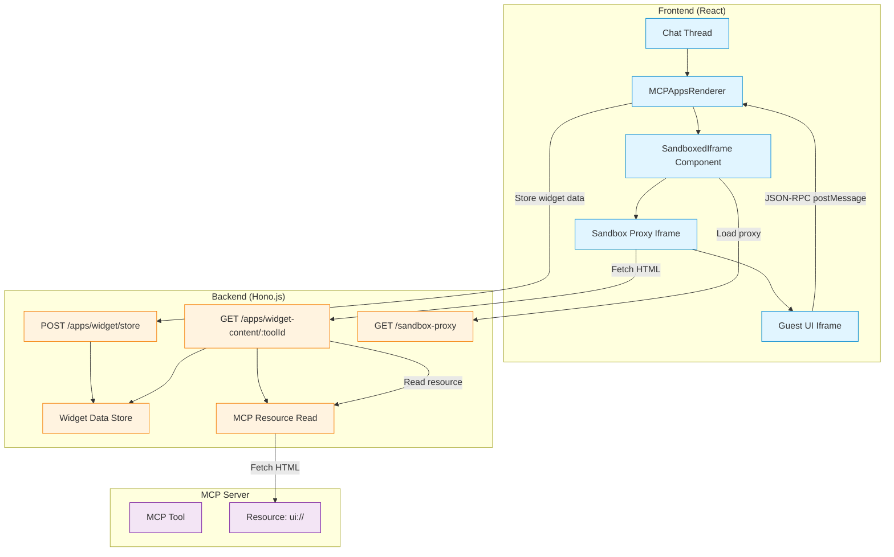
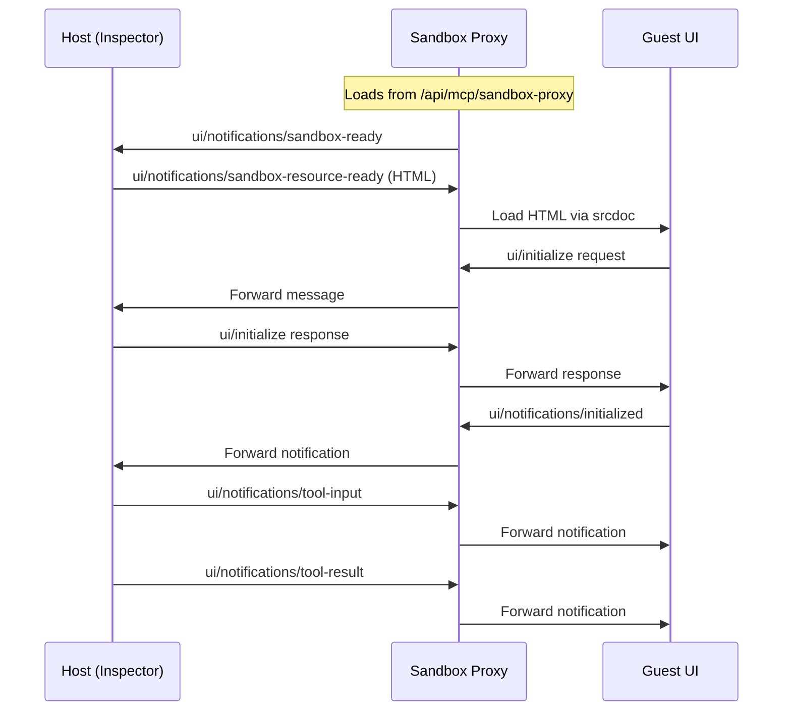

# MCP Apps Architecture

This guide explains how MCPJam Inspector implements MCP Apps (SEP-1865) to render custom UI widgets for MCP tool results. MCP Apps use JSON-RPC 2.0 over postMessage with a double-iframe sandbox architecture for security isolation.

<Note>
  MCPJam Inspector also supports [OpenAI Apps SDK](./openai-sdk-architecture)
  and [MCP-UI](./playground-architecture#mcp-ui-integration) for custom UI
  rendering. MCP Apps takes priority when a tool has `ui/resourceUri` metadata.
</Note>

## Overview

MCP Apps enables MCP servers to provide rich, interactive widgets for tool results. The implementation uses a secure double-iframe architecture where the outer iframe (sandbox proxy) isolates the inner iframe (guest UI) from the host page.

### Key features

- **Double-iframe sandbox**: Security isolation via sandbox proxy at different origin
- **JSON-RPC 2.0 protocol**: Standardized communication over postMessage
- **Tool and resource access**: Widgets can call MCP tools and read resources
- **Theme synchronization**: Automatic light/dark mode updates
- **Display modes**: Inline, Picture-in-Picture, and fullscreen support

### Detection priority

When rendering tool results, the Inspector checks for UI metadata in this order:

1. **MCP Apps**: `ui/resourceUri` in tool metadata
2. **OpenAI Apps SDK**: `openai/outputTemplate` in tool metadata
3. **MCP-UI**: Inline `ui://` resource in tool result

## Architecture overview



## Double-iframe sandbox

The double-iframe architecture provides security isolation:

1. **Host page**: MCPJam Inspector React application
2. **Sandbox proxy**: Outer iframe at `/api/mcp/sandbox-proxy` with minimal permissions
3. **Guest UI**: Inner iframe with widget HTML loaded via `srcdoc`

### Message flow



### SandboxedIframe component

Located in `client/src/components/ui/sandboxed-iframe.tsx`:

```typescript
export const SandboxedIframe = forwardRef<SandboxedIframeHandle, SandboxedIframeProps>(
  function SandboxedIframe({ html, sandbox, onMessage, ... }, ref) {
    // Outer iframe loads sandbox proxy
    // Waits for ui/notifications/sandbox-ready
    // Sends HTML via ui/notifications/sandbox-resource-ready
    // Forwards all non-sandbox messages to parent handler
  }
);
```

## Widget data flow

### 1. Tool execution and detection

When a tool is executed, the system checks for MCP Apps support:

```typescript
// In thread.tsx
const uiType = detectUIType(partToolMeta, (part as any).output);

if (uiType === "mcp-apps" && partToolMeta?.["ui/resourceUri"]) {
  return <MCPAppsRenderer ... />;
}
```

### 2. Widget data storage

Before rendering, widget data is stored server-side:

```typescript
// POST /api/mcp/apps/widget/store
{
  serverId: string;
  resourceUri: string;
  toolInput: Record<string, unknown>;
  toolOutput: unknown;
  toolId: string;
  toolName: string;
  theme: "light" | "dark";
  protocol: "mcp-apps";
}
```

### 3. HTML fetching and injection

The server fetches HTML from the MCP resource and injects the client script:

```typescript
// GET /api/mcp/apps/widget-content/:toolId
// 1. Retrieve widget data from store
// 2. Read HTML from MCP server via readResource(uri)
// 3. Inject window.mcpApp script into <head>
// 4. Return enhanced HTML
```

## window.mcpApp API

The injected script provides the MCP Apps API to widget code:

```javascript
window.mcpApp = {
  toolInput: { ... },   // Tool input arguments
  toolResult: { ... },  // Tool execution result
  hostContext: { ... }, // Host context (theme, locale, etc.)

  // Call another MCP tool
  async callTool(name, args = {}) { ... },

  // Read an MCP resource
  async readResource(uri) { ... },

  // Open external link
  async openLink(url) { ... },

  // Send message to chat
  async sendMessage(text) { ... },

  // Notify host of size change
  resize(width, height) { ... },
};
```

### Events

Widgets can listen for these events:

- `mcp:tool-input` - Tool input received
- `mcp:tool-result` - Tool result received
- `mcp:context-change` - Host context changed (theme, etc.)
- `mcp:tool-cancelled` - Tool was cancelled
- `mcp:teardown` - Widget is about to be torn down

## JSON-RPC 2.0 protocol

All communication uses JSON-RPC 2.0 format:

### Requests (with response expected)

```javascript
// Widget sends
{ jsonrpc: "2.0", id: 1, method: "tools/call", params: { name: "...", arguments: {} } }

// Host responds
{ jsonrpc: "2.0", id: 1, result: { ... } }
// or
{ jsonrpc: "2.0", id: 1, error: { code: -32000, message: "..." } }
```

### Notifications (no response)

```javascript
// Host sends
{ jsonrpc: "2.0", method: "ui/notifications/tool-result", params: { ... } }
```

### Supported methods

| Method                         | Direction     | Description                         |
| ------------------------------ | ------------- | ----------------------------------- |
| `ui/initialize`                | Widget → Host | Initialize widget, get host context |
| `tools/call`                   | Widget → Host | Call an MCP tool                    |
| `resources/read`               | Widget → Host | Read an MCP resource                |
| `ui/open-link`                 | Widget → Host | Open external URL                   |
| `ui/message`                   | Widget → Host | Send message to chat                |
| `ui/size-change`               | Widget → Host | Notify of size change               |
| `ui/notifications/initialized` | Widget → Host | Widget finished initializing        |
| `ui/notifications/tool-input`  | Host → Widget | Send tool input                     |
| `ui/notifications/tool-result` | Host → Widget | Send tool result                    |
| `ui/host-context-change`       | Host → Widget | Theme or context changed            |

## Server routes

### POST /api/mcp/apps/widget/store

Stores widget data for later retrieval by the iframe.

### GET /api/mcp/apps/widget-content/:toolId

Fetches widget HTML from MCP resource and injects the client script.

### GET /api/mcp/sandbox-proxy

Serves the sandbox proxy HTML that creates the double-iframe architecture.

## Security considerations

### Content Security Policy

The sandbox proxy uses a permissive CSP to allow widget content:

```html
<meta
  http-equiv="Content-Security-Policy"
  content="
  default-src 'self';
  script-src 'self' 'unsafe-inline' 'unsafe-eval' blob: data: https://cdn.tailwindcss.com ...;
  style-src * blob: data: 'unsafe-inline';
  connect-src *;
  ...
"
/>
```

### Iframe sandbox attributes

```html
<iframe sandbox="allow-scripts allow-same-origin allow-forms allow-popups" />
```

### Security trade-offs

- Double-iframe provides origin isolation
- `allow-same-origin` required for localStorage access
- Widgets should be treated as semi-trusted code
- CSP headers restrict network access

## Related files

- `client/src/components/chat-v2/mcp-apps-renderer.tsx` - Main renderer component
- `client/src/components/ui/sandboxed-iframe.tsx` - Reusable double-iframe component
- `client/src/lib/mcp-apps-utils.ts` - Detection utilities
- `server/routes/mcp/apps.ts` - Widget storage and serving
- `server/routes/mcp/sandbox-proxy.html` - Sandbox proxy HTML
- `server/routes/mcp/index.ts` - Route mounting

## Comparison with OpenAI Apps SDK

| Feature           | MCP Apps (SEP-1865) | OpenAI Apps SDK         |
| ----------------- | ------------------- | ----------------------- |
| Protocol          | JSON-RPC 2.0        | Custom postMessage      |
| Sandbox           | Double-iframe       | Single iframe           |
| API               | `window.mcpApp`     | `window.openai`         |
| Metadata          | `ui/resourceUri`    | `openai/outputTemplate` |
| State persistence | Not supported       | localStorage            |
| Modal support     | Not supported       | Supported               |

## Contributing

When contributing to MCP Apps support:

1. Test with real MCP servers that implement SEP-1865
2. Verify double-iframe security isolation
3. Check JSON-RPC message format compliance
4. Update this documentation for architecture changes
