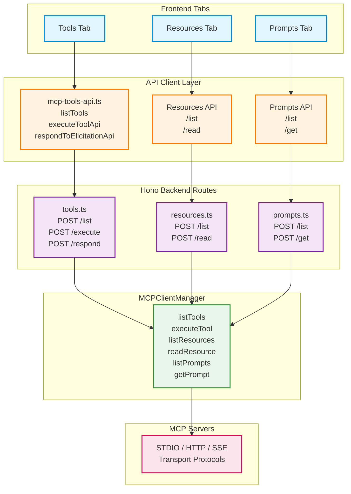

## Overview

MCPJam Inspector provides dedicated testing interfaces for the three core MCP capabilities: **Tools**, **Resources**, and **Prompts**. Each tab offers a complete development environment with parameter configuration, execution/reading, result visualization, and JSON-RPC logging.

**Key Features**:
- Interactive parameter forms with schema-based validation
- Real-time execution and result display
- Elicitation support for interactive tool workflows
- JSON-RPC message inspection
- OpenAI Apps SDK widget rendering (Tools)
- Saved requests management (Tools)
- Resource content preview (Resources)
- Prompt template testing (Prompts)

**Location**:
- Frontend Components:
  - `client/src/components/ToolsTab.tsx`
  - `client/src/components/ResourcesTab.tsx`
  - `client/src/components/PromptsTab.tsx`
- Backend Routes:
  - `server/routes/mcp/tools.ts`
  - `server/routes/mcp/resources.ts`
  - `server/routes/mcp/prompts.ts`
- API Client: `client/src/lib/mcp-tools-api.ts`

---

## Architecture Overview

### System Flow



---

## Tools Tab Architecture

### Overview

The **Tools Tab** provides a complete interface for testing MCP tools with parameter configuration, execution, and result visualization. It supports interactive elicitation workflows and saves tool executions for reuse.

**Key Features**:
- Schema-based parameter forms
- Tool execution with elicitation support
- Result validation against output schemas
- OpenAI Apps SDK widget rendering
- Saved requests library
- JSON-RPC logging integration

### Component Structure

```typescript
// client/src/components/ToolsTab.tsx
export function ToolsTab({ serverConfig, serverName }: ToolsTabProps) {
  const [tools, setTools] = useState<ToolMap>({});
  const [selectedTool, setSelectedTool] = useState<string>("");
  const [formFields, setFormFields] = useState<FormField[]>([]);
  const [result, setResult] = useState<CallToolResult | null>(null);
  const [structuredResult, setStructuredResult] = useState<Record<string, unknown> | null>(null);
  const [activeElicitation, setActiveElicitation] = useState<ActiveElicitation | null>(null);
  const [savedRequests, setSavedRequests] = useState<SavedRequest[]>([]);
  // ...
}
```

### Data Flow

#### 1. Listing Tools

```typescript
// Client → API Client → Backend → MCPClientManager

// 1. Frontend fetches tools
const fetchTools = async () => {
  const data = await listTools(serverName);
  const toolArray = data.tools ?? [];
  const dictionary = Object.fromEntries(
    toolArray.map((tool) => [tool.name, tool])
  );
  setTools(dictionary);
};

// 2. API client calls backend
// client/src/lib/mcp-tools-api.ts:28-44
export async function listTools(serverId: string) {
  const res = await fetch("/api/mcp/tools/list", {
    method: "POST",
    headers: { "Content-Type": "application/json" },
    body: JSON.stringify({ serverId }),
  });
  return await res.json();
}

// 3. Backend routes to MCPClientManager
// server/routes/mcp/tools.ts:123-140
tools.post("/list", async (c) => {
  const { serverId } = await c.req.json();
  const result = await c.mcpClientManager.listTools(serverId);

  // Get cached metadata for OpenAI Apps SDK
  const toolsMetadata = c.mcpClientManager.getAllToolsMetadata(serverId);

  return c.json({ ...result, toolsMetadata });
});
```

#### 2. Executing Tools

```typescript
// Client → API Client → Backend → Execution Context → MCPClientManager

// 1. Frontend builds parameters and executes
const executeTool = async () => {
  const params = buildParameters();
  const response = await executeToolApi(serverName, selectedTool, params);
  handleExecutionResponse(response, selectedTool, executionStartTime);
};

// 2. API client calls execute endpoint
// client/src/lib/mcp-tools-api.ts:47-67
export async function executeToolApi(serverId, toolName, parameters) {
  const res = await fetch("/api/mcp/tools/execute", {
    method: "POST",
    body: JSON.stringify({ serverId, toolName, parameters }),
  });
  return await res.json();
}

// 3. Backend creates execution context
// server/routes/mcp/tools.ts:142-236
tools.post("/execute", async (c) => {
  const context: ExecutionContext = {
    id: executionId,
    serverId,
    toolName,
    execPromise: manager.executeTool(serverId, toolName, parameters),
    queue: [],
  };

  activeExecution = context;

  // Set elicitation handler for interactive workflows
  manager.setElicitationHandler(serverId, async (params) => {
    const payload = { executionId, requestId: makeRequestId(), ... };
    enqueueRequest(context, payload);

    return new Promise((resolve, reject) => {
      pendingResponses.set(payload.requestId, { resolve, reject });
    });
  });

  // Race between completion and elicitation
  const next = await Promise.race([
    context.execPromise.then((result) => ({ kind: "done", result })),
    takeNextRequest(context).then((payload) => ({ kind: "elicitation", payload })),
  ]);

  if (next.kind === "done") {
    resetExecution(context, () => manager.clearElicitationHandler(serverId));
    return c.json({ status: "completed", result: next.result });
  }

  // Return elicitation request
  return c.json({
    status: "elicitation_required",
    executionId,
    requestId: next.payload.requestId,
    request: next.payload.request,
  }, 202);
});
```

#### 3. Handling Elicitation

```typescript
// User responds → API → Backend → Resume execution

// 1. Frontend handles elicitation response
const handleElicitationResponse = async (action, parameters) => {
  const payload = action === "accept"
    ? { action: "accept", content: parameters ?? {} }
    : { action };

  const response = await respondToElicitationApi(
    activeElicitation.requestId,
    payload
  );

  handleExecutionResponse(response, selectedTool, Date.now());
};

// 2. Backend resolves pending elicitation
// server/routes/mcp/tools.ts:238-292
tools.post("/respond", async (c) => {
  const { requestId, response } = await c.req.json();

  const pending = pendingResponses.get(requestId);
  pending.resolve(response); // Resume tool execution

  // Race again for next elicitation or completion
  const next = await Promise.race([
    context.execPromise.then((result) => ({ kind: "done", result })),
    takeNextRequest(context).then((payload) => ({ kind: "elicitation", payload })),
  ]);

  if (next.kind === "done") {
    return c.json({ status: "completed", result: next.result });
  }

  // Another elicitation needed
  return c.json({
    status: "elicitation_required",
    requestId: next.payload.requestId,
    request: next.payload.request,
  }, 202);
});
```

### Key Features

#### 1. Schema-Based Forms

```typescript
// client/src/components/ToolsTab.tsx:152-157
useEffect(() => {
  if (selectedTool && tools[selectedTool]) {
    setFormFields(
      generateFormFieldsFromSchema(tools[selectedTool].inputSchema)
    );
  }
}, [selectedTool, tools]);

// Generates form fields from JSON schema
// @/lib/tool-form.ts
export function generateFormFieldsFromSchema(schema: any): FormField[] {
  // Converts JSON schema to UI form fields
  // Supports: string, number, boolean, array, object, enum
}
```

#### 2. Result Validation

```typescript
// client/src/components/ToolsTab.tsx:241-257
const currentTool = tools[toolName];
if (currentTool?.outputSchema) {
  const validationReport = validateToolOutput(
    rawResult,
    currentTool.outputSchema
  );
  setValidationErrors(validationReport.structuredErrors);
  setUnstructuredValidationResult(validationReport.unstructuredStatus);
}
```

#### 3. OpenAI Apps SDK Support

```typescript
// client/src/components/ToolsTab.tsx:228-239
if (rawResult?.structuredContent) {
  setStructuredResult(rawResult.structuredContent);

  // Check for OpenAI component using tool metadata
  const toolMeta = getToolMeta(toolName);
  const hasOpenAIComponent = toolMeta?.["openai/outputTemplate"];
  setShowStructured(!hasOpenAIComponent); // Hide JSON if widget available
}

// Rendered in ResultsPanel with iframe sandbox
// client/src/components/tools/ResultsPanel.tsx
```

#### 4. Saved Requests

```typescript
// client/src/components/ToolsTab.tsx:358-388
const handleSaveCurrent = () => {
  setDialogDefaults({ title: selectedTool, description: "" });
  setIsSaveDialogOpen(true);
};

// Saved to localStorage with serverKey
const newRequest = saveRequest(serverKey, {
  title,
  description,
  toolName: selectedTool,
  parameters: buildParameters(),
});

// Load saved request
const handleLoadRequest = (req: SavedRequest) => {
  setSelectedTool(req.toolName);
  setTimeout(() => applyParametersToFields(req.parameters), 50);
};
```

### Execution Context Pattern

The backend uses an **execution context** to manage long-running tool executions with multiple elicitations:

```typescript
// server/routes/mcp/tools.ts:19-26
type ExecutionContext = {
  id: string;
  serverId: string;
  toolName: string;
  execPromise: Promise<ListToolsResult>; // Tool execution promise
  queue: ElicitationPayload[];           // Queued elicitation requests
  waiter?: (payload: ElicitationPayload) => void; // Promise resolver
};

let activeExecution: ExecutionContext | null = null;
```

**Key Pattern**: Only one tool execution can be active at a time (409 Conflict if another is in progress).

---

## Resources Tab Architecture

### Overview

The **Resources Tab** provides browsing and reading capabilities for MCP resources. It supports text and binary content preview with special handling for OpenAI Apps SDK widgets.

**Key Features**:
- Resource listing with metadata
- Content reading and display
- Text/JSON preview
- OpenAI widget rendering in sandboxed iframe
- MIME type detection

### Data Flow

#### 1. Listing Resources

```typescript
// Client → Backend → MCPClientManager

// 1. Frontend fetches resources
const fetchResources = async () => {
  const response = await fetch("/api/mcp/resources/list", {
    method: "POST",
    headers: { "Content-Type": "application/json" },
    body: JSON.stringify({ serverId: serverName }),
  });
  const data = await response.json();
  setResources(data.resources);
};

// 2. Backend routes to MCPClientManager
// server/routes/mcp/resources.ts:33-53
resources.post("/list", async (c) => {
  const { serverId } = await c.req.json();
  const { resources } = await c.mcpClientManager.listResources(serverId);
  return c.json({ resources });
});
```

#### 2. Reading Resources

```typescript
// Client → Backend → MCPClientManager

// 1. Frontend reads resource content
const readResource = async (uri: string) => {
  const response = await fetch("/api/mcp/resources/read", {
    method: "POST",
    body: JSON.stringify({ serverId: serverName, uri }),
  });
  const data = await response.json();
  setResourceContent(data.content);
};

// 2. Backend calls MCPClientManager
// server/routes/mcp/resources.ts:56-94
resources.post("/read", async (c) => {
  const { serverId, uri } = await c.req.json();
  const content = await c.mcpClientManager.readResource(serverId, { uri });
  return c.json({ content });
});
```

### OpenAI Widget Support

Resources can contain HTML widgets for OpenAI Apps SDK:

```typescript
// server/routes/mcp/resources.ts:131-438

// 1. Store widget metadata
resources.post("/widget/store", async (c) => {
  const { serverId, uri, toolInput, toolOutput, toolId } = await c.req.json();
  widgetDataStore.set(toolId, {
    serverId, uri, toolInput, toolOutput, toolId,
    timestamp: Date.now(),
  });
});

// 2. Serve widget with injected APIs
resources.get("/widget/:toolId", async (c) => {
  const widgetData = widgetDataStore.get(toolId);

  // Read resource HTML from MCP server
  const content = await mcpClientManager.readResource(serverId, { uri });

  // Inject OpenAI API shims
  const apiScript = `
    <script>
      window.openai = {
        toolInput: ${JSON.stringify(toolInput)},
        toolOutput: ${JSON.stringify(toolOutput)},
        async callTool(toolName, params) { /* postMessage to parent */ },
        async sendFollowupTurn(message) { /* postMessage to parent */ },
        async setWidgetState(state) { /* save to localStorage */ },
      };
    </script>
  `;

  // Inject into HTML and set CSP headers
  return c.html(modifiedHtml);
});
```

**Widget Features**:
- `window.openai` API shim for tool calling
- State persistence via localStorage
- postMessage communication with parent
- CSP headers for security
- TTL-based cleanup (1 hour)

---

## Prompts Tab Architecture

### Overview

The **Prompts Tab** provides testing for MCP prompt templates with argument substitution and result preview.

**Key Features**:
- Prompt listing with descriptions
- Dynamic argument forms
- Prompt retrieval with substitution
- Text/JSON content display

### Data Flow

#### 1. Listing Prompts

```typescript
// Client → Backend → MCPClientManager

// 1. Frontend fetches prompts
const fetchPrompts = async () => {
  const response = await fetch("/api/mcp/prompts/list", {
    method: "POST",
    body: JSON.stringify({ serverId: serverName }),
  });
  const data = await response.json();
  setPrompts(data.prompts);
};

// 2. Backend routes to MCPClientManager
// server/routes/mcp/prompts.ts:7-28
prompts.post("/list", async (c) => {
  const { serverId } = await c.req.json();
  const { prompts } = await c.mcpClientManager.listPrompts(serverId);
  return c.json({ prompts });
});
```

#### 2. Getting Prompts

```typescript
// Client → Backend → MCPClientManager

// 1. Frontend builds arguments and retrieves prompt
const getPrompt = async () => {
  const params = buildParameters(); // String-only values
  const response = await fetch("/api/mcp/prompts/get", {
    method: "POST",
    body: JSON.stringify({
      serverId: serverName,
      name: selectedPrompt,
      args: params,
    }),
  });
  const data = await response.json();
  setPromptContent(data.content);
};

// 2. Backend converts args to strings
// server/routes/mcp/prompts.ts:31-77
prompts.post("/get", async (c) => {
  const { serverId, name, args } = await c.req.json();

  // MCP requires string arguments
  const promptArguments = args
    ? Object.fromEntries(
        Object.entries(args).map(([key, value]) => [key, String(value)])
      )
    : undefined;

  const content = await c.mcpClientManager.getPrompt(serverId, {
    name,
    arguments: promptArguments,
  });

  return c.json({ content });
});
```

### Argument Forms

```typescript
// client/src/components/PromptsTab.tsx:111-126
const generateFormFields = (args: PromptArgument[]) => {
  const fields: FormField[] = args.map((arg) => ({
    name: arg.name,
    type: "string", // MCP prompts use string args
    description: arg.description,
    required: Boolean(arg.required),
    value: "",
  }));

  setFormFields(fields);
};

// Builds Record<string, string> for API
const buildParameters = (): Record<string, string> => {
  const params: Record<string, string> = {};
  formFields.forEach((field) => {
    if (field.value !== "") {
      params[field.name] = String(field.value);
    }
  });
  return params;
};
```

---

## Common Patterns

### 1. ResizablePanel Layout

All three tabs use a consistent 3-panel layout:

```typescript
<ResizablePanelGroup direction="vertical">
  {/* Top Section */}
  <ResizablePanel defaultSize={70}>
    <ResizablePanelGroup direction="horizontal">
      {/* Left: List View */}
      <ResizablePanel defaultSize={30}>
        {/* Tools/Resources/Prompts list */}
      </ResizablePanel>

      <ResizableHandle withHandle />

      {/* Right: Detail/Execute View */}
      <ResizablePanel defaultSize={70}>
        {/* Parameters or preview */}
      </ResizablePanel>
    </ResizablePanelGroup>
  </ResizablePanel>

  <ResizableHandle withHandle />

  {/* Bottom Section */}
  <ResizablePanel defaultSize={30}>
    <ResizablePanelGroup direction="horizontal">
      {/* Left: JSON-RPC Logger */}
      <ResizablePanel defaultSize={40}>
        <JsonRpcLoggerView serverIds={[serverName]} />
      </ResizablePanel>

      <ResizableHandle withHandle />

      {/* Right: Results/Status */}
      <ResizablePanel defaultSize={60}>
        {/* Tool results, resource content, or prompt output */}
      </ResizablePanel>
    </ResizablePanelGroup>
  </ResizablePanel>
</ResizablePanelGroup>
```

### 2. Empty State Handling

```typescript
// All tabs check for server connection
if (!serverConfig || !serverName) {
  return (
    <EmptyState
      icon={IconComponent}
      title="No Server Selected"
      description="Connect to an MCP server to explore..."
    />
  );
}
```

### 3. JSON-RPC Logging Integration

```typescript
// All tabs include JSON-RPC logger filtered to current server
<JsonRpcLoggerView serverIds={serverName ? [serverName] : undefined} />

// Shows real-time MCP protocol messages:
// - tools/list, tools/call
// - resources/list, resources/read
// - prompts/list, prompts/get
```

### 4. Error Handling

```typescript
// Backend routes use consistent error serialization
function serializeMcpError(error: unknown) {
  return {
    name: error?.name ?? "Error",
    message: error?.message ?? String(error),
    code: error?.code,
    data: error?.data,
    stack: process.env.NODE_ENV === "development" ? error?.stack : undefined,
  };
}

function jsonError(c: any, error: unknown, fallbackStatus = 500) {
  const details = serializeMcpError(error);
  return c.json({ error: details.message, mcpError: details }, status);
}
```

---

## API Reference

### Tools Endpoints

<ResponseField name="POST /api/mcp/tools/list" type="{ serverId: string }">
  List available tools for a server.

  **Response**:
  ```typescript
  {
    tools: Tool[];
    toolsMetadata: Record<string, Record<string, any>>; // OpenAI metadata cache
  }
  ```
</ResponseField>

<ResponseField name="POST /api/mcp/tools/execute" type="{ serverId: string, toolName: string, parameters: Record<string, unknown> }">
  Execute a tool with parameters. Returns immediately with result or elicitation request.

  **Response** (completed):
  ```typescript
  {
    status: "completed";
    result: CallToolResult;
  }
  ```

  **Response** (elicitation needed):
  ```typescript
  {
    status: "elicitation_required";
    executionId: string;
    requestId: string;
    request: ElicitRequest["params"];
    timestamp: string;
  }
  ```

  **Status Code**: 202 for elicitation, 200 for completion, 409 if another execution is active
</ResponseField>

<ResponseField name="POST /api/mcp/tools/respond" type="{ requestId: string, response: ElicitResult }">
  Respond to an elicitation request. Resumes tool execution and returns next state (completed or another elicitation).

  **Response**: Same as `/execute`
</ResponseField>

### Resources Endpoints

<ResponseField name="POST /api/mcp/resources/list" type="{ serverId: string }">
  List available resources for a server.

  **Response**:
  ```typescript
  {
    resources: MCPResource[];
  }
  ```
</ResponseField>

<ResponseField name="POST /api/mcp/resources/read" type="{ serverId: string, uri: string }">
  Read resource content by URI.

  **Response**:
  ```typescript
  {
    content: MCPReadResourceResult;
  }
  ```
</ResponseField>

<ResponseField name="POST /api/mcp/resources/widget/store" type="{ serverId, uri, toolInput, toolOutput, toolId }">
  Store widget metadata for OpenAI Apps SDK rendering (TTL: 1 hour).
</ResponseField>

<ResponseField name="GET /api/mcp/resources/widget/:toolId" type="Path parameter: toolId">
  Render OpenAI widget with injected API shims. Returns HTML with CSP headers.
</ResponseField>

### Prompts Endpoints

<ResponseField name="POST /api/mcp/prompts/list" type="{ serverId: string }">
  List available prompts for a server.

  **Response**:
  ```typescript
  {
    prompts: MCPPrompt[];
  }
  ```
</ResponseField>

<ResponseField name="POST /api/mcp/prompts/get" type="{ serverId: string, name: string, args?: Record<string, string> }">
  Get prompt with argument substitution.

  **Response**:
  ```typescript
  {
    content: GetPromptResult;
  }
  ```
</ResponseField>

---

## Technical Details

### Execution Context Lifecycle

```typescript
// server/routes/mcp/tools.ts

// 1. Create execution context
const context: ExecutionContext = {
  id: executionId,
  serverId,
  toolName,
  execPromise: manager.executeTool(serverId, toolName, parameters),
  queue: [],
};

activeExecution = context;

// 2. Set elicitation handler (enqueues requests)
manager.setElicitationHandler(serverId, async (params) => {
  const payload = { executionId, requestId: makeRequestId(), request: params };
  enqueueRequest(context, payload);

  return new Promise((resolve, reject) => {
    pendingResponses.set(payload.requestId, { resolve, reject });
  });
});

// 3. Race between execution and elicitation
const next = await Promise.race([
  context.execPromise.then((result) => ({ kind: "done", result })),
  takeNextRequest(context).then((payload) => ({ kind: "elicitation", payload })),
]);

// 4. Clean up on completion
if (next.kind === "done") {
  resetExecution(context, () => manager.clearElicitationHandler(serverId));
  activeExecution = null;
}
```

**Key Insight**: The execution context allows tools to request multiple elicitations in sequence without blocking the server.

### Form Field Generation

```typescript
// @/lib/tool-form.ts

export function generateFormFieldsFromSchema(schema: any): FormField[] {
  const properties = schema?.properties || {};
  const required = schema?.required || [];

  return Object.entries(properties).map(([name, prop]: [string, any]) => ({
    name,
    type: prop.type || "string",
    description: prop.description,
    required: required.includes(name),
    value: getDefaultValue(prop),
    enum: prop.enum,
    minimum: prop.minimum,
    maximum: prop.maximum,
  }));
}

// Supports: string, number, integer, boolean, array, object, enum
// UI renders different controls based on type
```

### Tool Metadata Caching

```typescript
// server/routes/mcp/tools.ts:123-140

tools.post("/list", async (c) => {
  const result = await c.mcpClientManager.listTools(serverId);

  // MCPClientManager caches _meta fields during listTools
  // This enables O(1) frontend lookups for OpenAI components
  const toolsMetadata = c.mcpClientManager.getAllToolsMetadata(serverId);

  return c.json({ ...result, toolsMetadata });
});

// Frontend access:
const getToolMeta = (toolName: string) => {
  return toolName ? tools[toolName]?._meta : undefined;
};

// Used to detect OpenAI widgets and hide JSON view
const hasOpenAIComponent = toolMeta?.["openai/outputTemplate"];
```

### Resource Widget API Shims

The widget endpoint injects JavaScript that provides OpenAI-compatible APIs:

```javascript
// server/routes/mcp/resources.ts:250-376

window.openai = {
  toolInput: { /* passed from tool call */ },
  toolOutput: { /* tool result */ },

  async callTool(toolName, params) {
    // postMessage to parent frame
    // Parent handles via openai-component-renderer
  },

  async sendFollowupTurn(message) {
    // postMessage to parent to send chat message
  },

  async setWidgetState(state) {
    // Persist to localStorage for session
    this.widgetState = state;
    localStorage.setItem(widgetStateKey, JSON.stringify(state));
  },

  async requestDisplayMode(options) {
    // Change display mode (inline, modal, sidebar)
    this.displayMode = options.mode || 'inline';
  },
};

// Also available as window.webplus (alias)
window.webplus = window.openai;
```

---

## Development Patterns

### Adding New Tool Features

1. **Update Form Generation**:
```typescript
// @/lib/tool-form.ts
export function generateFormFieldsFromSchema(schema: any) {
  // Add support for new JSON schema types
  // e.g., pattern, format, dependencies
}
```

2. **Extend Result Display**:
```typescript
// client/src/components/tools/ResultsPanel.tsx
// Add new content renderers (e.g., images, tables)
```

3. **Add Validation Rules**:
```typescript
// @/lib/schema-utils.ts
export function validateToolOutput(output: any, schema: any) {
  // Add custom validation logic
}
```

### Adding Resource Viewers

```typescript
// client/src/components/ResourcesTab.tsx:316-341

// Add content type detection
if (content.type === "text") {
  return <pre>{content.text}</pre>;
} else if (content.type === "image") {
  return ;
} else if (content.type === "pdf") {
  return <PDFViewer data={content.data} />;
}
```

### Testing Elicitation Workflows

```typescript
// 1. Create MCP server with elicitation
const tool = {
  name: "interactive_tool",
  handler: async (params, elicit) => {
    const response = await elicit({
      message: "Enter your name",
      requestedSchema: { type: "object", properties: { name: { type: "string" } } },
    });

    if (response.action === "accept") {
      return { result: `Hello, ${response.content.name}!` };
    }
    return { error: "User declined" };
  },
};

// 2. Test in Tools Tab
// - Execute tool
// - Dialog appears with schema form
// - Fill and submit
// - See final result
```

### Debugging Tips

**Enable Console Logging**:
```typescript
// Add to components
useEffect(() => {
  console.log("Tools fetched:", tools);
  console.log("Selected tool:", selectedTool);
  console.log("Form fields:", formFields);
}, [tools, selectedTool, formFields]);
```

**Inspect JSON-RPC Messages**:
```typescript
// Check JsonRpcLoggerView for:
// - tools/list request/response
// - tools/call request/response
// - resources/read request/response
// - Error messages and timing
```

**Check Network Tab**:
```bash
# Monitor API calls
/api/mcp/tools/list
/api/mcp/tools/execute
/api/mcp/tools/respond
/api/mcp/resources/list
/api/mcp/resources/read
/api/mcp/prompts/list
/api/mcp/prompts/get
```

---

## Related Documentation

- [MCPClientManager](./mcp-client-manager) - MCP orchestration layer
- [Playground Architecture](./playground-architecture) - LLM chat integration
- [JSON-RPC Logging](../inspector/debugging) - Protocol inspection
- [OpenAI Apps SDK](../inspector/tools-prompts-resources#openai-apps-sdk) - Widget rendering

## External Links

- [MCP Specification](https://spec.modelcontextprotocol.io/)
- [MCP SDK](https://github.com/modelcontextprotocol/sdk)
- [OpenAI Apps SDK](https://openai.com/index/introducing-the-app-platform/)
- [JSON Schema](https://json-schema.org/)
