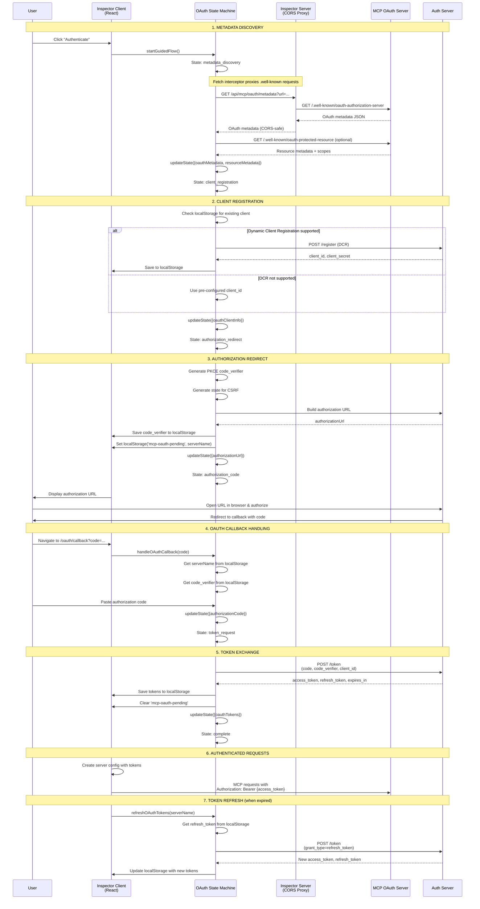
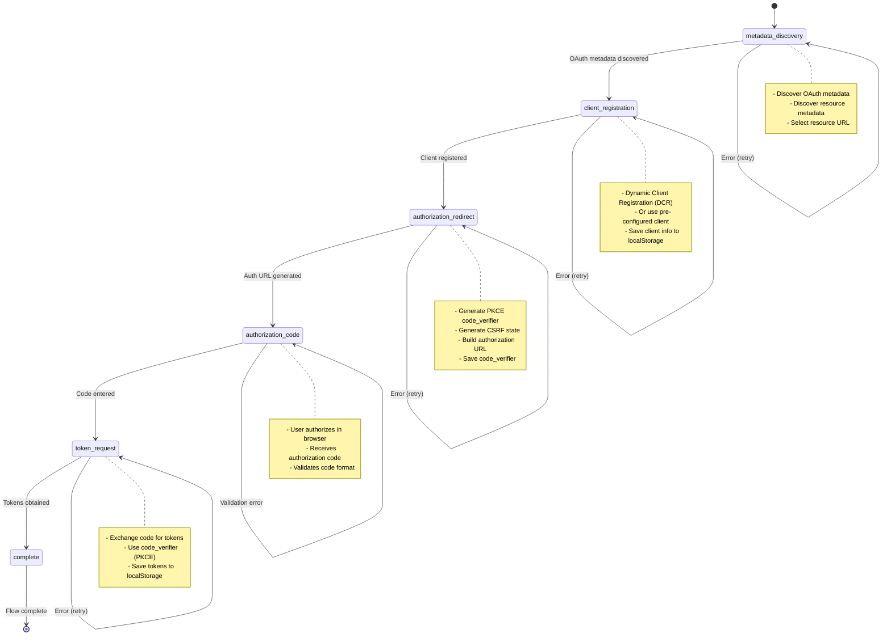
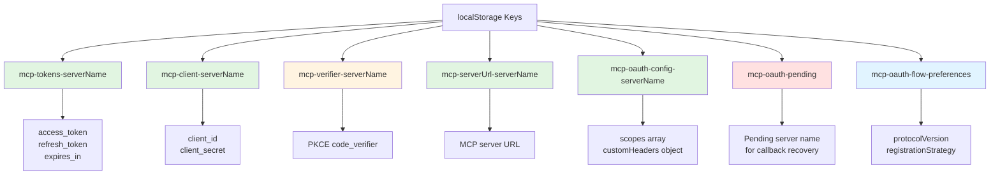
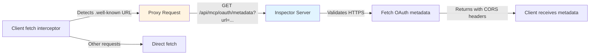

## Architecture Overview

The OAuth implementation uses:

- **Client-side state machine** for flow orchestration
- **CORS proxy server** for metadata discovery and SSE handling
- **localStorage** for persistence
- **MCP SDK** for OAuth operations
- **Multi-protocol support** for 2025-03-26, 2025-06-18, and 2025-11-25 specifications

## Complete OAuth Flow

The following diagram shows the complete OAuth flow from user initiation through token exchange:



## State Machine Transitions

The OAuth flow is managed by a state machine with 6 distinct states:



## Data Persistence (localStorage)

All OAuth data is persisted in the browser's localStorage with server-specific keys:



OAuth test profiles are also stored in the app state with the following structure:

- `oauthFlowProfile`: Contains server URL, client credentials, scopes, custom headers, protocol version, and registration strategy
- Profiles are attached to server configurations and persist across sessions
- Used to pre-populate the OAuth Profile Modal when editing configurations

## CORS Proxy Architecture

To bypass CORS restrictions when fetching OAuth metadata, we use a proxy server:



## Protocol Versions

The OAuth debugger supports three MCP OAuth protocol versions:

### 2025-03-26 (Original)

- Direct RFC8414 discovery from MCP server base URL
- Fallback to default endpoints (`/authorize`, `/token`, `/register`)
- PKCE **required** for all clients
- No Protected Resource Metadata (RFC9728)
- Registration: DCR (SHOULD) or pre-registered

### 2025-06-18 (Current)

- Protected Resource Metadata (RFC9728) required
- RFC8414 discovery with root fallback
- PKCE recommended but not strictly enforced
- Registration: DCR (SHOULD) or pre-registered

### 2025-11-25 (Draft)

- Client ID Metadata Documents (CIMD) support
- RFC8414 or OIDC discovery without root fallback
- PKCE strictly required and enforced
- Registration: CIMD (SHOULD), DCR, or pre-registered

## Key Components

### 1. OAuthFlowLogger

**Location:** `client/src/components/oauth/OAuthFlowLogger.tsx`

Provides an interactive guide for the OAuth flow with educational content:

- Groups logs and HTTP requests by OAuth step
- Displays step metadata including title, summary, and status badges
- Shows teachable moments and tips for each step
- Supports focusing on specific steps in the sequence diagram
- Auto-scrolls to latest activity
- Integrated action controls (Configure, Reset, Continue)
- Summary header showing target server, protocol, and registration strategy

Step metadata is defined in `client/src/lib/oauth/state-machines/shared/step-metadata.ts` with:

- Step ordering and indexing
- Educational summaries for each step
- Teachable moments highlighting key concepts
- Tips for common issues

### 2. OAuthProfileModal

**Location:** `client/src/components/oauth/OAuthProfileModal.tsx`

Modal dialog for configuring OAuth test profiles:

- Server name and URL configuration
- Protocol version selection (2025-03-26, 2025-06-18, 2025-11-25)
- Registration strategy selection (CIMD, DCR, Pre-registered)
- Advanced settings accordion for optional configuration
- Custom headers management with add/remove functionality
- Client credentials input for pre-registered flows
- Validation and error handling
- Generates unique server names to avoid conflicts

The modal derives initial values from existing server configurations and supports both creating new profiles and editing existing ones.

### 3. OAuth Utility Functions

**Location:** `client/src/components/oauth/utils.ts`

Helper functions for OAuth profile management:

- `deriveOAuthProfileFromServer()`: Extracts OAuth configuration from server definitions
- `toUrlString()`: Safely converts URL objects to strings
- Profile derivation with fallback to empty profile
- Header extraction from HTTP server configurations
- Scope and credential extraction from server configs

### 4. MCPOAuthProvider

**Location:** `client/src/lib/mcp-oauth.ts:72`

Implements the `OAuthClientProvider` interface from the MCP SDK:

<CodeGroup>
```typescript Methods
// Get/create client info with custom credentials
clientInformation()

// Store client info to localStorage
saveClientInformation(clientInfo)

// Retrieve stored tokens
tokens()

// Store tokens to localStorage
saveTokens(tokens)

// Redirect user to auth server
redirectToAuthorization(url)

// Retrieve PKCE verifier
codeVerifier()

// Store PKCE verifier
saveCodeVerifier(verifier)

````
</CodeGroup>

### 5. OAuth State Machine

**Location:** `client/src/lib/oauth-state-machine.ts:353`

Manages the step-by-step OAuth flow:

- Each step has `canTransition` and `execute` methods
- Handles errors and retries automatically
- Updates UI state via callbacks
- Validates preconditions before transitions
- Tracks current step for UI synchronization

### 6. Debug Proxy

**Location:** `server/routes/mcp/oauth.ts:10`

Proxies OAuth and MCP requests to bypass CORS:

- Enforces HTTPS for security
- Adds proper CORS headers
- Validates URL format
- Returns OAuth metadata JSON
- Handles SSE (Server-Sent Events) responses
- Detects legacy HTTP+SSE transport (2024-11-05)
- Parses SSE streams and extracts endpoint events

### 7. Fetch Interceptor

**Location:** `client/src/lib/mcp-oauth.ts:17`

Intercepts and proxies OAuth metadata requests:

<CodeGroup>
```typescript Interceptor
function createOAuthFetchInterceptor() {
  return async function interceptedFetch(input, init) {
    const url = extractUrl(input);

    // Check if this is an OAuth metadata request
    if (url.includes('/.well-known/oauth-authorization-server')) {
      // Proxy through our server to avoid CORS
      const proxyUrl = `/api/mcp/oauth/metadata?url=${encodeURIComponent(url)}`;
      return await originalFetch(proxyUrl, init);
    }

    // For all other requests, use original fetch
    return await originalFetch(input, init);
  };
}
````

</CodeGroup>

## OAuth Flow States

From `client/src/lib/oauth-flow-types.ts:10-16`:

| State                    | Description                                    |
| ------------------------ | ---------------------------------------------- |
| `metadata_discovery`     | Discover OAuth & resource metadata from server |
| `client_registration`    | Register client (DCR) or use pre-configured    |
| `authorization_redirect` | Generate auth URL with PKCE                    |
| `authorization_code`     | Wait for user authorization                    |
| `token_request`          | Exchange code for tokens                       |
| `complete`               | OAuth flow finished                            |

## Security Features

<CardGroup cols={2}>
  <Card title="PKCE" icon="shield-check">
    Code verifier stored at `oauth-state-machine.ts:248` for secure authorization without client secrets
  </Card>

<Card title="CSRF Protection" icon="shield-halved">
  Random state parameter generated at `oauth-state-machine.ts:231-236`
</Card>

<Card title="HTTPS Enforcement" icon="lock">
  Proxy validates HTTPS at `oauth.ts:22`
</Card>

  <Card title="Scope Validation" icon="list-check">
    Uses advertised scopes from metadata at `oauth-state-machine.ts:222-229`
  </Card>
</CardGroup>

## Error Handling

Each state handles errors gracefully:

- Stores error in `latestError` state field
- Updates `statusMessage` with user-friendly error
- Provides helpful error messages for common issues:
  - `invalid_client` - Client ID verification failed
  - `unauthorized_client` - Client not authorized for this server
  - `invalid_grant` - Authorization code expired or invalid
- Allows retry from current step without restarting flow

## Token Management

<Steps>
  <Step title="Storage">
    Tokens stored in localStorage with server-specific keys
  </Step>

<Step title="Refresh">
  Automatic token refresh using refresh_token at `mcp-oauth.ts:464`
</Step>

<Step title="Usage">
  Tokens added as Bearer token in Authorization header at `mcp-oauth.ts:577-580`
</Step>

  <Step title="Cleanup">
    `clearOAuthData()` removes all OAuth-related localStorage entries
  </Step>
</Steps>

## Server Configuration Without Connection

The `saveServerConfigWithoutConnecting` function allows saving OAuth test profiles without establishing a connection:

```typescript
// Save server configuration for OAuth testing
saveServerConfigWithoutConnecting(
  {
    name: "oauth-test-server",
    type: "http",
    url: "https://example.com",
    useOAuth: true,
    oauthScopes: ["openid", "profile"],
    headers: { "X-API-Key": "secret" },
    clientId: "optional-client-id",
    clientSecret: "optional-client-secret",
  },
  {
    oauthProfile: {
      serverUrl: "https://example.com",
      clientId: "optional-client-id",
      clientSecret: "optional-client-secret",
      scopes: "openid profile",
      customHeaders: [{ key: "X-API-Key", value: "secret" }],
      protocolVersion: "2025-11-25",
      registrationStrategy: "cimd",
    },
  },
);
```

This function:

- Validates the form data
- Creates or updates the server entry without connecting
- Stores OAuth configuration in localStorage
- Preserves the OAuth test profile for future debugging sessions
- Updates the active workspace with the new server configuration

## Usage Example

<CodeGroup>
```typescript Initiate OAuth
// Initiate OAuth flow
const result = await initiateOAuth({
  serverName: 'my-mcp-server',
  serverUrl: 'https://mcp.example.com',
  scopes: ['read', 'write'],
  clientId: 'optional-custom-client-id', // Optional
  clientSecret: 'optional-client-secret' // Optional
});

if (result.success && result.serverConfig) {
// Use server config for authenticated requests
// serverConfig includes Authorization header with Bearer token
}

````

```typescript Handle Callback
// Handle OAuth callback (after user authorizes)
const callbackResult = await handleOAuthCallback(authorizationCode);
````

```typescript Refresh Tokens
// Refresh tokens when needed
const refreshResult = await refreshOAuthTokens(serverName);
```

```typescript Helper Functions
// Check if OAuth is configured
const hasConfig = hasOAuthConfig(serverName);

// Get stored tokens
const tokens = getStoredTokens(serverName);

// Clear OAuth data
clearOAuthData(serverName);
```

</CodeGroup>

## File References

| Component                | Location                                                        |
| ------------------------ | --------------------------------------------------------------- |
| OAuth Flow Types         | `client/src/lib/oauth/state-machines/types.ts`                  |
| OAuth Profile Types      | `client/src/lib/oauth/profile.ts`                               |
| State Machine Factory    | `client/src/lib/oauth/state-machines/factory.ts`                |
| 2025-03-26 State Machine | `client/src/lib/oauth/state-machines/debug-oauth-2025-03-26.ts` |
| 2025-06-18 State Machine | `client/src/lib/oauth/state-machines/debug-oauth-2025-06-18.ts` |
| 2025-11-25 State Machine | `client/src/lib/oauth/state-machines/debug-oauth-2025-11-25.ts` |
| OAuth Provider           | `client/src/lib/mcp-oauth.ts`                                   |
| Debug Proxy              | `server/routes/mcp/oauth.ts`                                    |
| OAuth Flow UI            | `client/src/components/OAuthFlowTab.tsx`                        |
| OAuth Profile Modal      | `client/src/components/oauth/OAuthProfileModal.tsx`             |
| OAuth Flow Logger        | `client/src/components/oauth/OAuthFlowLogger.tsx`               |
| OAuth Utilities          | `client/src/components/oauth/utils.ts`                          |
| Status Message Component | `client/src/components/oauth/StatusMessageComponent.tsx`        |
| OAuth Sequence Diagram   | `client/src/components/OAuthSequenceDiagram.tsx`                |

<Note>
  The OAuth implementation follows the MCP specification and uses PKCE for
  enhanced security. All sensitive data is stored in localStorage and never sent
  to unauthorized servers.
</Note>
