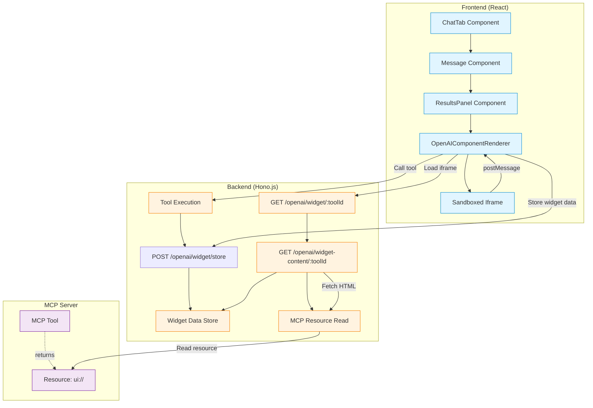
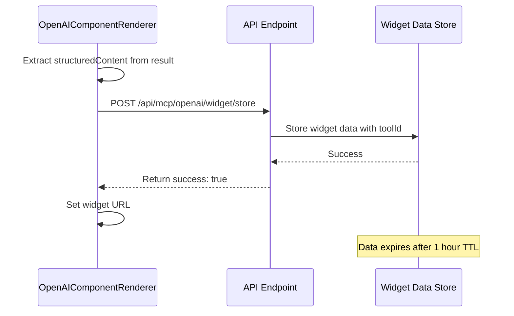
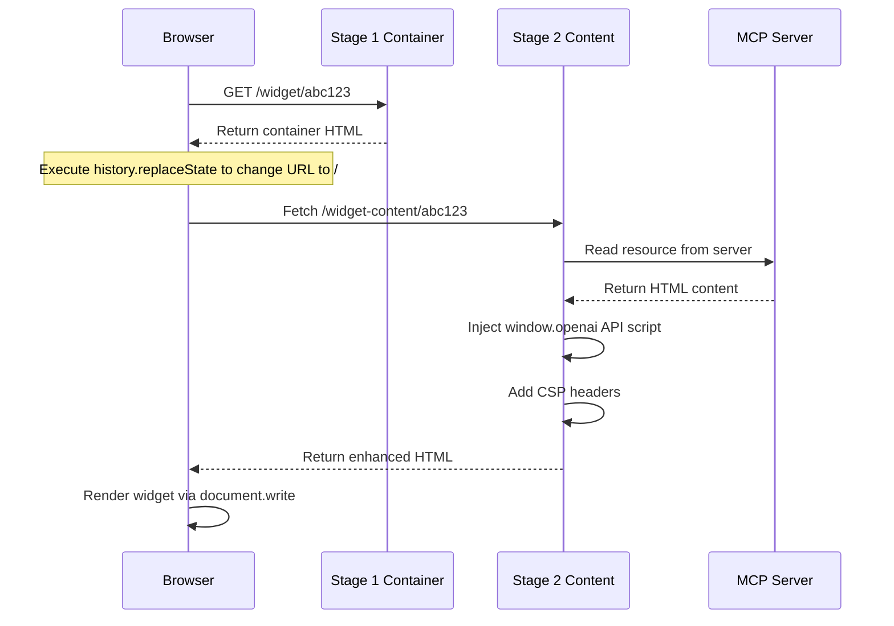
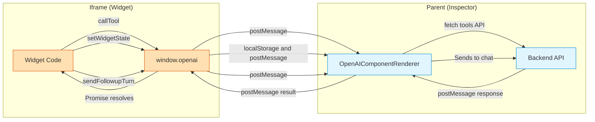
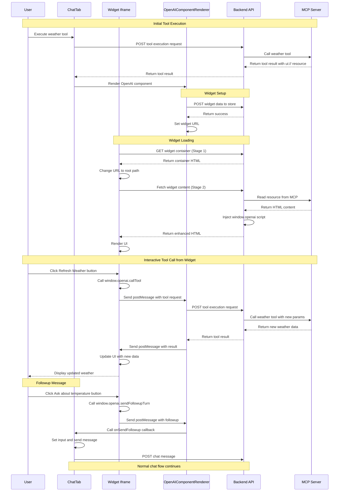

# OpenAI SDK Architecture

This guide explains how MCPJam Inspector implements the OpenAI Apps SDK to render custom UI components for MCP tool results. This enables MCP server developers to create rich, interactive visualizations for their tool outputs.

<Note>
MCPJam Inspector also supports [MCP-UI](https://github.com/modelcontextprotocol/mcp-ui) for simpler component-based UIs. See the [Playground Architecture](./playground-architecture#mcp-ui-integration) docs for MCP-UI implementation details.
</Note>

## Overview

MCPJam Inspector provides full support for the [OpenAI Apps SDK](https://developers.openai.com/apps-sdk), allowing MCP tools to return custom UI components that render in iframes with a sandboxed `window.openai` API bridge.

<Note>
  This document covers the **V1 Playground** implementation. As of PR #773, **Playground V2** (`ChatTabV2.tsx`) also supports OpenAI Apps with a streamlined implementation using `openai-app-renderer.tsx`. The V2 implementation uses MCP resources API to fetch widget templates and renders them with similar `window.openai` bridge capabilities.
</Note>

### Key Features

- **Custom UI Rendering**: Display tool results using custom HTML/React components
- **Interactive Widgets**: Components can call other MCP tools and send followup messages
- **State Persistence**: Widget state persists across sessions via localStorage
- **Theme Synchronization**: Widgets automatically receive theme updates (light/dark mode)
- **Secure Isolation**: Components run in sandboxed iframes with CSP headers
- **Server-Side Storage**: Widget context stored server-side with 1-hour TTL for iframe access
- **Dual Mode Support**:
  - `ui://` URIs for server-provided HTML content
  - External URLs for remotely hosted components

### OpenAI Apps SDK vs MCP-UI

MCPJam Inspector supports two approaches for custom UI rendering:

| Feature | OpenAI Apps SDK | MCP-UI |
|---------|-----------------|--------|
| Specification | OpenAI proprietary | MCP-UI (open standard) |
| Rendering | Sandboxed iframes | RemoteDOM components |
| Complexity | Full web applications | Simple interactive components |
| Tool calls | `window.openai.callTool()` | Action handlers |
| State persistence | `window.openai.setWidgetState()` | Not supported |
| Security | Full iframe sandbox | Component-level isolation |
| Best for | Complex dashboards, charts, forms | Buttons, cards, simple layouts |

**When to use OpenAI Apps SDK:**
- Need full JavaScript framework support (React, Vue, etc.)
- Require persistent state across sessions
- Building complex interactive visualizations
- Need access to external APIs and libraries

**When to use MCP-UI:**
- Simple interactive components (buttons, cards)
- Prefer open standards over proprietary APIs
- Don't need state persistence
- Want faster rendering without iframe overhead

See [Playground Architecture - MCP-UI Integration](./playground-architecture#mcp-ui-integration) for MCP-UI implementation details.

## Architecture Overview



## Component Flow

### 1. Tool Execution & Detection

When a tool is executed that returns OpenAI SDK components, the system detects this in two ways:

**Method A: `_meta["openai/outputTemplate"]` field**

```typescript
// Tool definition includes OpenAI output template
{
  "name": "weather_widget",
  "description": "Get weather with custom UI",
  "_meta": {
    "openai/outputTemplate": "ui://weather/display"
  }
}
```

**Method B: `ui://` resource in response**

```typescript
// Tool result contains ui:// resource
{
  "content": [{
    "type": "resource",
    "resource": {
      "uri": "ui://weather/display",
      "mimeType": "text/html"
    }
  }]
}
```

#### ResultsPanel Detection Logic

Located in `client/src/components/tools/ResultsPanel.tsx:100-104`:

```typescript
// Check for OpenAI component using tool metadata from definition
const openaiOutputTemplate = toolMeta?.[\"openai/outputTemplate\"];
const hasOpenAIComponent =
  openaiOutputTemplate && typeof openaiOutputTemplate === \"string\";
const uiResource = resolveUIResource(result);
```

The `resolveUIResource` function searches for `ui://` URIs in:

1. Direct `resource` field at root level
2. `content` array items with `type: "resource"`

### 2. Widget Data Storage Flow

Before rendering, widget data must be stored server-side for iframe access:



**Why Store Server-Side?**

- Iframes need access to `toolInput` and `toolOutput` for `window.openai` API
- Client localStorage can't be shared across iframe sandbox boundaries
- Server becomes the source of truth for widget initialization data

#### Storage Implementation

Located in `server/routes/mcp/openai.ts:14-32`:

```typescript
interface WidgetData {
  serverId: string;
  uri: string;
  toolInput: Record<string, any>;
  toolOutput: any;
  toolResponseMetadata?: Record<string, any> | null;
  toolId: string;
  toolName: string;
  theme?: "light" | "dark";
  timestamp: number;
}

const widgetDataStore = new Map<string, WidgetData>();

// Cleanup expired widget data every 5 minutes
setInterval(
  () => {
    const now = Date.now();
    const ONE_HOUR = 60 * 60 * 1000;
    for (const [toolId, data] of widgetDataStore.entries()) {
      if (now - data.timestamp > ONE_HOUR) {
        widgetDataStore.delete(toolId);
      }
    }
  },
  5 * 60 * 1000,
).unref();
```

### 3. Two-Stage Widget Loading

The system uses a clever two-stage loading process to ensure React Router compatibility:



**Why Two Stages?**

- Many widgets use React Router's `BrowserRouter` which expects clean URLs
- Stage 1 changes URL to "/" before widget code loads
- Stage 2 fetches actual content after URL is reset
- Prevents routing conflicts and 404 errors

#### Stage 1: Container Page

Located in `server/routes/mcp/openai.ts:81-120`:

```typescript
openai.get(\"/widget/:toolId\", async (c) => {
  const toolId = c.req.param(\"toolId\");
  const widgetData = widgetDataStore.get(toolId);

  if (!widgetData) {
    return c.html(\"Error: Widget data not found or expired\", 404);
  }

  return c.html(`
    <!DOCTYPE html>
    <html>
    <head>
      <meta charset=\"utf-8\">
      <title>Loading Widget...</title>
    </head>
    <body>
      <script>
        (async function() {
          // Change URL to \"/\" BEFORE loading widget
          history.replaceState(null, '', '/');

          // Fetch actual widget HTML
          const response = await fetch('/api/mcp/openai/widget-content/${toolId}');
          const html = await response.text();

          // Replace entire document
          document.open();
          document.write(html);
          document.close();
        })();
      </script>
    </body>
    </html>
  `);
});
```

#### Stage 2: Content Injection

Located in `server/routes/mcp/openai.ts:123-459`:

Key steps:

1. Retrieve widget data from store
2. Read HTML from MCP server via `readResource(uri)`
3. Inject `window.openai` API script with bridge implementation
4. Add security headers (CSP, X-Frame-Options)
5. Set cache control headers (no-cache for fresh content)

### 4. window.openai API Bridge

The injected script provides the OpenAI Apps SDK API to widget code:



#### API Implementation

Located in `server/routes/mcp/openai.ts:213-376`:

**Core API Methods:**

```javascript
const openaiAPI = {
  toolInput: ${JSON.stringify(toolInput)},
  toolOutput: ${JSON.stringify(toolOutput)},
  toolResponseMetadata: ${JSON.stringify(toolResponseMetadata ?? null)},
  displayMode: 'inline',
  maxHeight: 600,
  theme: ${JSON.stringify(theme ?? "dark")},
  locale: 'en-US',
  safeArea: { insets: { top: 0, bottom: 0, left: 0, right: 0 } },
  userAgent: {
    device: { type: 'desktop' },
    capabilities: { hover: true, touch: false }
  },
  widgetState: null,

  // Persist widget state
  async setWidgetState(state) {
    this.widgetState = state;
    try {
      localStorage.setItem(widgetStateKey, JSON.stringify(state));
    } catch (err) {
      console.error('[OpenAI Widget] Failed to save widget state:', err);
    }
    window.parent.postMessage({
      type: 'openai:setWidgetState',
      toolId: toolId,
      state
    }, '*');
  },

  // Call another MCP tool
  async callTool(toolName, params = {}) {
    return new Promise((resolve, reject) => {
      const requestId = `tool_${Date.now()}_${Math.random()}`;

      const handler = (event) => {
        if (event.data.type === 'openai:callTool:response' &&
            event.data.requestId === requestId) {
          window.removeEventListener('message', handler);
          event.data.error ? reject(new Error(event.data.error))
                           : resolve(event.data.result);
        }
      };

      window.addEventListener('message', handler);
      window.parent.postMessage({
        type: 'openai:callTool',
        requestId,
        toolName,
        params
      }, '*');

      setTimeout(() => {
        window.removeEventListener('message', handler);
        reject(new Error('Tool call timeout'));
      }, 30000);
    });
  },

  // Send followup message to chat
  async sendFollowupTurn(message) {
    const payload = typeof message === 'string'
      ? { prompt: message }
      : message;
    window.parent.postMessage({
      type: 'openai:sendFollowup',
      message: payload.prompt || payload
    }, '*');
  },

  // Request display mode change
  async requestDisplayMode(options = {}) {
    const mode = options.mode || 'inline';
    this.displayMode = mode;
    window.parent.postMessage({
      type: 'openai:requestDisplayMode',
      mode
    }, '*');
    return { mode };
  },

  // Alias for compatibility
  async sendFollowUpMessage(args) {
    const prompt = typeof args === 'string' ? args : (args?.prompt || '');
    return this.sendFollowupTurn(prompt);
  },

  // Open external URL
  async openExternal(options) {
    const href = typeof options === 'string' ? options : options?.href;
    if (!href) {
      throw new Error('href is required for openExternal');
    }
    window.parent.postMessage({
      type: 'openai:openExternal',
      href
    }, '*');
    window.open(href, '_blank', 'noopener,noreferrer');
  }
};

// Make available globally
window.openai = openaiAPI;
window.webplus = openaiAPI; // Compatibility alias
```

**Security Notes:**

- API is frozen with `writable: false, configurable: false`
- 30-second timeout on tool calls prevents hanging requests
- Origin validation in parent ensures only iframe messages are processed

### 5. Parent-Side Message Handling

Located in `client/src/components/chat-v2/openai-app-renderer.tsx:172-290`:

```typescript
useEffect(() => {
  const handleMessage = async (event: MessageEvent) => {
    // Only accept messages from our iframe
    if (!iframeRef.current ||
        event.source !== iframeRef.current.contentWindow) {
      return;
    }

    switch (event.data.type) {
      case \"openai:setWidgetState\":
        localStorage.setItem(widgetStateKey, JSON.stringify(event.data.state));
        break;

      case \"openai:callTool\":
        if (onCallTool) {
          try {
            const result = await onCallTool(
              event.data.toolName,
              event.data.params || {}
            );
            iframeRef.current?.contentWindow?.postMessage({
              type: \"openai:callTool:response\",
              requestId: event.data.requestId,
              result: result
            }, \"*\");
          } catch (err) {
            iframeRef.current?.contentWindow?.postMessage({
              type: \"openai:callTool:response\",
              requestId: event.data.requestId,
              error: err instanceof Error ? err.message : \"Unknown error\"
            }, \"*\");
          }
        }
        break;

      case \"openai:sendFollowup\":
        if (onSendFollowup) {
          onSendFollowup(event.data.message);
        }
        break;
    }
  };

  window.addEventListener(\"message\", handleMessage);
  return () => window.removeEventListener(\"message\", handleMessage);
}, [widgetUrl, onCallTool, onSendFollowup]);
```

#### Theme Synchronization

The parent component automatically sends theme updates to widgets when the user changes between light and dark mode:

Located in `client/src/components/chat-v2/openai-app-renderer.tsx:293-307`:

```typescript
// Send theme updates to iframe when theme changes
useEffect(() => {
  if (!isReady || !iframeRef.current?.contentWindow) return;

  iframeRef.current.contentWindow.postMessage(
    {
      type: "openai:set_globals",
      globals: {
        theme: themeMode,
      },
    },
    "*",
  );
}, [themeMode, isReady]);
```

Widgets can listen for theme changes using the `openai:set_globals` event:

```javascript
// In widget code
window.addEventListener("message", (event) => {
  if (event.data.type === "openai:set_globals") {
    const { theme } = event.data.globals;
    // Update widget UI based on theme
    document.body.classList.toggle("dark", theme === "dark");
  }
});
```

#### Tool Execution Bridge

Located in `client/src/components/ChatTab.tsx:181-207`:

```typescript
const handleCallTool = async (
  toolName: string,
  params: Record<string, any>
) => {
  const response = await fetch(\"/api/mcp/tools/execute\", {
    method: \"POST\",
    headers: { \"Content-Type\": \"application/json\" },
    body: JSON.stringify({
      toolName,
      parameters: params,
      // Pass serverId if only one server is connected
      ...(selectedConnectedNames.length === 1
        ? { serverId: selectedConnectedNames[0] }
        : {})
    })
  });

  const data = await response.json();
  return data.result;
};
```

## Security Architecture

### Content Security Policy

Located in `server/routes/mcp/openai.ts:408-437`:

```typescript
const trustedCdns = [
  \"https://persistent.oaistatic.com\",
  \"https://*.oaistatic.com\",
  \"https://unpkg.com\",
  \"https://cdn.jsdelivr.net\",
  \"https://cdnjs.cloudflare.com\",
  \"https://cdn.skypack.dev\"
].join(\" \");

c.header(\"Content-Security-Policy\", [
  \"default-src 'self'\",
  `script-src 'self' 'unsafe-inline' 'unsafe-eval' ${trustedCdns}`,
  \"worker-src 'self' blob:\",
  \"child-src 'self' blob:\",
  `style-src 'self' 'unsafe-inline' ${trustedCdns}`,
  \"img-src 'self' data: https: blob:\",
  \"media-src 'self' data: https: blob:\",
  `font-src 'self' data: ${trustedCdns}`,
  \"connect-src 'self' https: wss: ws:\",
  \"frame-ancestors 'self'\"
].join(\"; \"));
```

### Iframe Sandbox

Located in `client/src/components/chat-v2/openai-app-renderer.tsx:379-391`:

```typescript
<iframe
  ref={iframeRef}
  src={widgetUrl}
  sandbox=\"allow-scripts allow-same-origin allow-forms allow-popups allow-popups-to-escape-sandbox\"
  title={`OpenAI Component: ${toolCall.name}`}
  allow=\"web-share\"
/>
```

**Sandbox Permissions:**

- `allow-scripts`: Enable JavaScript execution
- `allow-same-origin`: Allow localStorage access (required for state)
- `allow-forms`: Support form submissions
- `allow-popups`: Enable external link navigation
- `allow-popups-to-escape-sandbox`: Allow popup windows to load normally

**Security Trade-offs:**

- `allow-same-origin` + `allow-scripts` = Full JavaScript capabilities
- Required for React Router and modern frameworks
- Mitigated by CSP headers and origin validation
- Widgets should be treated as semi-trusted code

## Complete Data Flow Example

Let's trace a complete interaction where a widget calls a tool:



## Development Guide

### Testing OpenAI SDK Widgets Locally

1. **Create a test MCP server with OpenAI SDK support:**

```typescript
// server.ts
import { Server } from \"@modelcontextprotocol/sdk/server/index.js\";
import { StdioServerTransport } from \"@modelcontextprotocol/sdk/server/stdio.js\";

const server = new Server(
  { name: \"test-widget-server\", version: \"1.0.0\" },
  { capabilities: { tools: {}, resources: {} } }
);

// Define tool with OpenAI output template
server.setRequestHandler(ListToolsRequestSchema, async () => ({
  tools: [{
    name: \"hello_widget\",
    description: \"Test widget with custom UI\",
    inputSchema: {
      type: \"object\",
      properties: {
        name: { type: \"string\" }
      }
    },
    _meta: {
      \"openai/outputTemplate\": \"ui://hello/display\"
    }
  }]
}));

// Tool returns structured content
server.setRequestHandler(CallToolRequestSchema, async (request) => {
  if (request.params.name === \"hello_widget\") {
    return {
      content: [{
        type: \"resource\",
        resource: {
          uri: \"ui://hello/display\",
          mimeType: \"text/html\"
        }
      }],
      _meta: {
        structuredContent: {
          greeting: `Hello, ${request.params.arguments.name}!`,
          timestamp: new Date().toISOString()
        }
      }
    };
  }
});

// Serve widget HTML
server.setRequestHandler(ReadResourceRequestSchema, async (request) => {
  if (request.params.uri === \"ui://hello/display\") {
    return {
      contents: [{
        uri: \"ui://hello/display\",
        mimeType: \"text/html\",
        text: `
<!DOCTYPE html>
<html>
<head>
  <meta charset=\"UTF-8\">
  <title>Hello Widget</title>
  <style>
    body { font-family: system-ui; padding: 20px; }
    button { padding: 10px 20px; margin: 10px 0; }
  </style>
</head>
<body>
  <div id=\"app\"></div>
  <script>
    // Access tool input/output
    const input = window.openai.toolInput;
    const output = window.openai.toolOutput;

    // Render UI
    document.getElementById('app').innerHTML = \`
      <h1>\${output.greeting}</h1>
      <p>Time: \${output.timestamp}</p>
      <button id=\"refresh\">Refresh</button>
      <button id=\"followup\">Send Followup</button>
    \`;

    // Call tool on button click
    document.getElementById('refresh').addEventListener('click', async () => {
      const result = await window.openai.callTool('hello_widget', {
        name: input.name + ' (refreshed)'
      });
      console.log('Tool result:', result);
    });

    // Send followup message
    document.getElementById('followup').addEventListener('click', () => {
      window.openai.sendFollowupTurn('Tell me more about greetings');
    });
  </script>
</body>
</html>
        `
      }]
    };
  }
});

const transport = new StdioServerTransport();
server.connect(transport);
```

2. **Add server to MCPJam Inspector config:**

```json
{
  \"mcpServers\": {
    \"test-widget\": {
      \"command\": \"node\",
      \"args\": [\"path/to/server.ts\"]
    }
  }
}
```

3. **Test in Inspector:**
   - Connect to server in Servers tab
   - Navigate to Chat tab
   - Execute: "Call the hello_widget tool with name John"
   - Widget should render with interactive buttons

### Debugging Widget Issues

**Common Problems:**

1. **Widget doesn't load (404)**
   - Check that `widgetDataStore` contains toolId
   - Verify storage TTL hasn't expired (1 hour default)
   - Confirm MCP server returns valid HTML for `ui://` resource

2. **`window.openai` is undefined**
   - Verify script injection in Stage 2 content endpoint
   - Check browser console for CSP violations
   - Ensure `<head>` tag exists in HTML for injection

3. **Widget data not found (404)**
   - Check that widget data was successfully stored via POST `/api/mcp/openai/widget/store`
   - Verify toolId matches between store and load requests
   - Check server logs for storage errors

4. **Tool calls timeout**
   - Check network tab for `/api/mcp/tools/execute` failures
   - Verify MCP server is connected and responsive
   - Increase timeout in `callTool` implementation (default: 30s)

5. **React Router 404 errors**
   - Confirm Stage 1 executes `history.replaceState('/')` before loading
   - Check that widget uses `BrowserRouter` not `HashRouter`
   - Verify `<base href=\"/\">` is present in HTML

6. **State doesn't persist**
   - Check localStorage in browser DevTools
   - Verify `widgetStateKey` format: `openai-widget-state:${toolName}:${toolId}`
   - Confirm `setWidgetState` postMessage handler is working

7. **Theme not updating**
   - Check that `openai:set_globals` messages are being sent from parent
   - Verify widget has event listener for theme changes
   - Inspect `window.openai.theme` value in widget console

**Debug Tools:**

```javascript
// Add to widget for debugging
window.addEventListener("message", (e) => {
  console.log("[Widget] Received message:", e.data);
});

// Monitor all postMessage calls
const originalPostMessage = window.parent.postMessage;
window.parent.postMessage = function (...args) {
  console.log("[Widget] Sending message:", args[0]);
  return originalPostMessage.apply(window.parent, args);
};

// Check openai API availability
console.log("openai API:", window.openai);
console.log("toolInput:", window.openai?.toolInput);
console.log("toolOutput:", window.openai?.toolOutput);
```

### Extending the Implementation

**Adding New OpenAI API Methods:**

1. Update server-side injection script (`server/routes/mcp/resources.ts:250-376`)
2. Add postMessage handler in parent (`client/src/components/chat/openai-component-renderer.tsx:118-196`)
3. Update TypeScript types if needed

**Example: Adding `openExternal` method:**

```typescript
// 1. Server-side API injection
openaiAPI.openExternal = async function({ href }) {
  window.parent.postMessage({
    type: 'openai:openExternal',
    href
  }, '*');
};

// 2. Parent-side handler
case \"openai:openExternal\":
  window.open(event.data.href, \"_blank\", \"noopener,noreferrer\");
  break;
```

## Performance Considerations

### Widget Data Storage

- **TTL**: 1 hour default, configurable in `resources.ts:22`
- **Cleanup**: Runs every 5 minutes
- **Memory**: Each widget stores ~1-10KB (toolInput + toolOutput)
- **Scale**: 1000 concurrent widgets ≈ 10MB memory
- **Recommendation**: For production, use Redis instead of Map

### Iframe Rendering

- **Initial Load**: 200-500ms (Stage 1 + Stage 2 + resource fetch)
- **Tool Calls**: 100-300ms (postMessage + backend + MCP)
- **Optimization**:
  - Cache MCP resource reads (currently disabled with `no-cache`)
  - Preload widget data before iframe creation
  - Use service workers for offline support

### postMessage Overhead

- **Latency**: 5-15ms per message round-trip
- **Payload**: JSON serialization for all data
- **Bottleneck**: Large tool results (>1MB) slow down significantly
- **Mitigation**: Use streaming or chunked responses for large data

## Security Best Practices

1. **Validate postMessage Origins:**

   ```typescript
   if (event.source !== iframeRef.current?.contentWindow) return;
   ```

2. **Sanitize Tool Parameters:**

   ```typescript
   const params = JSON.parse(JSON.stringify(event.data.params)); // Deep clone
   // Validate against tool schema before execution
   ```

3. **Limit Widget Capabilities:**
   - Only expose necessary MCP tools to widgets
   - Implement rate limiting on tool calls
   - Restrict network access via CSP

4. **Content Security Policy:**
   - Remove `unsafe-eval` if possible (breaks some frameworks)
   - Whitelist only trusted CDNs
   - Consider using nonces for inline scripts

5. **Audit Widget Code:**
   - Widgets have semi-trusted status
   - Review HTML content from MCP servers
   - Scan for XSS vulnerabilities
   - Monitor for suspicious postMessage patterns

## Related Files

- `client/src/components/tools/ResultsPanel.tsx` - Detects OpenAI components
- `client/src/components/chat-v2/openai-app-renderer.tsx` - Renders iframes and handles widget lifecycle
- `client/src/components/ChatTab.tsx` - Chat integration
- `server/routes/mcp/openai.ts` - Widget storage, serving, and OpenAI bridge injection
- `server/routes/mcp/index.ts` - Mounts OpenAI routes at `/openai`
- `client/src/lib/mcp-tools-api.ts` - Tool execution API

## Resources

- [OpenAI Apps SDK - Custom UX Guide](https://developers.openai.com/apps-sdk/build/custom-ux)
- [OpenAI Apps SDK - API Reference](https://developers.openai.com/apps-sdk/reference)
- [MCP Specification](https://modelcontextprotocol.io/)
- [MCPJam Inspector Repository](https://github.com/MCPJam/inspector)

## Contributing

When contributing to the OpenAI SDK integration:

1. **Test with real MCP servers** - Don't just mock the API
2. **Check security implications** - All changes to iframe/postMessage code need review
3. **Update this documentation** - Keep architecture diagrams current
4. **Add debug logging** - Use `console.log` with `[OpenAI Widget]` prefix
5. **Consider backwards compatibility** - Existing widgets should continue working

For questions or issues, open a GitHub issue or join our [Discord community](https://discord.gg/JEnDtz8X6z).
