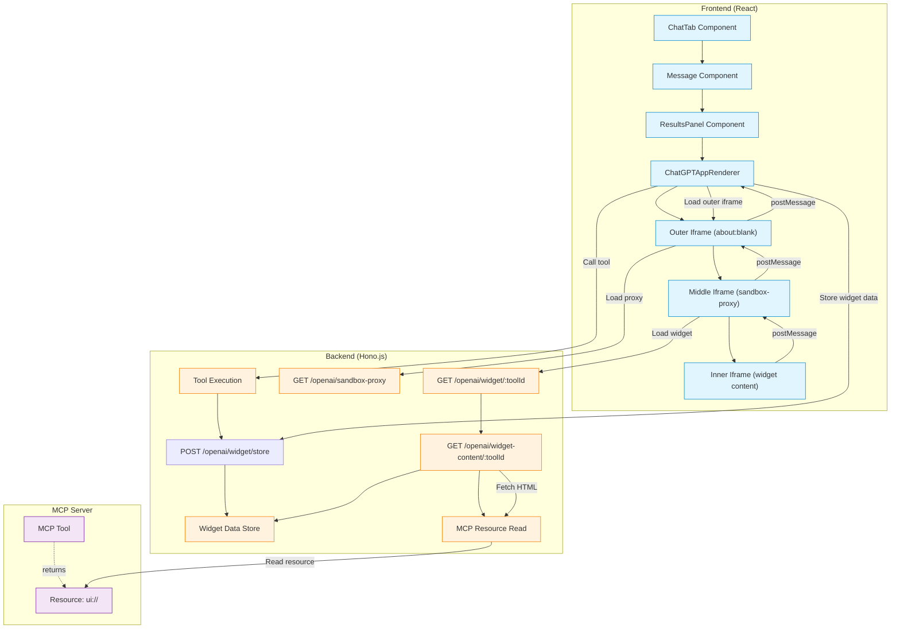
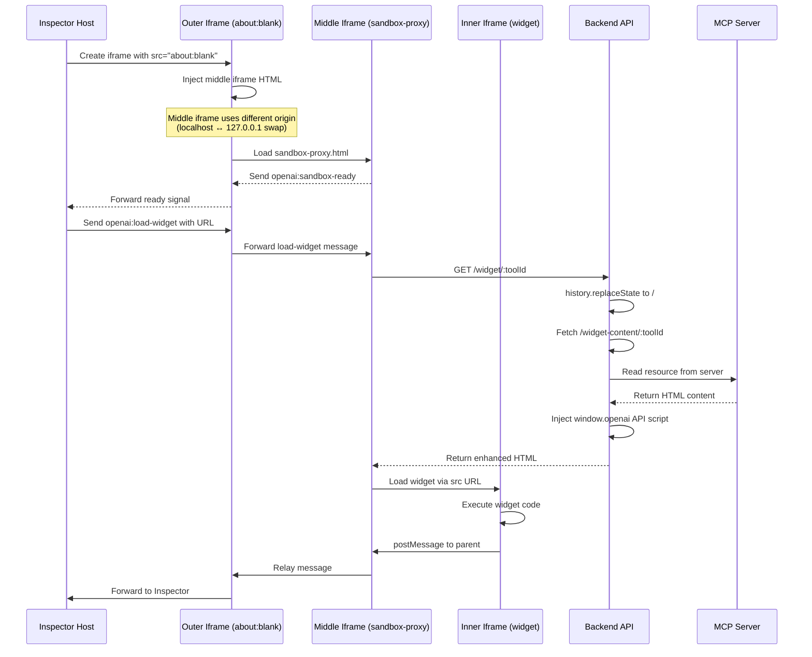
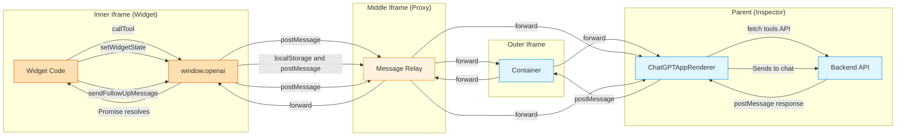
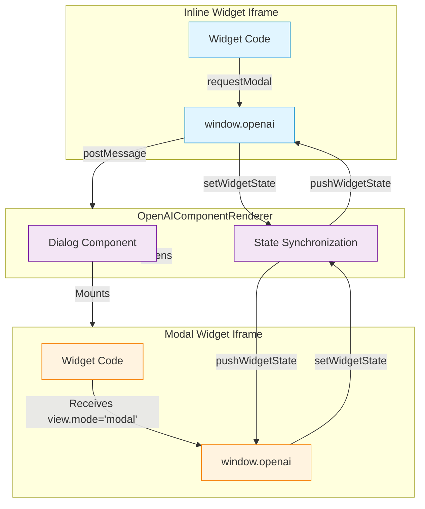
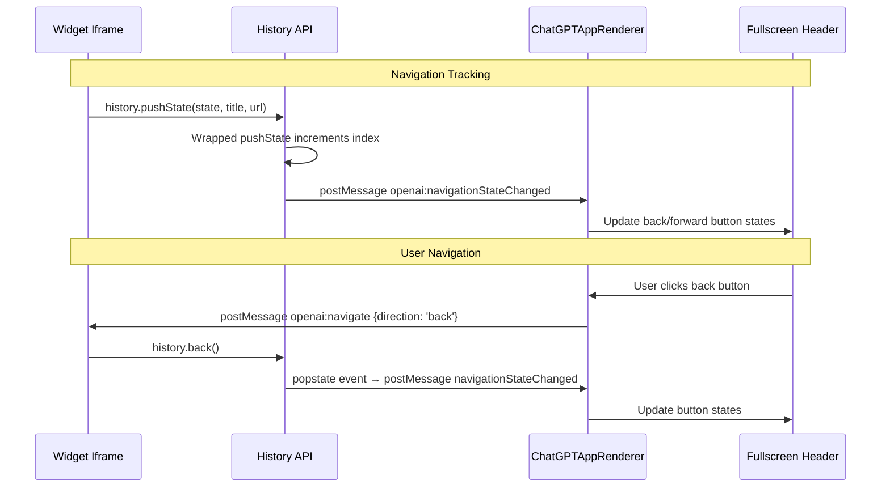

# OpenAI SDK Architecture

This guide explains how MCPJam Inspector implements the OpenAI Apps SDK to render custom UI components for MCP tool results. This enables MCP server developers to create rich, interactive visualizations for their tool outputs.

<Note>
  MCPJam Inspector also supports
  [MCP-UI](https://github.com/modelcontextprotocol/mcp-ui) for simpler
  component-based UIs. See the [Playground
  Architecture](./playground-architecture#mcp-ui-integration) docs for MCP-UI
  implementation details.
</Note>

## Overview

MCPJam Inspector provides full support for the [OpenAI Apps SDK](https://developers.openai.com/apps-sdk), allowing MCP tools to return custom UI components that render in iframes with a sandboxed `window.openai` API bridge.

<Note>
  This document covers the **V1 Playground** implementation. As of PR #773,
  **Playground V2** (`ChatTabV2.tsx`) also supports OpenAI Apps with a
  streamlined implementation using `chatgpt-app-renderer.tsx`. The V2
  implementation uses MCP resources API to fetch widget templates and renders
  them with similar `window.openai` bridge capabilities.
</Note>

### Key Features

- **Custom UI Rendering**: Display tool results using custom HTML/React components
- **Interactive Widgets**: Components can call other MCP tools and send followup messages
- **State Persistence**: Widget state persists across sessions via localStorage
- **Theme Synchronization**: Widgets automatically receive theme updates (light/dark mode)
- **Secure Isolation**: Components run in sandboxed iframes with CSP headers
- **Server-Side Storage**: Widget context stored server-side with 1-hour TTL for iframe access
- **Modal Support**: Widgets can open modal dialogs with separate view contexts
- **Dual Mode Support**:
  - `ui://` URIs for server-provided HTML content
  - External URLs for remotely hosted components

### OpenAI Apps SDK vs MCP-UI

MCPJam Inspector supports two approaches for custom UI rendering:

| Feature           | OpenAI Apps SDK                   | MCP-UI                         |
| ----------------- | --------------------------------- | ------------------------------ |
| Specification     | OpenAI proprietary                | MCP-UI (open standard)         |
| Rendering         | Sandboxed iframes                 | RemoteDOM components           |
| Complexity        | Full web applications             | Simple interactive components  |
| Tool calls        | `window.openai.callTool()`        | Action handlers                |
| State persistence | `window.openai.setWidgetState()`  | Not supported                  |
| Security          | Full iframe sandbox               | Component-level isolation      |
| Best for          | Complex dashboards, charts, forms | Buttons, cards, simple layouts |

**When to use OpenAI Apps SDK:**

- Need full JavaScript framework support (React, Vue, etc.)
- Require persistent state across sessions
- Building complex interactive visualizations
- Need access to external APIs and libraries

**When to use MCP-UI:**

- Simple interactive components (buttons, cards)
- Prefer open standards over proprietary APIs
- Don't need state persistence
- Want faster rendering without iframe overhead

See [Playground Architecture - MCP-UI Integration](./playground-architecture#mcp-ui-integration) for MCP-UI implementation details.

## Architecture Overview

MCPJam Inspector implements a **triple-iframe architecture** matching ChatGPT's actual implementation for maximum compatibility and security isolation:



### Triple-Iframe Architecture

The triple-iframe design provides **true cross-origin isolation** for maximum security:

1. **Outer Iframe** (`about:blank`) - Container with popup permissions
2. **Middle Iframe** (cross-origin sandbox proxy) - Uses localhost ↔ 127.0.0.1 origin swap for isolation
3. **Inner Iframe** (widget content via `src` URL) - Actual widget with proper URL context

**Why Three Iframes?**

- **Cross-origin isolation**: Middle iframe runs on different origin (localhost vs 127.0.0.1)
- **URL context preservation**: Widget loads via `src` (not `srcdoc`) for Next.js/React Router compatibility
- **Security boundaries**: Each layer enforces sandbox restrictions
- **ChatGPT parity**: Matches OpenAI's production implementation exactly

## Component Flow

### 1. Tool Execution & Detection

When a tool is executed that returns OpenAI SDK components or MCP Apps, the system detects this in multiple ways:

**Method A: `_meta["openai/outputTemplate"]` field (ChatGPT Apps)**

```typescript
// Tool definition includes OpenAI output template
{
  "name": "weather_widget",
  "description": "Get weather with custom UI",
  "_meta": {
    "openai/outputTemplate": "ui://weather/display"
  }
}
```

**Method B: `_meta["ui/resourceUri"]` field (MCP Apps)**

```typescript
// Tool definition includes MCP Apps resource URI
{
  "name": "weather_widget",
  "description": "Get weather with custom UI",
  "_meta": {
    "ui/resourceUri": "ui://weather/display"
  }
}
```

**Method C: `ui://` resource in response**

```typescript
// Tool result contains ui:// resource
{
  "content": [{
    "type": "resource",
    "resource": {
      "uri": "ui://weather/display",
      "mimeType": "text/html"
    }
  }]
}
```

#### ResultsPanel Detection Logic

Located in `client/src/components/tools/ResultsPanel.tsx`:

```typescript
// Check for OpenAI component or MCP App using tool metadata from definition
const openaiOutputTemplate = toolMeta?.[\"openai/outputTemplate\"];
const mcpAppResourceUri = toolMeta?.[\"ui/resourceUri\"];
const hasOpenAIComponent =
  openaiOutputTemplate && typeof openaiOutputTemplate === \"string\";
const hasMCPApp = mcpAppResourceUri && typeof mcpAppResourceUri === \"string\";
const uiResource = resolveUIResource(result);
```

The system detects custom UI components by checking for:

1. `openai/outputTemplate` metadata (ChatGPT Apps)
2. `ui/resourceUri` metadata (MCP Apps)
3. `ui://` URIs in tool results via `resolveUIResource`

The `resolveUIResource` function searches for `ui://` URIs in:

1. Direct `resource` field at root level
2. `content` array items with `type: "resource"`

### 2. Widget Data Storage Flow

Before rendering, widget data must be stored server-side for iframe access:


**Why Store Server-Side?**

- Iframes need access to `toolInput` and `toolOutput` for `window.openai` API
- Client localStorage can't be shared across iframe sandbox boundaries
- Server becomes the source of truth for widget initialization data

#### Storage Implementation

Located in `server/routes/mcp/chatgpt.ts:14-51`:

```typescript
interface WidgetData {
  serverId: string;
  uri: string;
  toolInput: Record<string, any>;
  toolOutput: any;
  toolResponseMetadata?: Record<string, any> | null;
  toolId: string;
  toolName: string;
  theme?: "light" | "dark";
  timestamp: number;
}

const widgetDataStore = new Map<string, WidgetData>();

// Cleanup expired widget data every 5 minutes
setInterval(
  () => {
    const now = Date.now();
    const ONE_HOUR = 60 * 60 * 1000;
    for (const [toolId, data] of widgetDataStore.entries()) {
      if (now - data.timestamp > ONE_HOUR) {
        widgetDataStore.delete(toolId);
      }
    }
  },
  5 * 60 * 1000,
).unref();
```

### 3. Triple-Iframe Widget Loading

The system uses a sophisticated triple-iframe architecture with cross-origin isolation:



**Why Triple-Iframe Architecture?**

- **Cross-origin isolation**: Middle iframe uses localhost ↔ 127.0.0.1 origin swap for true security boundary
- **URL context preservation**: Widget loads via `src` (not `srcdoc`) for Next.js/React Router compatibility
- **Message relay**: Each layer forwards postMessage events up/down the chain
- **ChatGPT parity**: Matches OpenAI's production implementation exactly
- **Sandbox enforcement**: Each iframe layer enforces its own sandbox restrictions

#### Sandbox Proxy Implementation

The middle iframe serves as a cross-origin relay between the host and widget. Located in `server/routes/mcp/chatgpt-sandbox-proxy.html`:

```html
<!doctype html>
<html>
  <head>
    <title>ChatGPT Apps Sandbox Proxy</title>
  </head>
  <body>
    <script>
      // Validate sandbox tokens for security
      const ALLOWED_SANDBOX_TOKENS = [
        "allow-scripts",
        "allow-same-origin",
        "allow-forms",
        "allow-popups",
        "allow-popups-to-escape-sandbox",
      ];

      // Create inner iframe for widget content
      const inner = document.createElement("iframe");
      inner.setAttribute("sandbox", "allow-scripts allow-same-origin allow-forms");
      inner.setAttribute("allow", "local-network-access *; microphone *; midi *");
      document.body.appendChild(inner);

      let widgetLoaded = false;

      // Message relay: Parent <-> Inner iframe
      window.addEventListener("message", (event) => {
        if (event.source === window.parent) {
          // Load widget when host sends URL
          if (event.data?.type === "openai:load-widget") {
            const { url, sandbox } = event.data;
            inner.setAttribute("sandbox", validateSandbox(sandbox));
            inner.src = url; // Load via src for URL context
            widgetLoaded = true;
          } else if (widgetLoaded && inner.contentWindow) {
            // Forward messages to widget
            inner.contentWindow.postMessage(event.data, "*");
          }
        } else if (event.source === inner.contentWindow) {
          // Forward messages from widget to host
          window.parent.postMessage(event.data, "*");
        }
      });

      // Signal ready to host
      window.parent.postMessage({ type: "openai:sandbox-ready" }, "*");
    </script>
  </body>
</html>
```

**Key Features:**

- **Cross-origin isolation**: Proxy runs on different origin (localhost ↔ 127.0.0.1)
- **Message relay**: Bidirectional forwarding between host and widget
- **Sandbox validation**: Only allows whitelisted sandbox tokens
- **Widget loading via src**: Preserves URL context for React Router
- **Ready signal**: Notifies host when proxy is initialized

#### Widget Content Injection

The `/widget-content/:toolId` endpoint performs the following:

1. Retrieve widget data from store (includes host-controlled globals)
2. Read HTML from MCP server via `readResource(uri)`
3. Parse view mode and params from query string (`view_mode`, `view_params`)
4. Inject `window.openai` API script with:
   - Host-controlled locale (BCP 47 format, e.g., 'en-US')
   - Host-controlled deviceType ('mobile', 'tablet', 'desktop')
   - Host-controlled userLocation (coarse IP-based geolocation)
   - Host-controlled maxHeight constraint (ChatGPT uses ~500px for inline)
5. Add security headers (CSP, X-Frame-Options)
6. Set cache control headers (no-cache for fresh content)

**Host-Controlled Globals (New in PR #1001):**

Per the OpenAI Apps SDK spec, these values are **controlled by the host** (Inspector), not computed in the widget:

- `locale`: Browser language from `navigator.language` (e.g., 'en-US', 'es-ES')
- `deviceType`: Computed from viewport width (mobile: <768px, tablet: <1024px, desktop: ≥1024px)
- `userLocation`: Coarse IP-based geolocation `{ country, region, city }` or `null` (uses ip-api.com, no API key required)
- `maxHeight`: Maximum allowed height for inline mode (ChatGPT default: ~500px)

These values are passed to the widget via `window.openai` and cannot be overridden by widget code.

### 4. window.openai API Bridge

The injected script provides the OpenAI Apps SDK API to widget code. Messages flow through the triple-iframe chain:



#### API Implementation

Located in `server/routes/mcp/chatgpt.ts:213-376`:

**Core API Methods:**

```javascript
const openaiAPI = {
  toolInput: ${JSON.stringify(toolInput)},
  toolOutput: ${JSON.stringify(toolOutput)},
  toolResponseMetadata: ${JSON.stringify(toolResponseMetadata ?? null)},
  displayMode: 'inline',
  maxHeight: ${maxHeight ?? null},  // Host-controlled constraint
  theme: ${JSON.stringify(theme ?? "dark")},
  locale: ${JSON.stringify(locale ?? "en-US")},  // From playground locale selector
  safeArea: { insets: { top: 0, bottom: 0, left: 0, right: 0 } },
  userAgent: {
    device: { type: 'desktop' },  // 'mobile' | 'tablet' | 'desktop'
    capabilities: { hover: true, touch: false }  // Device input capabilities
  },
  view: {
    mode: ${JSON.stringify(viewMode)},  // 'inline' or 'modal'
    params: ${serializeForInlineScript(viewParams)}
  },
  widgetState: null,

  // Persist widget state (localStorage + propagate to model)
  async setWidgetState(state) {
    this.widgetState = state;
    try {
      localStorage.setItem(widgetStateKey, JSON.stringify(state));
    } catch (err) {
      console.error('[OpenAI Widget] Failed to save widget state:', err);
    }
    // Propagate state to parent for model context
    window.parent.postMessage({
      type: 'openai:setWidgetState',
      toolId: toolId,
      state
    }, '*');
  },

  // Call another MCP tool
  async callTool(toolName, args = {}) {
    const callId = ++this._callId;
    return new Promise((resolve, reject) => {
      this._pendingCalls.set(callId, { resolve, reject });
      
      // Include client-supplied _meta per SDK spec
      window.parent.postMessage({
        type: 'openai:callTool',
        toolName,
        args,
        callId,
        toolId: ${JSON.stringify(toolId)},
        _meta: Object.assign({
          'openai/locale': hostLocale,
          'openai/userAgent': navigator.userAgent,
          'openai/subject': getSubjectId()
        }, hostUserLocation ? { 'openai/userLocation': hostUserLocation } : {})
      }, '*');

      setTimeout(() => {
        if (this._pendingCalls.has(callId)) {
          this._pendingCalls.delete(callId);
          reject(new Error('Tool call timeout'));
        }
      }, 30000);
    });
  },

  // Send followup message to chat
  async sendFollowupTurn(message) {
    const payload = typeof message === 'string'
      ? { prompt: message }
      : message;
    window.parent.postMessage({
      type: 'openai:sendFollowup',
      message: payload.prompt || payload
    }, '*');
  },

  // Request display mode change
  async requestDisplayMode(options = {}) {
    const mode = options.mode || 'inline';
    const maxHeight = options.maxHeight;
    this.displayMode = mode;
    if (typeof maxHeight === 'number') {
      this.maxHeight = maxHeight;
    }
    window.parent.postMessage({
      type: 'openai:requestDisplayMode',
      mode,
      maxHeight
    }, '*');
    return { mode };
  },

  // Alias for compatibility
  async sendFollowUpMessage(args) {
    const prompt = typeof args === 'string' ? args : (args?.prompt || '');
    return this.sendFollowupTurn(prompt);
  },

  // Open external URL
  async openExternal(options) {
    const href = typeof options === 'string' ? options : options?.href;
    if (!href) {
      throw new Error('href is required for openExternal');
    }
    window.parent.postMessage({
      type: 'openai:openExternal',
      href
    }, '*');
    window.open(href, '_blank', 'noopener,noreferrer');
  },

  // Request modal dialog
  async requestModal(options) {
    window.parent.postMessage({
      type: 'openai:requestModal',
      title: options.title,
      params: options.params,
      anchor: options.anchor
    }, '*');
  }
};

// Make available globally
window.openai = openaiAPI;
window.webplus = openaiAPI; // Compatibility alias
```

**Device Globals:**

The `window.openai` API provides device context to widgets through several properties:

- **`userAgent.device.type`** - Device type: `'mobile'`, `'tablet'`, or `'desktop'`. In the UI Playground, this is controlled by the device type selector. Outside the playground, it's automatically detected from the browser window size.

- **`userAgent.capabilities`** - Input capabilities:
  - `hover` (boolean) - Whether the device supports hover interactions
  - `touch` (boolean) - Whether the device supports touch input
  
  In the UI Playground, these are controlled by the hover and touch toggle buttons. Outside the playground, they default to `{ hover: true, touch: false }`.

- **`safeArea.insets`** - Safe area insets in pixels for device notches, rounded corners, and gesture areas:
  - `top` (number) - Top inset in pixels
  - `bottom` (number) - Bottom inset in pixels
  - `left` (number) - Left inset in pixels
  - `right` (number) - Right inset in pixels
  
  In the UI Playground, these are configured through the safe area editor with presets for common devices (iPhone notch, Dynamic Island, Android gesture navigation). Outside the playground, all insets default to 0.

Widgets can use these values to adapt their layout and interactions for different device contexts. For example, a widget might disable hover-based tooltips on touch devices or adjust padding to account for safe area insets.

**Security Notes:**

- API is frozen with `writable: false, configurable: false`
- 30-second timeout on tool calls prevents hanging requests
- Origin validation in parent ensures only iframe messages are processed

**OAuth Challenge Handling (New in PR #1001):**

When a tool returns a 401 status, the system checks for OAuth challenges per RFC 7235:

```typescript
// In ChatGPTAppRenderer message handler
case "openai:callTool": {
  const result = await onCallTool(toolName, args, _meta);
  
  // Check for OAuth challenge in response metadata
  const resultMeta = result?._meta || result?.meta;
  const wwwAuth = resultMeta?.["mcp/www_authenticate"];
  
  if (wwwAuth && typeof wwwAuth === "string") {
    // Parse RFC 7235 challenge: Bearer realm="...", error="...", error_description="..."
    handleOAuthChallenge(wwwAuth, toolName);
  }
  
  postToWidget({
    type: 'openai:callTool:response',
    callId,
    result,
    error: result?.isError ? result?.content?.[0]?.text : undefined
  });
  break;
}
```

The system displays user-friendly toast notifications when OAuth is required, guiding users to configure OAuth in server settings.

### 5. Modal Support

As of PR #931, widgets can request modal dialogs using `window.openai.requestModal()`. This enables widgets to display secondary views or detailed information in a separate modal context.

#### Modal Architecture



#### Modal Request Flow

Located in `client/src/components/chat-v2/chatgpt-app-renderer.tsx:380-388`:

```typescript
case "openai:requestModal": {
  setModalTitle(event.data.title || "Modal");
  setModalParams(event.data.params || {});
  setModalOpen(true);
  break;
}
```

When a widget calls `window.openai.requestModal()`, the parent:

1. Extracts modal title and params from the message
2. Opens a Dialog component
3. Mounts a new iframe with the same widget URL
4. Appends query params: `?view_mode=modal&view_params=<encoded_json>`

#### View Mode Detection

Widgets receive view context via `window.openai.view`:

```javascript
// In widget code
if (window.openai.view.mode === "modal") {
  // Render modal-specific UI
  const params = window.openai.view.params;
  renderModalView(params);
} else {
  // Render inline UI
  renderInlineView();
}
```

#### Widget State Synchronization

Modal and inline views share widget state automatically. When either view calls `setWidgetState()`, the state is propagated to the other view via `openai:pushWidgetState` messages.

Located in `client/src/components/chat-v2/chatgpt-app-renderer.tsx:269-284`:

```typescript
// After state is set, push to other view
const targetWindow = isFromInline
  ? modalWindow
  : isFromModal
    ? inlineWindow
    : null;

if (targetWindow) {
  targetWindow.postMessage(
    {
      type: "openai:pushWidgetState",
      toolId: resolvedToolCallId,
      state: event.data.state,
    },
    "*",
  );
}
```

The receiving view updates its local state and dispatches a `openai:widget_state` event:

Located in `server/routes/mcp/chatgpt.ts:410-428`:

```javascript
if (
  event.data.type === "openai:pushWidgetState" &&
  event.data.toolId === toolId
) {
  try {
    const nextState = event.data.state ?? null;
    window.openai.widgetState = nextState;

    // Update localStorage
    try {
      localStorage.setItem(widgetStateKey, JSON.stringify(nextState));
    } catch (err) {}

    // Dispatch event for widget to listen
    try {
      const stateEvent = new CustomEvent("openai:widget_state", {
        detail: { state: nextState },
      });
      window.dispatchEvent(stateEvent);
    } catch (err) {
      console.error(
        "[OpenAI Widget] Failed to dispatch widget state event:",
        err,
      );
    }
  } catch (err) {
    console.error("[OpenAI Widget] Failed to apply pushed widget state:", err);
  }
}
```

**Example Usage:**

```javascript
// In inline widget
document.getElementById("details-btn").addEventListener("click", () => {
  window.openai.requestModal({
    title: "Detailed View",
    params: { itemId: 123, view: "details" },
  });
});

// Widget code handles both views
if (window.openai.view.mode === "modal") {
  const { itemId, view } = window.openai.view.params;
  renderDetailedView(itemId, view);
} else {
  renderSummaryView();
}

// State changes sync automatically
window.openai.setWidgetState({ selectedItem: 123 });
// Both inline and modal views receive the update
```

### 6. Display Mode Support

As of PR #927, widgets can request different display modes to optimize their presentation:

- **Inline** (default) - Widget renders within the chat message flow with configurable height
- **Picture-in-Picture (PiP)** - Widget floats at the top of the screen in a fixed overlay
- **Fullscreen** - Widget expands to fill the entire viewport

#### Display Mode Implementation

The display mode system uses React state to track which widget (if any) is in PiP mode, and applies different CSS classes based on the current mode:

**State Management** (`client/src/components/chat-v2/thread.tsx`):

```typescript
const [pipWidgetId, setPipWidgetId] = useState<string | null>(null);

const handleRequestPip = (toolCallId: string) => {
  setPipWidgetId(toolCallId);
};

const handleExitPip = (toolCallId: string) => {
  if (pipWidgetId === toolCallId) {
    setPipWidgetId(null);
  }
};
```

**Mode Detection** (`client/src/components/chat-v2/chatgpt-app-renderer.tsx:440-442`):

```typescript
const isPip = displayMode === "pip" && pipWidgetId === resolvedToolCallId;
const isFullscreen = displayMode === "fullscreen";
```

**CSS Classes** (`client/src/components/chat-v2/chatgpt-app-renderer.tsx:444-476`):

```typescript
let containerClassName = "mt-3 space-y-2 relative group";

if (isFullscreen) {
  containerClassName = [
    "fixed",
    "inset-0",
    "z-50",
    "w-full",
    "h-full",
    "bg-background",
    "flex",
    "flex-col",
  ].join(" ");
} else if (isPip) {
  containerClassName = [
    "fixed",
    "top-4",
    "inset-x-0",
    "z-40",
    "w-full",
    "max-w-4xl",
    "mx-auto",
    "space-y-2",
    "bg-background/95",
    "backdrop-blur",
    "supports-[backdrop-filter]:bg-background/80",
    "shadow-xl",
    "border",
    "border-border/60",
    "rounded-xl",
    "p-3",
  ].join(" ");
}
```

**Exit Button** (`client/src/components/chat-v2/chatgpt-app-renderer.tsx:481-493`):

```typescript
{shouldShowExitButton && (
  <button
    onClick={() => {
      setDisplayMode("inline");
      onExitPip?.(resolvedToolCallId);
    }}
    className="absolute left-2 top-2 z-10 flex h-6 w-6 items-center justify-center rounded-md bg-background/80 hover:bg-background border border-border/50 text-muted-foreground hover:text-foreground transition-colors cursor-pointer"
    aria-label="Close PiP mode"
    title="Close PiP mode"
  >
    <X className="w-4 h-4" />
  </button>
)}
```

**Key Features:**

- **Single PiP Widget**: Only one widget can be in PiP mode at a time. Requesting PiP on a different widget automatically exits the current PiP widget.
- **Automatic Inline Fallback**: If a widget is in PiP mode but another widget becomes the active PiP, the first widget automatically returns to inline mode.
- **Z-Index Layering**: Fullscreen widgets use `z-50`, PiP widgets use `z-40`, ensuring proper stacking order.
- **Transform Isolation**: The chat container uses `transform: translateZ(0)` to create a new stacking context, preventing z-index conflicts.
- **Backdrop Blur**: PiP widgets use backdrop blur for a modern floating effect with semi-transparent background.

#### Requesting Display Mode from Widgets

Widgets can request display mode changes using the `window.openai.requestDisplayMode()` API:

```javascript
// Request Picture-in-Picture mode
await window.openai.requestDisplayMode({ mode: "pip" });

// Request Fullscreen mode
await window.openai.requestDisplayMode({ mode: "fullscreen" });

// Return to inline mode
await window.openai.requestDisplayMode({ mode: "inline" });

// Set inline mode with custom height
await window.openai.requestDisplayMode({
  mode: "inline",
  maxHeight: 800,
});
```

The parent component handles these requests and updates the widget's display mode accordingly.

#### Fullscreen Navigation (PR #1033)

When a widget is in fullscreen mode, a navigation header is rendered at the top with back/forward buttons, widget title, and close button. This enables users to navigate multi-page widgets without leaving fullscreen mode.

**Architecture:**

The fullscreen navigation system uses host-backed navigation tracking to mirror the widget's internal history state:



**Implementation Details:**

1. **History Wrapping** (`server/routes/mcp/chatgpt.ts:352-407`):

```javascript
// Track navigation state
const navigationState = { currentIndex: 0, historyLength: 1 };

// Wrap history.pushState to track navigation
const originalPushState = history.pushState.bind(history);
history.pushState = function(state, title, url) {
  const nextIndex = navigationState.currentIndex + 1;
  const stateWithIndex = { ...state, __navIndex: nextIndex };
  originalPushState(stateWithIndex, title, url);
  navigationState.currentIndex = nextIndex;
  navigationState.historyLength = history.length;
  notifyNavigationState();
};

// Track popstate for back/forward navigation
window.addEventListener('popstate', (event) => {
  const stateIndex = event.state?.__navIndex ?? navigationState.currentIndex;
  navigationState.currentIndex = stateIndex;
  notifyNavigationState();
});

// Notify parent of navigation state changes
const notifyNavigationState = () => {
  window.parent.postMessage({
    type: 'openai:navigationStateChanged',
    toolId: toolId,
    canGoBack: navigationState.currentIndex > 0,
    canGoForward: navigationState.currentIndex < navigationState.historyLength - 1,
    historyLength: navigationState.historyLength,
    currentIndex: navigationState.currentIndex
  }, '*');
};
```

2. **Parent-Side Navigation Handler** (`client/src/components/chat-v2/chatgpt-app-renderer.tsx:888-896`):

```typescript
case "openai:navigationStateChanged": {
  // Update navigation button state
  if (event.data.toolId === resolvedToolCallId) {
    setCanGoBack(event.data.canGoBack ?? false);
    setCanGoForward(event.data.canGoForward ?? false);
  }
  break;
}
```

3. **Navigation Command Handler** (`server/routes/mcp/chatgpt.ts:535-551`):

```javascript
case 'openai:navigate':
  // Host-backed navigation: respond to commands from parent
  if (event.data.toolId === toolId) {
    if (event.data.direction === 'back') {
      if (navigationState.currentIndex > 0) {
        navigationState.currentIndex--;
        history.back();
      }
    } else if (event.data.direction === 'forward') {
      if (navigationState.currentIndex < navigationState.historyLength - 1) {
        navigationState.currentIndex++;
        history.forward();
      }
    }
  }
  break;
```

4. **Fullscreen Header UI** (`client/src/components/chat-v2/chatgpt-app-renderer.tsx:1117-1164`):

```typescript
{isFullscreen && (
  <div className="flex items-center justify-between px-4 h-14 border-b">
    <div className="flex items-center gap-2">
      <button
        onClick={() => navigateWidget("back")}
        disabled={!canGoBack}
        className={canGoBack ? "hover:bg-muted cursor-pointer" : "cursor-not-allowed"}
      >
        <ChevronLeft className="w-5 h-5" />
      </button>
      <button
        onClick={() => navigateWidget("forward")}
        disabled={!canGoForward}
        className={canGoForward ? "hover:bg-muted cursor-pointer" : "cursor-not-allowed"}
      >
        <ChevronRight className="w-5 h-5" />
      </button>
    </div>

    <div className="font-medium text-sm">{toolName || "ChatGPT App"}</div>

    <button onClick={() => setDisplayMode("inline")}>
      <X className="w-5 h-5" />
    </button>
  </div>
)}
```

**Key Features:**

- **Host-Backed Navigation**: Parent component mirrors widget's history state, enabling navigation controls outside the iframe
- **State Persistence**: Navigation index stored in `history.state.__navIndex` to survive popstate events
- **Automatic Tracking**: All `pushState`, `replaceState`, and `popstate` events automatically update navigation state
- **Disabled State Management**: Back/forward buttons are disabled when navigation is not available
- **Transform Isolation Fix**: Parent container's `transform: translateZ(0)` is removed in fullscreen mode to prevent z-index stacking issues

**Use Cases:**

- Multi-page dashboards with internal routing
- Wizard-style forms with step navigation
- Documentation browsers with history
- Any widget using React Router or similar routing libraries

### 7. Parent-Side Message Handling

Located in `client/src/components/chat-v2/chatgpt-app-renderer.tsx:312-347`:

```typescript
useEffect(() => {
  const handleMessage = async (event: MessageEvent) => {
    // Accept messages from inline or modal iframe
    const inlineWindow = iframeRef.current?.contentWindow;
    const modalWindow = modalIframeRef.current?.contentWindow;
    const isFromInline = inlineWindow != null && event.source === inlineWindow;
    const isFromModal = modalWindow != null && event.source === modalWindow;

    if (!isFromInline && !isFromModal) {
      return;
    }

    switch (event.data.type) {
      case \"openai:setWidgetState\":
        localStorage.setItem(widgetStateKey, JSON.stringify(event.data.state));
        break;

      case \"openai:callTool\":
        if (onCallTool) {
          try {
            const result = await onCallTool(
              event.data.toolName,
              event.data.params || {}
            );
            const targetWindow = event.source as Window | null;
            targetWindow?.postMessage({
              type: \"openai:callTool:response\",
              requestId: event.data.requestId,
              result: result
            }, \"*\");
          } catch (err) {
            const targetWindow = event.source as Window | null;
            targetWindow?.postMessage({
              type: \"openai:callTool:response\",
              requestId: event.data.requestId,
              error: err instanceof Error ? err.message : \"Unknown error\"
            }, \"*\");
          }
        }
        break;

      case \"openai:sendFollowup\":
        if (onSendFollowup) {
          onSendFollowup(event.data.message);
        }
        break;

      case \"openai:requestDisplayMode\":
        const mode = event.data.mode;
        setDisplayMode(mode);
        if (mode === \"pip\") {
          onRequestPip?.(resolvedToolCallId);
        } else if (mode === \"inline\" || mode === \"fullscreen\") {
          if (pipWidgetId === resolvedToolCallId) {
            onExitPip?.(resolvedToolCallId);
          }
        }
        if (typeof event.data.maxHeight === \"number\") {
          setMaxHeight(event.data.maxHeight);
        }
        break;
    }
  };

  window.addEventListener(\"message\", handleMessage);
  return () => window.removeEventListener(\"message\", handleMessage);
}, [widgetUrl, onCallTool, onSendFollowup, pipWidgetId, onRequestPip, onExitPip, resolvedToolCallId]);
```

#### Display Mode Synchronization

The component automatically resets to inline mode if another widget takes over PiP mode:

Located in `client/src/components/chat-v2/chatgpt-app-renderer.tsx:368-372`:

```typescript
useEffect(() => {
  if (displayMode === "pip" && pipWidgetId !== resolvedToolCallId) {
    setDisplayMode("inline");
  }
}, [displayMode, pipWidgetId, resolvedToolCallId]);
```

This ensures only one widget can be in PiP mode at a time, preventing overlapping floating widgets.

#### Global Values Synchronization

The parent component automatically sends global values to widgets, including theme, display mode, locale, and maxHeight. These values update whenever the user changes settings in the playground.

Located in `client/src/components/chat-v2/chatgpt-app-renderer.tsx:831-850`:
```typescript
useEffect(() => {
  if (!isReady) return;
  const globals: Record<string, unknown> = {
    theme: themeMode,
    displayMode,
    locale,
  };
  if (typeof maxHeight === "number" && Number.isFinite(maxHeight))
    globals.maxHeight = maxHeight;
  postToWidget({ type: "openai:set_globals", globals });
  if (modalOpen) postToWidget({ type: "openai:set_globals", globals }, true);
}, [
  themeMode,
  maxHeight,
  displayMode,
  locale,
  isReady,
  modalOpen,
  postToWidget,
]);
```

Widgets can listen for global value changes using the `openai:set_globals` event:

```javascript
// In widget code
window.addEventListener("message", (event) => {
  if (event.data.type === "openai:set_globals") {
    const { theme, locale, displayMode, maxHeight } = event.data.globals;
    
    // Update widget UI based on theme
    document.body.classList.toggle("dark", theme === "dark");
    
    // Adapt content for locale
    if (locale.startsWith("ja")) {
      // Show Japanese content
    }
    
    // Adjust layout for display mode
    if (displayMode === "fullscreen") {
      // Expand to use full viewport
    }
  }
});
```

**Available Global Values:**

- `theme` - Current theme mode (`"light"` or `"dark"`)
- `displayMode` - Current display mode (`"inline"`, `"pip"`, or `"fullscreen"`)
- `locale` - BCP 47 locale code (e.g., `"en-US"`, `"es-ES"`, `"ja-JP"`)
- `maxHeight` - Maximum height in pixels for inline mode (optional)

#### Widget State Propagation to Model

As of PR #891, widget state changes are now propagated to the LLM model as hidden assistant messages. This allows the AI to understand and reason about widget interactions.

**Implementation** (`client/src/components/chat-v2/chatgpt-app-renderer.tsx:232-244`):

```typescript
case "openai:setWidgetState": {
  // Widget state is already persisted by the iframe script
  console.log("[OpenAI App] Widget state updated:", event.data.state);

  if (onWidgetStateChange && event.data.toolId === resolvedToolCallId) {
    const newState = event.data.state;
    const newStateStr = newState === null ? null : JSON.stringify(newState);

    // Dedupe: only propagate if state actually changed
    if (newStateStr !== previousWidgetStateRef.current) {
      previousWidgetStateRef.current = newStateStr;
      onWidgetStateChange(resolvedToolCallId, newState);
    }
  }
  break;
}
```

**Chat Integration** (`client/src/components/ChatTabV2.tsx:281-326`):

```typescript
const handleWidgetStateChange = useCallback(
  (toolCallId: string, state: any) => {
    setMessages((prevMessages) => {
      const messageId = `widget-state-${toolCallId}`;

      // If state is null, remove the widget state message
      if (state === null) {
        return prevMessages.filter((msg) => msg.id !== messageId);
      }

      const stateText = `The state of widget ${toolCallId} is: ${JSON.stringify(state)}`;

      const existingIndex = prevMessages.findIndex(
        (msg) => msg.id === messageId,
      );

      if (existingIndex !== -1) {
        // Update existing state message if changed
        const existingMessage = prevMessages[existingIndex];
        const existingText =
          existingMessage.parts?.[0]?.type === "text"
            ? (existingMessage.parts[0] as any).text
            : null;
        if (existingText === stateText) {
          return prevMessages; // No change
        }

        const newMessages = [...prevMessages];
        newMessages[existingIndex] = {
          id: messageId,
          role: "assistant",
          parts: [{ type: "text", text: stateText }],
        };
        return newMessages;
      }

      // Add new state message
      return [
        ...prevMessages,
        {
          id: messageId,
          role: "assistant",
          parts: [{ type: "text", text: stateText }],
        },
      ];
    });
  },
  [setMessages],
);
```

**UI Hiding** (`client/src/components/chat-v2/thread.tsx:99`):

```typescript
// Hide widget-state messages from UI (they're sent to model but not displayed)
if (message.id?.startsWith("widget-state-")) return null;
```

**Key Features:**

- **Hidden Messages**: Widget state messages are prefixed with `widget-state-` and hidden from the UI
- **Deduplication**: State changes are only propagated if the serialized state actually changed
- **Model Context**: The LLM receives state updates as assistant messages, enabling it to reason about widget interactions
- **Null Handling**: Setting state to `null` removes the state message entirely
- **Example**: When a chart widget updates its selected date range, the model receives: `"The state of widget tool_123 is: {\"startDate\":\"2024-01-01\",\"endDate\":\"2024-01-31\"}"`

This enables powerful use cases like:

- LLM understanding user interactions with widgets
- Contextual follow-up questions based on widget state
- Multi-turn conversations that reference widget selections
- Debugging widget behavior through model awareness

#### Tool Execution Bridge

Located in `client/src/components/ChatTab.tsx:181-207`:

```typescript
const handleCallTool = async (
  toolName: string,
  params: Record<string, any>
) => {
  const response = await fetch(\"/api/mcp/tools/execute\", {
    method: \"POST\",
    headers: { \"Content-Type\": \"application/json\" },
    body: JSON.stringify({
      toolName,
      parameters: params,
      // Pass serverId if only one server is connected
      ...(selectedConnectedNames.length === 1
        ? { serverId: selectedConnectedNames[0] }
        : {})
    })
  });

  const data = await response.json();
  return data.result;
};
```

## Security Architecture

### Content Security Policy

MCPJam Inspector implements configurable CSP enforcement for widget sandboxing with two modes:

**CSP Modes:**

- **Permissive** (default) - Allows all HTTPS resources for development and testing
- **Strict** (widget-declared) - Only allows domains declared in the widget's `openai/widgetCSP` metadata

#### Widget CSP Declaration

Widgets can declare required domains using the `openai/widgetCSP` metadata field in their resource:

```typescript
{
  "_meta": {
    "openai/widgetCSP": {
      "connect_domains": [
        "https://api.example.com",
        "wss://websocket.example.com"
      ],
      "resource_domains": [
        "https://cdn.example.com",
        "https://fonts.googleapis.com"
      ]
    }
  }
}
```

**Domain Types:**

- `connect_domains` - Allowed origins for `fetch()`, `XMLHttpRequest`, and WebSocket connections (maps to `connect-src`)
- `resource_domains` - Allowed origins for scripts, styles, images, fonts, and media (maps to `script-src`, `style-src`, `img-src`, `font-src`, `media-src`)

#### CSP Header Generation

Located in `server/routes/mcp/chatgpt.ts:571-701`:

```typescript
function buildCspHeader(
  mode: CspMode,
  widgetCsp?: WidgetCspMeta | null,
): CspConfig {
  // Base trusted CDNs (always included for widget asset loading)
  const baseTrustedCdns = [
    "https://persistent.oaistatic.com",
    "https://*.oaistatic.com",
    "https://unpkg.com",
    "https://cdn.jsdelivr.net",
    "https://cdnjs.cloudflare.com",
    "https://cdn.skypack.dev",
    "https://cdn.tailwindcss.com",
  ];

  let connectDomains: string[];
  let resourceDomains: string[];

  switch (mode) {
    case "permissive":
      // Allow https: wildcard
      connectDomains = ["'self'", "https:", "wss:", "ws:"];
      resourceDomains = ["'self'", "data:", "blob:", "https:", ...baseTrustedCdns];
      break;

    case "widget-declared":
      // Honor widget's declared CSP
      connectDomains = [
        "'self'",
        ...(widgetCsp?.connect_domains || []),
      ];
      resourceDomains = [
        "'self'",
        "data:",
        "blob:",
        ...(widgetCsp?.resource_domains || baseTrustedCdns),
      ];
      break;
  }

  // Build full CSP header
  const headerString = [
    "default-src 'self'",
    `script-src 'self' 'unsafe-inline' 'unsafe-eval' ${resourceDomains.join(" ")}`,
    "worker-src 'self' blob:",
    "child-src 'self' blob:",
    `style-src 'self' 'unsafe-inline' ${resourceDomains.join(" ")}`,
    `img-src ${mode === "widget-declared" ? resourceDomains.join(" ") : "'self' data: blob: https:"}`,
    `media-src ${mode === "widget-declared" ? resourceDomains.join(" ") : "'self' data: blob: https:"}`,
    `font-src 'self' data: ${resourceDomains.join(" ")}`,
    `connect-src ${connectDomains.join(" ")}`,
    "frame-ancestors 'self'",
  ].join("; ");

  return { mode, connectDomains, resourceDomains, headerString };
}
```

The CSP header is applied in the `/widget-content/:toolId` endpoint based on the `csp_mode` query parameter.

#### CSP Violation Reporting

Widgets automatically report CSP violations to the parent for debugging. The injected widget script includes a violation listener:

Located in `server/routes/mcp/chatgpt.ts:458-473`:

```javascript
document.addEventListener('securitypolicyviolation', (e) => {
  const violation = {
    type: 'openai:csp-violation',
    toolId: toolId,
    directive: e.violatedDirective,
    blockedUri: e.blockedURI,
    sourceFile: e.sourceFile || null,
    lineNumber: e.lineNumber || null,
    columnNumber: e.columnNumber || null,
    originalPolicy: e.originalPolicy,
    effectiveDirective: e.effectiveDirective,
    disposition: e.disposition,
    timestamp: Date.now(),
  };

  console.warn('[OpenAI Widget CSP Violation]', violation.directive, ':', violation.blockedUri);
  window.parent.postMessage(violation, '*');
});
```

Violations are collected in the widget debug store and displayed in the CSP debug panel with actionable suggestions for fixing CSP declarations.

#### CSP Debug Panel

The UI Playground includes a CSP debug tab (shield icon) that shows:

- **Suggested fix** - Automatically generated `openai/widgetCSP` JSON snippet based on violations
- **Blocked requests** - List of all CSP violations with directive, URI, and source location
- **Declared domains** - Current `connect_domains` and `resource_domains` from widget metadata
- **Full CSP header** - Complete CSP header string for advanced debugging

Located in `client/src/components/chat-v2/csp-debug-panel.tsx`.

#### Development vs Production

- **Development**: Use permissive mode to avoid CSP issues while building widgets
- **Testing**: Switch to strict mode in UI Playground to identify required domains
- **Production**: Always use strict mode with properly declared `openai/widgetCSP` metadata

<Warning>
  The `'unsafe-inline'` and `'unsafe-eval'` directives are currently required for React and other frameworks. Future versions may support stricter CSP with nonces or hashes.
</Warning>

### Iframe Sandbox

Located in `client/src/components/chat-v2/chatgpt-app-renderer.tsx:518-530`:

```typescript
<iframe
  src="about:blank"
  sandbox="allow-scripts allow-same-origin allow-popups allow-popups-to-escape-sandbox allow-forms"
  allow="local-network-access *; microphone *; midi *"
  title={title}
/>
```

**Middle Iframe** (injected into outer iframe):

```html
<iframe
  id="middle"
  src="${sandboxProxyUrl}"  <!-- Cross-origin: localhost ↔ 127.0.0.1 -->
  sandbox="allow-scripts allow-same-origin allow-forms"
  allow="local-network-access *; microphone *; midi *"
></iframe>
```

**Inner Iframe** (created by sandbox proxy):

```javascript
const inner = document.createElement("iframe");
inner.setAttribute("sandbox", "allow-scripts allow-same-origin allow-forms");
inner.setAttribute("allow", "local-network-access *; microphone *; midi *");
inner.src = widgetUrl;  // Widget content loaded via src
```

**Sandbox Permissions:**

- `allow-scripts`: Enable JavaScript execution
- `allow-same-origin`: Allow localStorage access (required for state)
- `allow-forms`: Support form submissions
- `allow-popups`: Enable external link navigation (outer iframe only)
- `allow-popups-to-escape-sandbox`: Allow popup windows to load normally (outer iframe only)

**Security Architecture:**

- **Cross-origin isolation**: Middle iframe uses different origin (localhost ↔ 127.0.0.1) for true security boundary
- **Message relay**: Each layer validates and forwards messages, preventing direct access
- **CSP enforcement**: Each iframe layer enforces Content Security Policy
- **Sandbox layering**: Permissions are progressively restricted at each level
- **Widget trust model**: Widgets are semi-trusted code with limited host access

## Complete Data Flow Example

Let's trace a complete interaction where a widget calls a tool:


## Development Guide

### Testing OpenAI SDK Widgets Locally

1. **Create a test MCP server with OpenAI SDK support:**

```typescript
// server.ts
import { Server } from \"@modelcontextprotocol/sdk/server/index.js\";
import { StdioServerTransport } from \"@modelcontextprotocol/sdk/server/stdio.js\";

const server = new Server(
  { name: \"test-widget-server\", version: \"1.0.0\" },
  { capabilities: { tools: {}, resources: {} } }
);

// Define tool with OpenAI output template
server.setRequestHandler(ListToolsRequestSchema, async () => ({
  tools: [{
    name: \"hello_widget\",
    description: \"Test widget with custom UI\",
    inputSchema: {
      type: \"object\",
      properties: {
        name: { type: \"string\" }
      }
    },
    _meta: {
      \"openai/outputTemplate\": \"ui://hello/display\"
    }
  }]
}));

// Tool returns structured content
server.setRequestHandler(CallToolRequestSchema, async (request) => {
  if (request.params.name === \"hello_widget\") {
    return {
      content: [{
        type: \"resource\",
        resource: {
          uri: \"ui://hello/display\",
          mimeType: \"text/html\"
        }
      }],
      _meta: {
        structuredContent: {
          greeting: `Hello, ${request.params.arguments.name}!`,
          timestamp: new Date().toISOString()
        }
      }
    };
  }
});

// Serve widget HTML
server.setRequestHandler(ReadResourceRequestSchema, async (request) => {
  if (request.params.uri === \"ui://hello/display\") {
    return {
      contents: [{
        uri: \"ui://hello/display\",
        mimeType: \"text/html\",
        text: `
<!DOCTYPE html>
<html>
<head>
  <meta charset=\"UTF-8\">
  <title>Hello Widget</title>
  <style>
    body { font-family: system-ui; padding: 20px; }
    button { padding: 10px 20px; margin: 10px 0; }
  </style>
</head>
<body>
  <div id=\"app\"></div>
  <script>
    // Access tool input/output
    const input = window.openai.toolInput;
    const output = window.openai.toolOutput;

    // Render UI
    document.getElementById('app').innerHTML = \`
      <h1>\${output.greeting}</h1>
      <p>Time: \${output.timestamp}</p>
      <button id=\"refresh\">Refresh</button>
      <button id=\"followup\">Send Followup</button>
    \`;

    // Call tool on button click
    document.getElementById('refresh').addEventListener('click', async () => {
      const result = await window.openai.callTool('hello_widget', {
        name: input.name + ' (refreshed)'
      });
      console.log('Tool result:', result);
    });

    // Send followup message
    document.getElementById('followup').addEventListener('click', () => {
      window.openai.sendFollowupTurn('Tell me more about greetings');
    });
  </script>
</body>
</html>
        `
      }]
    };
  }
});

const transport = new StdioServerTransport();
server.connect(transport);
```

2. **Add server to MCPJam Inspector config:**

```json
{
  \"mcpServers\": {
    \"test-widget\": {
      \"command\": \"node\",
      \"args\": [\"path/to/server.ts\"]
    }
  }
}
```

3. **Test in Inspector:**
   - Connect to server in Servers tab
   - Navigate to Chat tab
   - Execute: "Call the hello_widget tool with name John"
   - Widget should render with interactive buttons

### Debugging Widget Issues

**Common Problems:**

1. **Widget doesn't load (404)**
   - Check that `widgetDataStore` contains toolId
   - Verify storage TTL hasn't expired (1 hour default)
   - Confirm MCP server returns valid HTML for `ui://` resource

2. **`window.openai` is undefined**
   - Verify script injection in Stage 2 content endpoint
   - Check browser console for CSP violations
   - Ensure `<head>` tag exists in HTML for injection

3. **Widget data not found (404)**
   - Check that widget data was successfully stored via POST `/api/mcp/openai/widget/store`
   - Verify toolId matches between store and load requests
   - Check server logs for storage errors

4. **Tool calls timeout**
   - Check network tab for `/api/mcp/tools/execute` failures
   - Verify MCP server is connected and responsive
   - Increase timeout in `callTool` implementation (default: 30s)

5. **React Router 404 errors**
   - Confirm Stage 1 executes `history.replaceState('/')` before loading
   - Check that widget uses `BrowserRouter` not `HashRouter`
   - Verify `<base href=\"/\">` is present in HTML

6. **State doesn't persist**
   - Check localStorage in browser DevTools
   - Verify `widgetStateKey` format: `openai-widget-state:${toolName}:${toolId}`
   - Confirm `setWidgetState` postMessage handler is working

7. **Theme not updating**
   - Check that `openai:set_globals` messages are being sent from parent
   - Verify widget has event listener for theme changes
   - Inspect `window.openai.theme` value in widget console

8. **Modal not opening**
   - Verify `requestModal` postMessage is being sent
   - Check that Dialog component state is updating (`modalOpen`)
   - Inspect modal iframe URL includes `view_mode=modal` query param
   - Confirm `window.openai.view.mode` is `'modal'` in modal iframe

9. **State not syncing between inline and modal**
   - Check that both iframes are mounted and have valid contentWindow
   - Verify `openai:pushWidgetState` messages are being sent
   - Inspect localStorage for widget state key
   - Confirm both views have `openai:widget_state` event listener

10. **CSP violations blocking resources**
    - Check the CSP debug tab (shield icon) for violation details
    - Switch to permissive mode in UI Playground to bypass CSP temporarily
    - Add blocked domains to `openai/widgetCSP` metadata in your widget
    - Verify CSP header in Network tab matches expected configuration
    - Use the suggested fix snippet from the CSP debug panel

**Debug Tools:**

```javascript
// Add to widget for debugging
window.addEventListener("message", (e) => {
  console.log("[Widget] Received message:", e.data);
});

// Monitor all postMessage calls
const originalPostMessage = window.parent.postMessage;
window.parent.postMessage = function (...args) {
  console.log("[Widget] Sending message:", args[0]);
  return originalPostMessage.apply(window.parent, args);
};

// Check openai API availability
console.log("openai API:", window.openai);
console.log("toolInput:", window.openai?.toolInput);
console.log("toolOutput:", window.openai?.toolOutput);

// Monitor CSP violations
document.addEventListener("securitypolicyviolation", (e) => {
  console.error("[CSP Violation]", {
    directive: e.violatedDirective,
    blockedUri: e.blockedURI,
    sourceFile: e.sourceFile,
    lineNumber: e.lineNumber,
  });
});
```

### Extending the Implementation

**Adding New OpenAI API Methods:**

1. Update server-side injection script (`server/routes/mcp/chatgpt.ts:213-376`)
2. Add postMessage handler in parent (`client/src/components/chat-v2/chatgpt-app-renderer.tsx`)
3. Update TypeScript types if needed

**Example: Adding a custom method:**

```typescript
// 1. Server-side API injection (server/routes/mcp/chatgpt.ts)
openaiAPI.customMethod = async function(options) {
  window.parent.postMessage({
    type: 'openai:customMethod',
    data: options
  }, '*');
};

// 2. Parent-side handler (client/src/components/chat-v2/chatgpt-app-renderer.tsx)
case \"openai:customMethod\":
  handleCustomMethod(event.data.data);
  break;
```

**Note on Message Flow:**

Remember that messages flow through the triple-iframe chain:
- Widget → Middle Proxy → Outer Container → Host
- Each layer forwards messages bidirectionally
- Origin validation occurs at each boundary

## Performance Considerations

### Widget Data Storage

- **TTL**: 1 hour default, configurable in `chatgpt.ts:22`
- **Cleanup**: Runs every 5 minutes
- **Memory**: Each widget stores ~1-10KB (toolInput + toolOutput + host globals)
- **Scale**: 1000 concurrent widgets ≈ 10MB memory
- **Recommendation**: For production, use Redis instead of Map

### Iframe Rendering

- **Initial Load**: 300-700ms (triple-iframe setup + resource fetch + cross-origin relay)
- **Tool Calls**: 100-300ms (postMessage relay through 3 iframes + backend + MCP)
- **Message Latency**: Additional 5-10ms per iframe layer (3 layers = 15-30ms overhead)
- **Optimization**:
  - Cache MCP resource reads (currently disabled with `no-cache`)
  - Preload widget data before iframe creation
  - Use service workers for offline support
  - Consider WebSocket for high-frequency tool calls

### postMessage Overhead

- **Latency**: 5-15ms per message round-trip
- **Payload**: JSON serialization for all data
- **Bottleneck**: Large tool results (>1MB) slow down significantly
- **Mitigation**: Use streaming or chunked responses for large data

## Security Best Practices

1. **Validate postMessage Origins:**

   ```typescript
   if (event.source !== iframeRef.current?.contentWindow) return;
   ```

2. **Sanitize Tool Parameters:**

   ```typescript
   const params = JSON.parse(JSON.stringify(event.data.params)); // Deep clone
   // Validate against tool schema before execution
   ```

3. **Limit Widget Capabilities:**
   - Only expose necessary MCP tools to widgets
   - Implement rate limiting on tool calls
   - Restrict network access via CSP

4. **Content Security Policy:**
   - Remove `unsafe-eval` if possible (breaks some frameworks)
   - Whitelist only trusted CDNs
   - Consider using nonces for inline scripts

5. **Audit Widget Code:**
   - Widgets have semi-trusted status
   - Review HTML content from MCP servers
   - Scan for XSS vulnerabilities
   - Monitor for suspicious postMessage patterns

## Related Files

- `client/src/components/tools/ResultsPanel.tsx` - Detects OpenAI components
- `client/src/components/chat-v2/chatgpt-app-renderer.tsx` - Main renderer component with triple-iframe architecture
- `client/src/components/ui/chatgpt-sandboxed-iframe.tsx` - Triple-iframe implementation with cross-origin isolation
- `client/src/components/chat-v2/thread.tsx` - Manages PiP state across all widgets in the thread
- `client/src/components/ChatTabV2.tsx` - Chat integration with transform isolation for z-index stacking
- `server/routes/mcp/chatgpt.ts` - Widget storage, serving, and OpenAI bridge injection
- `server/routes/mcp/chatgpt-sandbox-proxy.html` - Middle iframe proxy for cross-origin message relay
- `server/routes/mcp/index.ts` - Mounts ChatGPT routes at `/chatgpt`
- `client/src/components/chat-v2/csp-debug-panel.tsx` - CSP debug panel UI
- `client/src/components/ui-playground/PlaygroundMain.tsx` - UI Playground with CSP mode selector
- `client/src/stores/ui-playground-store.ts` - CSP mode state management
- `client/src/stores/widget-debug-store.ts` - CSP violation tracking
- `client/src/lib/mcp-tools-api.ts` - Tool execution API

## Resources

- [OpenAI Apps SDK - Custom UX Guide](https://developers.openai.com/apps-sdk/build/custom-ux)
- [OpenAI Apps SDK - API Reference](https://developers.openai.com/apps-sdk/reference)
- [MCP Specification](https://modelcontextprotocol.io/)
- [MCPJam Inspector Repository](https://github.com/MCPJam/inspector)

## Contributing

When contributing to the OpenAI SDK integration:

1. **Test with real MCP servers** - Don't just mock the API
2. **Check security implications** - All changes to iframe/postMessage code need review
3. **Update this documentation** - Keep architecture diagrams current
4. **Add debug logging** - Use `console.log` with `[OpenAI Widget]` prefix
5. **Consider backwards compatibility** - Existing widgets should continue working

For questions or issues, open a GitHub issue or join our [Discord community](https://discord.gg/JEnDtz8X6z).
