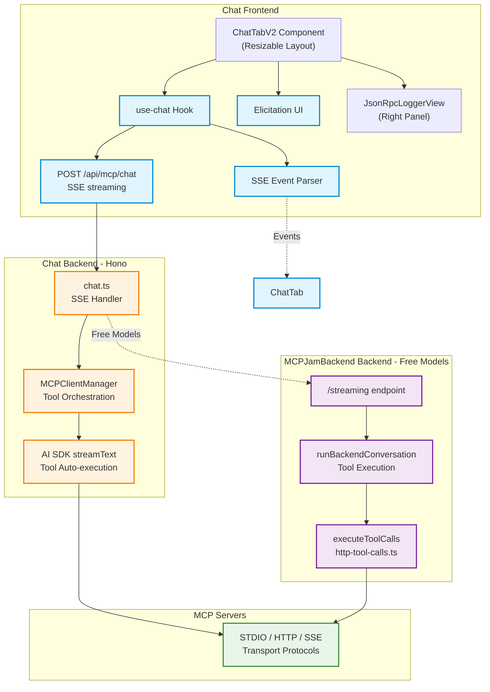

## Overview

The **Playground** (Chat Tab) is MCPJam Inspector's interactive testing environment for MCP servers with LLM integration. It enables real-time conversation with AI models while automatically invoking MCP tools, handling elicitations, and streaming responses.

**Key Features**:

- Multi-provider LLM support (OpenAI, Anthropic, DeepSeek, Google, Ollama)
- Free chat via MCPJam-provided models (powered by MCPJam backend)
- Real-time MCP tool execution with OpenAI Apps SDK compatibility
- MCP-UI rendering for custom interactive components
- Server-Sent Events (SSE) for streaming responses
- Interactive elicitation support (MCP servers requesting user input)
- Multi-server MCP integration with automatic tool routing

**Location**:

- Frontend: `client/src/components/ChatTabV2.tsx` (new resizable layout)
- Legacy: `client/src/components/ChatTab.tsx` (original single-panel layout)
- Backend: `server/routes/mcp/chat.ts`
- Hook: `client/src/hooks/use-chat.ts`

---

## Architecture Overview

### UI Layout (ChatTabV2)

The playground uses a **resizable split-panel layout** powered by `ResizablePanelGroup`:

```typescript
// client/src/components/ChatTabV2.tsx
<ResizablePanelGroup direction="horizontal">
  <ResizablePanel defaultSize={70} minSize={40}>
    {/* Chat interface with messages and input */}
  </ResizablePanel>

  <ResizableHandle withHandle />

  <ResizablePanel defaultSize={30} minSize={20} maxSize={50}>
    <JsonRpcLoggerView /> {/* Real-time MCP protocol viewer */}
  </ResizablePanel>
</ResizablePanelGroup>
```

**Key Features**:

- Chat panel (left): Message history, tool execution, input form
- Logger panel (right): JSON-RPC messages from MCP servers
- Resizable divider: Users can adjust panel sizes
- Responsive: Minimum widths prevent UI collapse

### System Components



---

## Chat Flow: Local vs Backend

The Playground supports two execution paths based on the selected model:

### 1. Local Execution (User API Keys)

Used when the user selects models requiring their own API keys (OpenAI, Anthropic, DeepSeek, Google, or Ollama).

**Flow**:

```typescript
// client/src/hooks/use-chat.ts:329-446
1. User sends message → useChat hook
2. Hook posts to /api/mcp/chat with:
   - model, provider, apiKey
   - messages history
   - systemPrompt, temperature
   - selectedServers (MCP server IDs)
   - sendMessagesToBackend: false

3. Backend (server/routes/mcp/chat.ts:741-762):
   a. Gets tools from MCPClientManager.getToolsForAiSdk(selectedServers)
   b. Creates LLM model via createLlmModel(model, apiKey)
   c. Calls createStreamingResponse() with tools

4. createStreamingResponse (chat.ts:207-403):
   a. Converts messages to AI SDK format
   b. Calls streamText() with:
      - model
      - tools (from MCPClientManager)
      - messages
      - onChunk callback for streaming
   c. Runs agent loop (MAX_AGENT_STEPS = 10):
      - Streams text deltas to client via SSE
      - On tool-call: Emits tool_call event, executes via AI SDK
      - On tool-result: Emits tool_result event with serverId
      - Continues if finishReason === "tool-calls"
   d. Emits elicitation_complete and [DONE]

5. Client receives SSE events:
   - text: Appends to message content
   - tool_call: Adds to contentBlocks
   - tool_result: Updates tool status, displays result
   - elicitation_request: Opens dialog for user input
```

**Key Files**:

- `server/routes/mcp/chat.ts:207-403` - `createStreamingResponse()`
- `server/utils/chat-helpers.ts` - `createLlmModel()`
- `client/src/hooks/use-chat.ts:181-327` - SSE event handling

---

### 2. Backend Execution (Free Models via MCPJamBackend)

Used when the user selects MCPJam-provided models (identified by `isMCPJamProvidedModel()`).

**Flow**:

```typescript
// server/routes/mcp/chat.ts:405-589
1. User sends message → useChat hook
2. Hook posts to /api/mcp/chat with:
   - model (MCPJam-provided)
   - messages history
   - sendMessagesToBackend: true
   - Authorization header (from WorkOS auth)

3. Backend calls sendMessagesToBackend() (chat.ts:405-589):
   a. Fetches tools from MCPClientManager
   b. Converts tools to JSON schema format (zodToJsonSchema)
   c. Calls runBackendConversation (shared/backend-conversation.ts)

4. runBackendConversation (backend-conversation.ts:69-169):
   a. Sends POST to CONVEX_HTTP_URL/streaming with:
      - tools (JSON schemas)
      - messages (stringified)
      - modelId
   b. Backend returns { ok: true, messages: [...] }
   c. For each message:
      - Extracts text content → emits SSE text event
      - Extracts tool-calls → emits tool_call events
   d. Calls executeToolCalls() to execute pending tools
   e. Loops until no unresolved tool calls or MAX_AGENT_STEPS

5. executeToolCallsFromMessages (shared/http-tool-calls.ts:68-193):
   a. Builds tool index with serverId metadata
   b. Finds unresolved tool calls in messages
   c. Executes each via tool.execute(input)
   d. Appends tool-result messages with:
      - output, result (with _meta for Apps SDK)
      - serverId (for OpenAI component resolution)

6. Client receives same SSE events as local execution
```

**Key Files**:

- `server/routes/mcp/chat.ts:405-589` - `sendMessagesToBackend()`
- `shared/backend-conversation.ts` - `runBackendConversation()`
- `shared/http-tool-calls.ts` - `executeToolCallsFromMessages()`

**MCPJam-Provided Models** (defined in `shared/types.ts:109-118`):

- `meta-llama/llama-3.3-70b-instruct`
- `openai/gpt-oss-120b`
- `x-ai/grok-4-fast`
- `openai/gpt-5-nano`

---

## Free Chat: MCPJamBackend Integration

MCPJam Inspector offers **free chat** powered by MCPJamBackend at `CONVEX_HTTP_URL`.

### How It Works

**1. Model Selection**:

```typescript
// client/src/hooks/use-chat.ts:128-130
const apiKey = isMCPJamProvidedModel(model.id) ? "router" : getToken(provider);
```

**2. Authentication**:

```typescript
// client/src/hooks/use-chat.ts:348-361
if (routeThroughBackend && getAccessToken) {
  const token = await getAccessToken(); // WorkOS auth
  authHeader = `Bearer ${token}`;
}
```

**3. Backend Routing**:

```typescript
// server/routes/mcp/chat.ts:649-652
const sendToBackend =
  model?.id &&
  isMCPJamProvidedModel(model.id) &&
  Boolean(requestData.sendMessagesToBackend);
```

**4. MCPJamBackend Communication**:

```typescript
// server/routes/mcp/chat.ts:85-117
const sendBackendRequest = async (baseUrl, authHeader, body, streamingContext) => {
  const res = await fetch(`${baseUrl}/streaming`, {
    method: "POST",
    headers: {
      "content-type": "application/json",
      ...(authHeader ? { Authorization: authHeader } : {}),
    },
    body: JSON.stringify({
      tools: [...], // JSON schemas
      messages: "...", // Stringified messages
      model: "meta-llama/llama-3.3-70b-instruct"
    }),
  });
  return await res.json();
};
```

**5. Response Format**:

```typescript
// shared/backend-conversation.ts:10-14
type BackendFetchResponse = {
  ok?: boolean;
  messages?: ModelMessage[]; // AI SDK format
};
```

**Environment Variables**:

- `CONVEX_HTTP_URL` - MCPJamBackend backend endpoint (required for free chat)
- Authenticated users get access via WorkOS tokens

---

## MCP Integration via MCPClientManager

The Playground uses **MCPClientManager** to orchestrate MCP server connections and tool execution.

### Tool Retrieval

```typescript
// server/routes/mcp/chat.ts:743-746
const toolsets = await mcpClientManager.getToolsForAiSdk(
  requestData.selectedServers, // ["server1", "server2", ...]
);
```

**What `getToolsForAiSdk()` does** (see `docs/contributing/mcp-client-manager.mdx`):

1. Fetches tools from specified servers (or all if undefined)
2. Converts MCP tool schemas to AI SDK format
3. Attaches `_serverId` metadata to each tool
4. Wires up `tool.execute()` to call `mcpClientManager.executeTool()`
5. Caches tool `_meta` fields for OpenAI Apps SDK

**Example Tool Object**:

```typescript
{
  name: "server1_read_file",
  description: "Read file contents",
  parameters: z.object({ path: z.string() }),
  execute: async (args) => {
    return await mcpClientManager.executeTool("server1", "read_file", args);
  },
  _serverId: "server1", // Added by MCPClientManager
  _meta: { ... } // OpenAI Apps SDK metadata
}
```

### Tool Execution Flow

**Local Execution (AI SDK)**:

```typescript
// server/routes/mcp/chat.ts:242-338
await streamText({
  model,
  tools: toolsets, // Contains wired execute functions
  messages,
  onChunk: async (chunk) => {
    if (chunk.chunk.type === "tool-call") {
      // AI SDK automatically calls tool.execute()
      // which internally calls mcpClientManager.executeTool()
    }
    if (chunk.chunk.type === "tool-result") {
      // Extract serverId from toolCallIdToName map
      const serverId = extractServerId(toolName);
      sendSseEvent(controller, encoder, {
        type: "tool_result",
        toolResult: { ..., serverId }
      });
    }
  }
});
```

**Backend Execution (MCPJamBackend)**:

```typescript
// shared/http-tool-calls.ts:68-193
await executeToolCallsFromMessages(messages, {
  toolsets: toolsetsByServer, // { server1: { tool1, tool2 }, server2: { ... } }
});

// For each unresolved tool call:
const tool = index[toolName];
const serverId = tool._serverId;
const result = await tool.execute(input);

// Append tool-result message with serverId
messages.push({
  role: "tool",
  content: [
    {
      type: "tool-result",
      toolCallId,
      output,
      result, // Full result with _meta
      serverId, // For OpenAI Apps SDK
    },
  ],
});
```

### Server Selection

Users can select which MCP servers to use in the chat:

```typescript
// client/src/components/ChatTab.tsx:50-54
const selectedServerNames = Object.keys(serverConfigs || {});
const selectedConnectedNames = selectedServerNames.filter(
  (name) => connectedServerConfigs?.[name]?.connectionStatus === "connected",
);
```

**Passed to backend**:

```typescript
// client/src/hooks/use-chat.ts:379
body: JSON.stringify({
  ...selectedServers, // ["server1", "server2"]
});
```

---

## Streaming Implementation (SSE)

The Playground uses **Server-Sent Events (SSE)** for real-time streaming of LLM responses and tool execution.

### Event Types

Defined in `shared/sse.ts`:

```typescript
type SSEvent =
  | SSETextEvent // LLM text chunks
  | SSEToolCallEvent // Tool invocation
  | SSEToolResultEvent // Tool execution result
  | SSEElicitationRequestEvent // MCP server requesting input
  | SSEElicitationCompleteEvent // Elicitation resolved
  | SSETraceStepEvent // Agent step summary
  | SSEErrorEvent; // Error occurred
```

### Server-Side Streaming

```typescript
// server/routes/mcp/chat.ts:677-775
return new Response(
  new ReadableStream({
    async start(controller) {
      const streamingContext = {
        controller,
        encoder: new TextEncoder(),
        toolCallId: 0,
        lastEmittedToolCallId: null,
        stepIndex: 0,
        toolCallIdToName: new Map(), // Track tool names for serverId lookup
      };

      // Stream LLM response
      await createStreamingResponse(model, tools, messages, streamingContext, ...);

      controller.close();
    }
  }),
  {
    headers: {
      "Content-Type": "text/event-stream",
      "Cache-Control": "no-cache",
      Connection: "keep-alive",
    }
  }
);
```

**Helper Function**:

```typescript
// server/routes/mcp/chat.ts:69-76
const sendSseEvent = (controller, encoder, event) => {
  const payload = event === "[DONE]" ? "[DONE]" : JSON.stringify(event);
  controller.enqueue(encoder.encode(`data: ${payload}\n\n`));
};
```

### Client-Side Parsing

```typescript
// client/src/hooks/use-chat.ts:396-422
const reader = response.body?.getReader();
for await (const evt of parseSSEStream(reader)) {
  if (evt === "[DONE]") break;
  applySseEvent(evt, assistantMessage, ...);
}
```

**Event Handlers** (`client/src/hooks/use-chat.ts:181-327`):

```typescript
switch (evt.type) {
  case "text":
    // Append to message content
    assistantContentRef.current += evt.content;
    contentBlocksRef.current.push({
      type: "text",
      content: evt.content,
    });
    break;

  case "tool_call":
    // Add tool call to message
    toolCallsRef.current.push(evt.toolCall);
    contentBlocksRef.current.push({
      type: "tool_call",
      toolCall: evt.toolCall,
    });
    break;

  case "tool_result":
    // Update tool call status and add result
    toolResultsRef.current.push(evt.toolResult);
    // Update corresponding tool_call block with result
    break;

  case "elicitation_request":
    // Show dialog for user input
    setElicitationRequest(evt);
    break;
}
```

---

## Elicitation Support

**Elicitation** allows MCP servers to request interactive input from the user during tool execution.

### Flow

```typescript
// server/routes/mcp/chat.ts:688-728
mcpClientManager.setElicitationCallback(async (request) => {
  // Emit SSE event to client
  sendSseEvent(controller, encoder, {
    type: "elicitation_request",
    requestId: request.requestId,
    message: request.message,
    schema: request.schema,
    timestamp: new Date().toISOString(),
  });

  // Wait for user response
  return new Promise((resolve, reject) => {
    const timeout = setTimeout(() => reject(new Error("Timeout")), 300000);
    mcpClientManager.getPendingElicitations().set(request.requestId, {
      resolve: (response) => {
        clearTimeout(timeout);
        resolve(response);
      },
      reject: (error) => {
        clearTimeout(timeout);
        reject(error);
      },
    });
  });
});
```

### User Response

```typescript
// server/routes/mcp/chat.ts:611-637
if (action === "elicitation_response") {
  const success = mcpClientManager.respondToElicitation(
    requestId,
    response, // { action: "accept", content: {...} }
  );
  return c.json({ success });
}
```

**Client Side** (`client/src/hooks/use-chat.ts:563-619`):

```typescript
const handleElicitationResponse = async (action, parameters) => {
  await fetch("/api/mcp/chat", {
    method: "POST",
    body: JSON.stringify({
      action: "elicitation_response",
      requestId: elicitationRequest.requestId,
      response: {
        action, // "accept" | "decline" | "cancel"
        content: parameters,
      },
    }),
  });
};
```

**UI Component**: `client/src/components/ElicitationDialog.tsx`

---

## OpenAI Apps SDK Integration

MCPJam Inspector supports **OpenAI Apps SDK** via `_meta` field preservation in tool results.

### Why `_meta`?

The OpenAI Apps SDK uses `_meta` to pass rendering hints to OpenAI's UI (e.g., chart data, markdown formatting, images). Tools can return:

```typescript
{
  content: { text: "Result text" },
  _meta: {
    display: "chart",
    data: { ... },
    format: "line"
  }
}
```

### Implementation

**1. Tool Metadata Caching** (MCPClientManager):

```typescript
// sdk/mcp-client-manager/index.ts
for (const tool of result.tools) {
  if (tool._meta) {
    metadataMap.set(tool.name, tool._meta);
  }
}
this.toolsMetadataCache.set(serverId, metadataMap);
```

**2. Result Preservation** (`shared/http-tool-calls.ts:154-168`):

```typescript
const toolResultMessage = {
  role: "tool",
  content: [
    {
      type: "tool-result",
      toolCallId,
      output, // Parsed output for AI SDK
      result, // Full result INCLUDING _meta
      serverId, // For OpenAI component resolution
    },
  ],
};
```

**3. Backend Conversation** (`shared/backend-conversation.ts:125-142`):

```typescript
if (item?.type === "tool-result") {
  const fullResult = item.result; // Preserve _meta
  const resultEvent = {
    toolName: item.toolName,
    result: fullResult ?? extractToolResultValue(rawOutput),
    serverId: item.serverId,
  };
  handlers?.onToolResult?.(resultEvent);
}
```

**4. SSE Emission** (`server/routes/mcp/chat.ts:512-528`):

```typescript
const emitToolResult = (result) => {
  sendSseEvent(controller, encoder, {
    type: "tool_result",
    toolResult: {
      id: currentToolCallId,
      result: result.result, // Contains _meta
      serverId: result.serverId,
    },
  });
};
```

### Accessing Tool Metadata

```typescript
// Get all tool metadata for a server
const metadata = mcpClientManager.getAllToolsMetadata("server1");
// Returns: { tool1: { _meta: {...} }, tool2: { _meta: {...} } }
```

---

## Technical Details

### Agent Loop

Both local and backend execution use an **agent loop** pattern:

```typescript
// server/routes/mcp/chat.ts:237-392
let steps = 0;
while (steps < MAX_AGENT_STEPS) {
  const streamResult = await streamText({ model, tools, messages });
  await streamResult.consumeStream();

  const finishReason = await streamResult.finishReason;
  const shouldContinue =
    finishReason === "tool-calls" ||
    (accumulatedText.length === 0 && iterationToolResults.length > 0);

  if (!shouldContinue) break;
  steps++;
}
```

**Constants** (`server/routes/mcp/chat.ts:57-58`):

- `MAX_AGENT_STEPS = 10` - Max iterations
- `ELICITATION_TIMEOUT = 300000` - 5 minutes

### Message Format

**Client Messages** (`shared/types.ts:19-28`):

```typescript
interface ChatMessage {
  id: string;
  role: "user" | "assistant" | "system";
  content: string;
  timestamp: Date;
  attachments?: Attachment[];
  toolCalls?: ToolCall[];
  toolResults?: ToolResult[];
  contentBlocks?: ContentBlock[]; // For UI rendering
}
```

**AI SDK Messages** (`server/routes/mcp/chat.ts:223-234`):

```typescript
type ModelMessage =
  | { role: "system", content: string }
  | { role: "user", content: string }
  | { role: "assistant", content: string | [...] }
  | { role: "tool", content: [{ type: "tool-result", ... }] };
```

### Content Blocks

Used for rich UI rendering:

```typescript
// client/src/hooks/use-chat.ts:196-210
contentBlocks = [
  { type: "text", content: "Hello", timestamp: Date },
  { type: "tool_call", toolCall: { id, name, parameters, status } },
  // tool_result added to same block when complete
];
```

### Model Selection

**Available Models** (`shared/types.ts:167-260`):

- Anthropic: Claude Opus 4, Sonnet 4, Sonnet 3.7/3.5, Haiku 3.5
- OpenAI: GPT-4.1, GPT-4.1 Mini/Nano, GPT-4o, GPT-4o Mini
- DeepSeek: Chat, Reasoner
- Google: Gemini 2.5 Pro/Flash, 2.0 Flash Exp, 1.5 Pro/Flash variants
- Meta: Llama 3.3 70B (Free)
- X.AI: Grok 4 Fast (Free)
- OpenAI: GPT-OSS 120B, GPT-5 Nano (Free)
- Ollama: User-defined local models

**Model Provider Keys** (`client/src/hooks/use-chat.ts:159-179`):

```typescript
const providerHasKey = {
  anthropic: hasToken("anthropic"),
  openai: hasToken("openai"),
  deepseek: hasToken("deepseek"),
  google: hasToken("google"),
  ollama: isOllamaRunning,
};
```

### Temperature & System Prompt

```typescript
// client/src/components/ChatTab.tsx:42-46
const [systemPromptState, setSystemPromptState] = useState(
  systemPrompt || "You are a helpful assistant with access to MCP tools.",
);
const [temperatureState, setTemperatureState] = useState(1.0);
```

**Passed to backend**:

```typescript
// client/src/hooks/use-chat.ts:373-375
body: JSON.stringify({
  systemPrompt,
  temperature,
  ...
})
```

---

## Key Files Reference

### Frontend

- `client/src/components/ChatTabV2.tsx` - Main chat UI with resizable layout
- `client/src/components/ChatTab.tsx` - Legacy single-panel layout
- `client/src/components/logging/json-rpc-logger-view.tsx` - MCP protocol viewer
- `client/src/components/ui/resizable.tsx` - Resizable panel components
- `client/src/hooks/use-chat.ts` - Chat state management
- `client/src/components/chat/message.tsx` - Message rendering
- `client/src/components/chat/chat-input.tsx` - Input component
- `client/src/components/ElicitationDialog.tsx` - Elicitation UI
- `client/src/lib/sse.ts` - SSE parsing utilities

### Backend

- `server/routes/mcp/chat.ts` - Chat endpoint (593 lines)
- `server/utils/chat-helpers.ts` - LLM model creation

### Shared

- `shared/types.ts` - Type definitions
- `shared/sse.ts` - SSE event types
- `shared/backend-conversation.ts` - Backend conversation orchestration
- `shared/http-tool-calls.ts` - Tool execution logic

### SDK

- `sdk/mcp-client-manager/index.ts` - MCP orchestration
- `sdk/mcp-client-manager/tool-converters.ts` - AI SDK conversion
- See `docs/contributing/mcp-client-manager.mdx` for full docs

---

## Development Patterns

### Adding New Model Providers

1. Add provider to `shared/types.ts`:

```typescript
export type ModelProvider = ... | "newprovider";
```

2. Add models to `SUPPORTED_MODELS` array

3. Implement in `server/utils/chat-helpers.ts`:

```typescript
case "newprovider":
  return createNewProvider({ apiKey })(modelDefinition.id);
```

4. Add API key handling in `client/src/hooks/use-ai-provider-keys.ts`

### Adding New SSE Event Types

1. Define in `shared/sse.ts`:

```typescript
export type SSENewEvent = {
  type: "new_event";
  data: any;
};

export type SSEvent = ... | SSENewEvent;
```

2. Emit in backend:

```typescript
sendSseEvent(controller, encoder, {
  type: "new_event",
  data: {...}
});
```

3. Handle in client:

```typescript
// client/src/hooks/use-chat.ts:applySseEvent()
case "new_event":
  // Handle event
  break;
```

### Debugging Tips

**Enable RPC Logging**:

```typescript
// See JSON-RPC messages in real-time
const mcpClientManager = new MCPClientManager(
  {},
  {
    rpcLogger: (event) => console.log(event),
  },
);
```

**Monitor SSE Events**:

```typescript
// client/src/lib/sse.ts - parseSSEStream()
// Add console.log to see all events
```

**Check Backend Logs**:

```bash
# Server logs show:
# - Connection status
# - Tool execution
# - Elicitation flow
# - Error details
```

---

## MCP-UI Integration

MCPJam Inspector supports rendering custom UI components from MCP servers using the [MCP-UI specification](https://github.com/modelcontextprotocol/mcp-ui).

### Detection and Rendering

Located in `client/src/components/chat-v2/thread.tsx:151-172`:

```typescript
function PartSwitch({ part, role, onSendFollowUp }) {
  if (isToolPart(part) || isDynamicTool(part)) {
    const maybeUiResource = (part as any)?.output?.content?.[0] ?? undefined;
    if (maybeUiResource && isUIResource(maybeUiResource)) {
      // This renders MCP-UI
      return (
        <>
          <ToolPart part={part} />
          <MCPUIResourcePart
            resource={maybeUiResource.resource}
            onSendFollowUp={onSendFollowUp}
          />
        </>
      );
    }
    // Fallback to standard tool rendering
    return <ToolPart part={part} />;
  }
  // ... other part types
}
```

### MCP-UI Component

The `MCPUIResourcePart` component uses `@mcp-ui/client` library to render UI resources:

```typescript
import {
  UIResourceRenderer,
  isUIResource,
  basicComponentLibrary,
  remoteButtonDefinition,
  remoteCardDefinition,
  remoteImageDefinition,
  remoteStackDefinition,
  remoteTextDefinition,
} from "@mcp-ui/client";

function MCPUIResourcePart({ resource, onSendFollowUp }) {
  const handleAction = async (action: UIActionResult) => {
    switch (action.type) {
      case "tool":
        // Trigger tool call via chat message
        onSendFollowUp(
          `Call tool ${action.payload.toolName} with parameters ${JSON.stringify(action.payload.params)}`
        );
        break;
      case "link":
        // Open external link
        if (action.payload?.url) {
          window.open(action.payload.url, "_blank", "noopener,noreferrer");
        }
        break;
      case "prompt":
        // Send prompt as follow-up message
        if (action.payload?.prompt) {
          onSendFollowUp(`Prompt: ${action.payload.prompt}`);
        }
        break;
      case "intent":
        // Handle intent action
        if (action.payload?.intent) {
          onSendFollowUp(`Intent: ${action.payload.intent}`);
        }
        break;
      case "notify":
        // Display notification
        if (action.payload?.message) {
          onSendFollowUp(`Notification: ${action.payload.message}`);
        }
        break;
    }
    return { status: "handled" };
  };

  return (
    <UIResourceRenderer
      resource={resource}
      htmlProps={{
        style: { border: "2px", borderRadius: "4px", minHeight: "400px" },
        iframeProps: {
          title: "Custom MCP Resource",
          className: "mcp-resource-frame",
        },
      }}
      remoteDomProps={{
        library: basicComponentLibrary,
        remoteElements: [
          remoteButtonDefinition,
          remoteTextDefinition,
          remoteStackDefinition,
          remoteCardDefinition,
          remoteImageDefinition,
        ],
      }}
      onUIAction={handleAction}
    />
  );
}
```

### Supported Action Types

MCP-UI components can trigger the following actions:

- **tool**: Request tool execution (converted to chat message)
- **link**: Open external URLs in new tab
- **prompt**: Send text prompt as follow-up message
- **intent**: Send intent string as follow-up message
- **notify**: Display notification (converted to chat message)

### Component Library

The implementation uses the basic component library from `@mcp-ui/client`:

- **Button**: Interactive buttons with action handlers
- **Text**: Text display with formatting
- **Stack**: Layout container for vertical/horizontal stacking
- **Card**: Container with border and padding
- **Image**: Image display with alt text

### MCP-UI vs OpenAI Apps SDK

MCPJam Inspector supports both MCP-UI and OpenAI Apps SDK for custom UI rendering:

| Feature           | MCP-UI                        | OpenAI Apps SDK                      |
| ----------------- | ----------------------------- | ------------------------------------ |
| Specification     | MCP-UI (open standard)        | OpenAI proprietary                   |
| Rendering         | RemoteDOM components          | Sandboxed iframes                    |
| Tool calls        | Via action handlers           | Via `window.openai.callTool()`       |
| State persistence | Not supported                 | Via `window.openai.setWidgetState()` |
| Security          | Component-level isolation     | Full iframe sandbox                  |
| Use case          | Simple interactive components | Complex web applications             |

See [OpenAI SDK Architecture](./openai-sdk-architecture) for details on OpenAI Apps SDK implementation.

## Related Documentation

- [MCPClientManager](./mcp-client-manager) - MCP orchestration layer
- [Elicitation Support](../inspector/elicitation) - Interactive prompts
- [Debugging](../inspector/debugging) - JSON-RPC logging
- [LLM Playground](../inspector/llm-playground) - User guide
- [OpenAI SDK Architecture](./openai-sdk-architecture) - OpenAI Apps SDK implementation

## External Links

- [MCP Specification](https://spec.modelcontextprotocol.io/)
- [MCP-UI Specification](https://github.com/modelcontextprotocol/mcp-ui)
- [Vercel AI SDK](https://sdk.vercel.ai/)
- [MCPJamBackend Backend](https://convex.dev/)
- [Server-Sent Events (MDN)](https://developer.mozilla.org/en-US/docs/Web/API/Server-sent_events)
- [OpenAI Apps SDK](https://openai.com/index/introducing-the-app-platform/)
