## Overview

MCPJam Inspector is a sophisticated multi-platform application that runs in three distinct modes: Web Application, Electron Desktop App, and Docker Container. This architecture guide explains how the system adapts to each deployment mode while maintaining a unified codebase.

<CardGroup cols={3}>
  <Card title="Web App" icon="globe">
    Standalone web application with separate client and server
  </Card>
  <Card title="Desktop App" icon="desktop">
    Electron application with embedded Hono server
  </Card>
  <Card title="Container" icon="docker">
    Dockerized deployment for cloud hosting
  </Card>
</CardGroup>

## High-Level Architecture

The application consists of distinct layers that work together across all deployment modes:

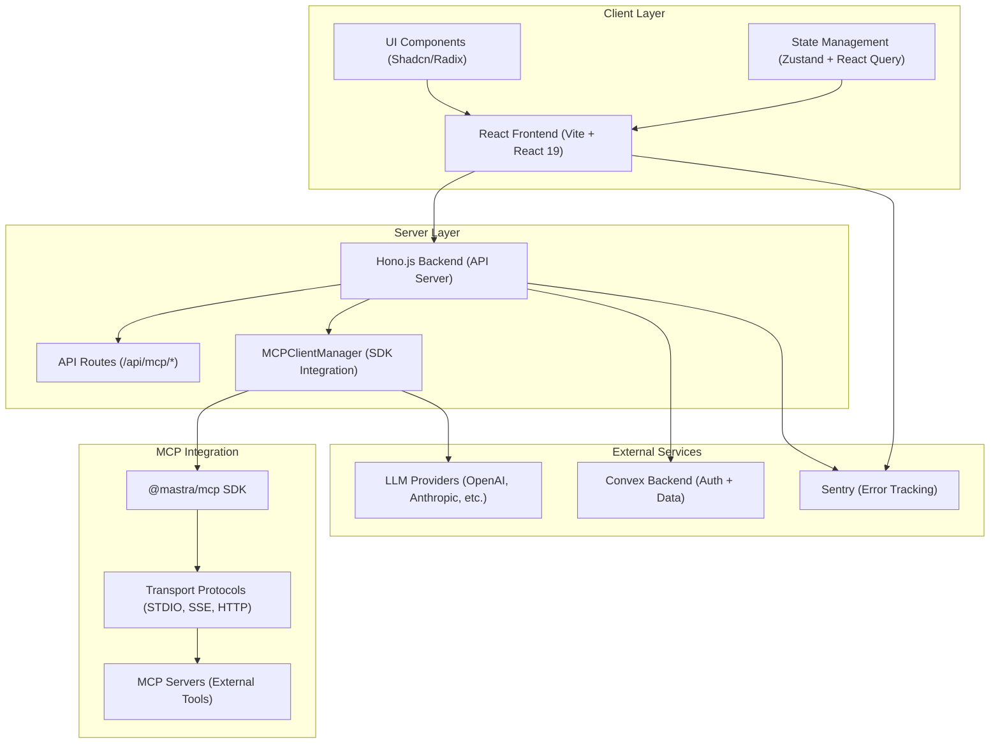

## Deployment Modes

### Mode Detection Flow

The application automatically detects its runtime environment and configures itself accordingly:

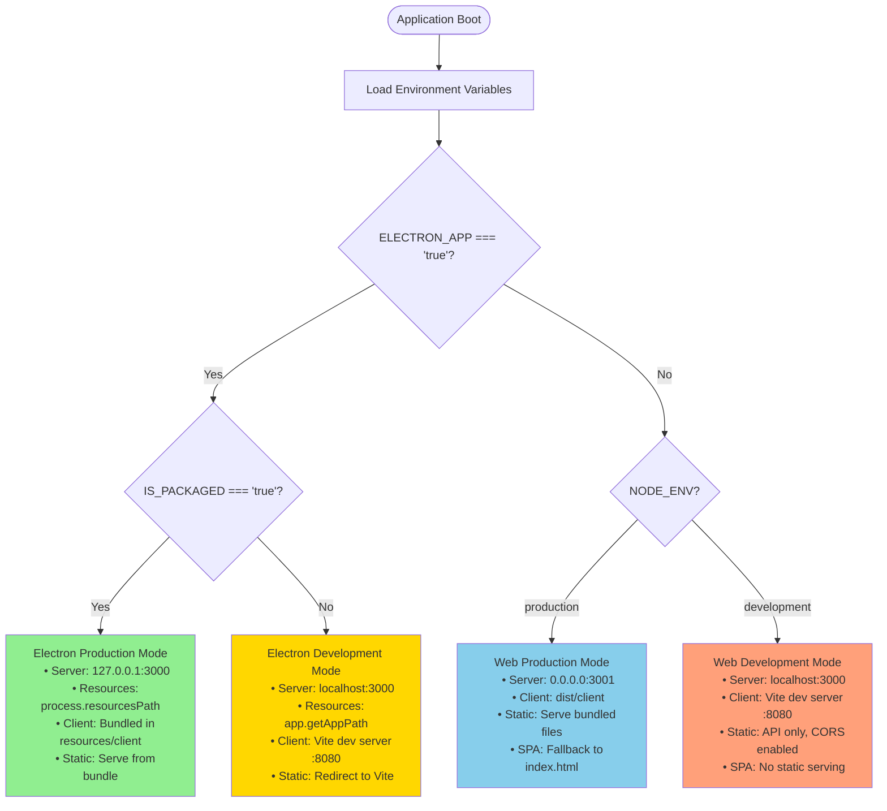

<AccordionGroup>
  <Accordion title="Web Development Mode" icon="code">
    **When:** `NODE_ENV=development` (no Electron)

    **Characteristics:**
    - Backend: Hono server on `localhost:3000`
    - Frontend: Vite dev server on `localhost:8080`
    - CORS enabled for cross-origin requests
    - Hot module replacement (HMR)
    - API-only server (no static file serving)

    **Key Files:**
    - `server/app.ts:135-142` - Development mode routing
    - `client/vite.config.ts` - Vite configuration
  </Accordion>

  <Accordion title="Web Production Mode" icon="server">
    **When:** `NODE_ENV=production` (no Electron)

    **Characteristics:**
    - Backend: Hono server on `0.0.0.0:3001`
    - Frontend: Served from `dist/client`
    - SPA fallback to `index.html`
    - Optimized production bundles
    - No CORS (same-origin)

    **Key Files:**
    - `server/app.ts:119-126` - Production static serving
    - `server/index.ts` - Standalone server entry point
  </Accordion>

  <Accordion title="Electron Development Mode" icon="bolt">
    **When:** `ELECTRON_APP=true` and `IS_PACKAGED=false`

    **Characteristics:**
    - Embedded Hono server on `localhost:3000`
    - Frontend: Vite dev server redirects
    - Resources from `app.getAppPath()`
    - DevTools enabled
    - Auto-reload on changes

    **Key Files:**
    - `src/main.ts:62-92` - Server startup
    - `src/main.ts:112` - Vite dev server URL loading
  </Accordion>

  <Accordion title="Electron Production Mode" icon="package">
    **When:** `ELECTRON_APP=true` and `IS_PACKAGED=true`

    **Characteristics:**
    - Embedded Hono server on `127.0.0.1:3000`
    - Frontend: Bundled in `resources/client`
    - Resources from `process.resourcesPath`
    - Code signing enabled
    - Single .app/.exe bundle

    **Key Files:**
    - `src/main.ts:68-73` - Environment setup
    - `server/app.ts:119-124` - Packaged static serving
  </Accordion>
</AccordionGroup>

## Server Architecture

### Hono Application Factory

The server uses a factory pattern to create the Hono app, allowing it to be reused across different contexts:

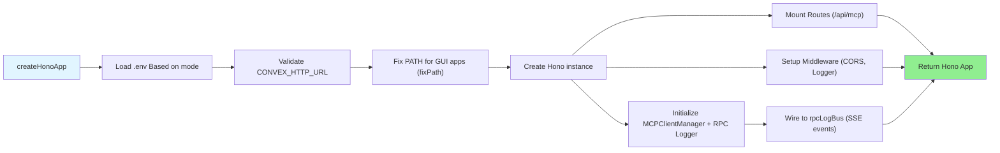

**Key Implementation:** `server/app.ts:20-146`

The factory function `createHonoApp()` is called from:
- `server/index.ts` - Standalone web server
- `src/main.ts:75` - Electron embedded server

### Request Lifecycle

Every HTTP request flows through multiple layers:

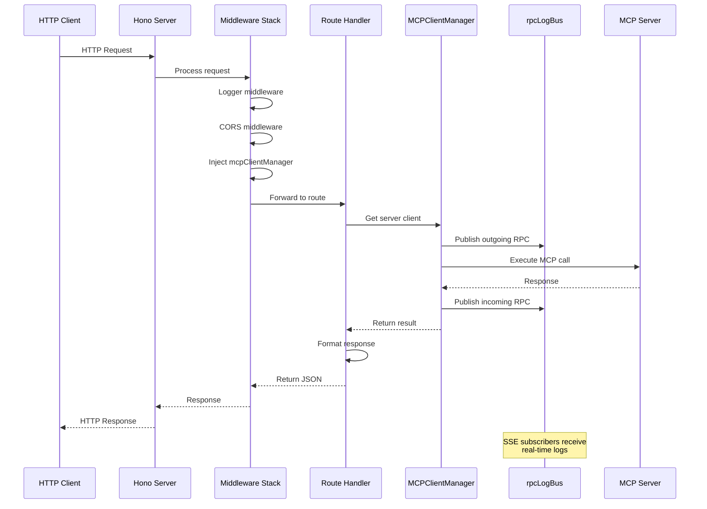

### API Routes Structure

<Tabs>
  <Tab title="MCP Routes">
    ```
    /api/mcp
    ├── /servers
    │   ├── GET / - List all servers
    │   ├── POST /:id/connect - Connect to server
    │   ├── POST /:id/disconnect - Disconnect from server
    │   ├── /tools
    │   │   ├── GET / - List tools
    │   │   └── POST /:name/call - Call tool
    │   ├── /resources
    │   │   ├── GET / - List resources
    │   │   └── GET /:uri - Read resource
    │   └── /prompts
    │       ├── GET / - List prompts
    │       └── POST /:name/get - Get prompt
    ├── /health - Health check
    └── /rpc-logs - SSE logs stream
    ```
  </Tab>

  <Tab title="File Locations">
    | Route | File | Line |
    |-------|------|------|
    | `/api/mcp` | `server/routes/mcp/index.ts` | - |
    | `/servers` | `server/routes/mcp/servers.ts` | - |
    | `/tools` | `server/routes/mcp/tools.ts` | - |
    | `/resources` | `server/routes/mcp/resources.ts` | - |
    | `/prompts` | `server/routes/mcp/prompts.ts` | - |
  </Tab>
</Tabs>

## Electron Integration

### Process Architecture

Electron uses a multi-process architecture for security and stability:

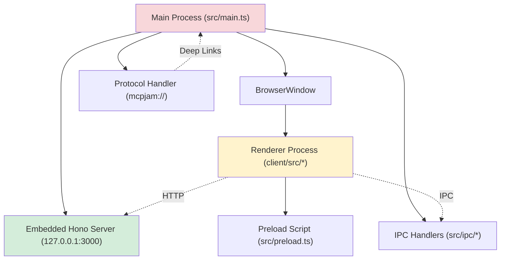

<Info>
  **Security Note:** The renderer process has no direct access to Node.js APIs. All privileged operations must go through the preload script and IPC.
</Info>

### Startup Sequence

Here's what happens when you launch the Electron app:

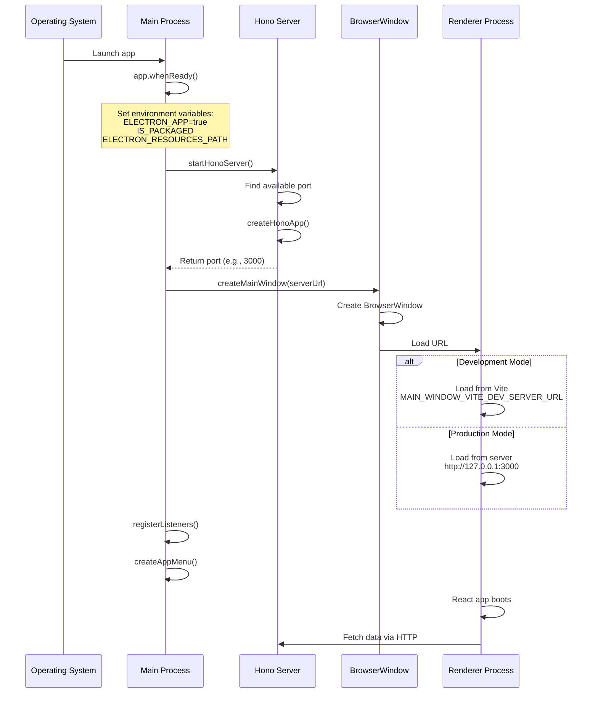

<Steps>
  <Step title="Environment Setup" icon="gear">
    `src/main.ts:66-73` sets critical environment variables that tell the server it's running in Electron
  </Step>

  <Step title="Server Start" icon="server">
    `src/main.ts:62-92` starts the embedded Hono server on an available port
  </Step>

  <Step title="Window Creation" icon="window">
    `src/main.ts:94-133` creates the main BrowserWindow with security settings
  </Step>

  <Step title="IPC Setup" icon="bolt">
    `src/ipc/listeners-register.ts` registers all IPC event handlers
  </Step>
</Steps>

### OAuth Deep Linking

The Electron app handles OAuth callbacks through a custom protocol handler:

<Card title="OAuth Architecture" icon="lock" href="/contributing/oauth-architecture">
  Learn about the complete OAuth flow including deep linking, state management, and security
</Card>

**Quick Overview:**

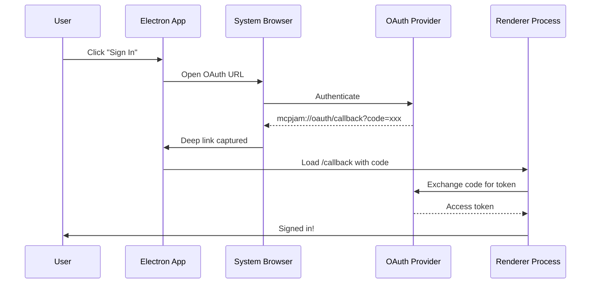

**Key Files:**
- `src/main.ts:31-33` - Protocol registration
- `src/main.ts:273-313` - Deep link handler
- `client/src/hooks/useElectronOAuth.ts` - React OAuth hook

## MCP Client Management

### MCPClientManager Architecture

The `MCPClientManager` is the heart of MCP server integration:

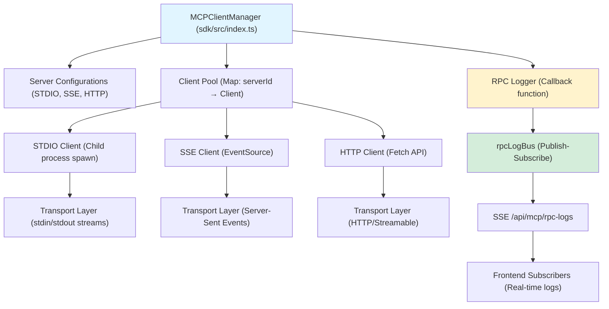

<CardGroup cols={3}>
  <Card title="STDIO Transport" icon="terminal">
    Spawns child processes for local MCP servers
  </Card>
  <Card title="SSE Transport" icon="rss">
    EventSource connections for remote servers
  </Card>
  <Card title="HTTP Transport" icon="cloud">
    Fetch-based requests with streaming support
  </Card>
</CardGroup>

### Client Lifecycle

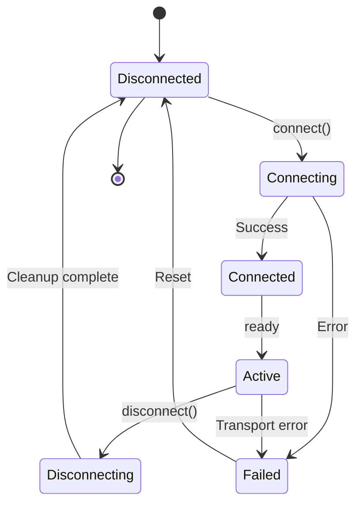

<Tip>
  For detailed MCP client implementation, see [MCP Client Manager Architecture](/contributing/mcp-client-manager)
</Tip>

## State Management

### Frontend State Architecture

The application uses a hybrid state management approach:

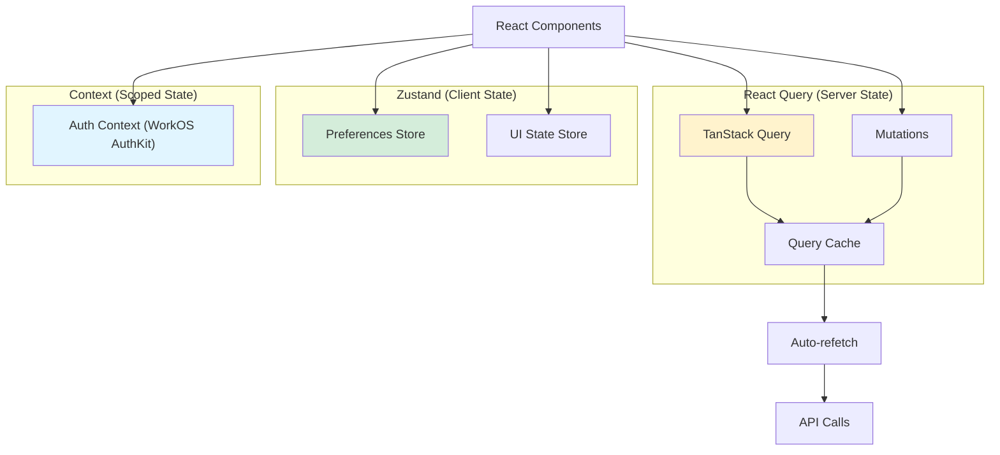

<AccordionGroup>
  <Accordion title="TanStack Query (Server State)" icon="database">
    **Purpose:** Manage server-side data with caching and auto-refetch

    **Used for:**
    - MCP server lists
    - Tool/resource/prompt data
    - Eval results
    - Real-time data synchronization

    **Key features:**
    - Automatic background refetching
    - Optimistic updates
    - Request deduplication
    - Stale-while-revalidate
  </Accordion>

  <Accordion title="Zustand (Client State)" icon="box">
    **Purpose:** Manage client-side UI state

    **Used for:**
    - User preferences (theme, layout)
    - UI state (modals, sidebars)
    - Form state
    - Temporary local data

    **Key features:**
    - Simple API
    - No boilerplate
    - TypeScript support
    - Middleware (persist, devtools)
  </Accordion>

  <Accordion title="Context API (Scoped State)" icon="circle-nodes">
    **Purpose:** Provide scoped state to component trees

    **Used for:**
    - Authentication (WorkOS AuthKit)
    - Theme provider
    - Feature flags

    **Key features:**
    - React-native
    - Component composition
    - Clean separation of concerns
  </Accordion>
</AccordionGroup>

## Real-time Communication

### SSE Event Bus

Real-time RPC logging uses Server-Sent Events for live updates:

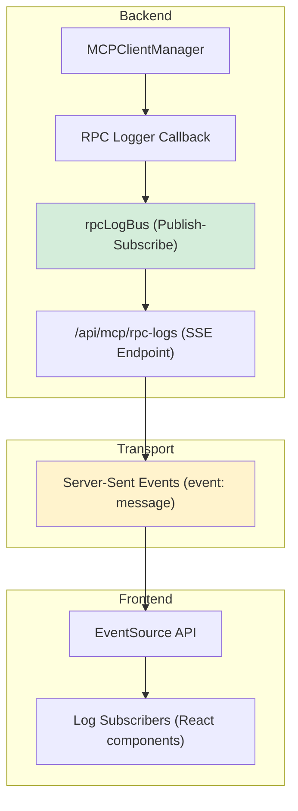

**Flow:**

1. MCPClientManager calls a tool
2. RPC logger callback fires
3. Publishes to rpcLogBus
4. Bus emits to all SSE connections
5. Frontend EventSource receives event
6. React components update UI

**Key Files:**
- `server/services/rpc-log-bus.ts` - Event bus implementation
- `server/app.ts:67-79` - RPC logger setup
- `client/src/hooks/useRPCLogs.ts` - Frontend subscription

## Environment Configuration

The application adapts to its environment through a series of configuration steps:

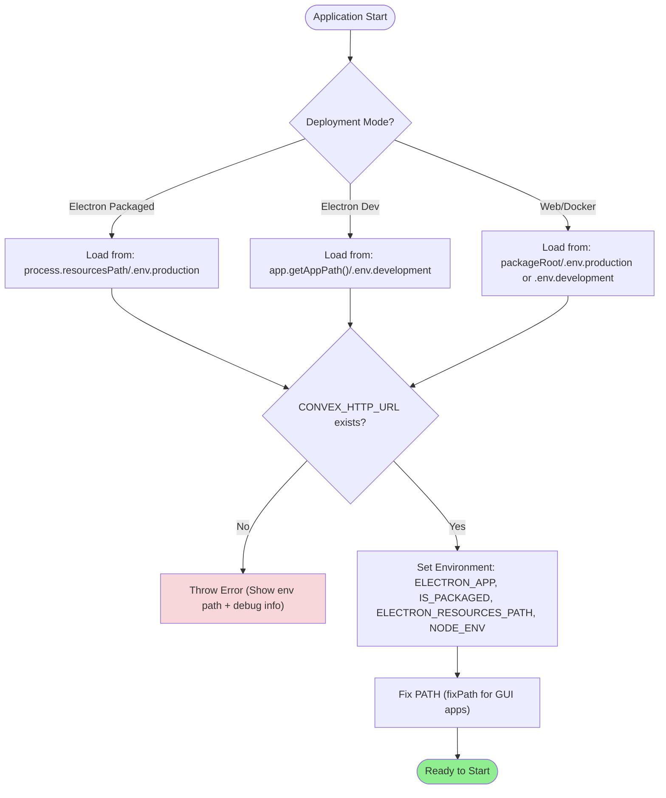

### Required Environment Variables

| Variable | Purpose | Set By | Required |
|----------|---------|--------|----------|
| `CONVEX_HTTP_URL` | Convex backend URL | User/CI | ✅ Yes |
| `ELECTRON_APP` | Indicates Electron runtime | Main process | Auto |
| `IS_PACKAGED` | Indicates packaged app | Main process | Auto |
| `ELECTRON_RESOURCES_PATH` | Resources directory | Main process | Auto |
| `NODE_ENV` | Runtime environment | Build/User | Auto |
| `PORT` | Server port | User | Optional (default: 3001) |
| `DEBUG_MCP_SELECTION` | Enable debug logs | User | Optional |

## Build & Deployment

### Build Process Flow

```mermaid
flowchart LR
    Start(["npm run build"])
    Clean["Clean (rm -rf dist out)"]
    Install["Install deps (client + server + sdk)"]
    SDK["Build SDK (npm run build:sdk)"]
    Client["Build Client (Vite build → dist/client)"]
    Server["Build Server (tsx build → dist/server)"]
    Done(["Ready for Production"])

    Start --> Clean
    Clean --> Install
    Install --> SDK
    SDK --> Client
    Client --> Server
    Server --> Done

    style Start fill:#e1f5ff
    style Done fill:#90EE90
```

<Tabs>
  <Tab title="Web Deployment">
    **Production Build:**
    ```bash
    npm run build
    npm start
    ```

    **Artifacts:**
    - `dist/client/` - Frontend static files
    - `dist/server/` - Backend Node.js files

    **Server:** Hono serves both API and static files
  </Tab>

  <Tab title="Electron Deployment">
    **Build Process:**
    ```bash
    npm run electron:make
    ```

    **Artifacts:**
    - `out/*.dmg` - macOS installer
    - `out/*.exe` - Windows installer
    - `out/*.deb` - Linux package

    **Includes:** Bundled client, server, and Node.js runtime
  </Tab>

  <Tab title="Docker Deployment">
    **Build Image:**
    ```bash
    docker build -t mcpjam/inspector .
    ```

    **Run Container:**
    ```bash
    docker run -p 3001:3001 mcpjam/inspector
    ```

    **Includes:** Complete application in Alpine Linux
  </Tab>
</Tabs>

## Performance Considerations

### Caching Strategy

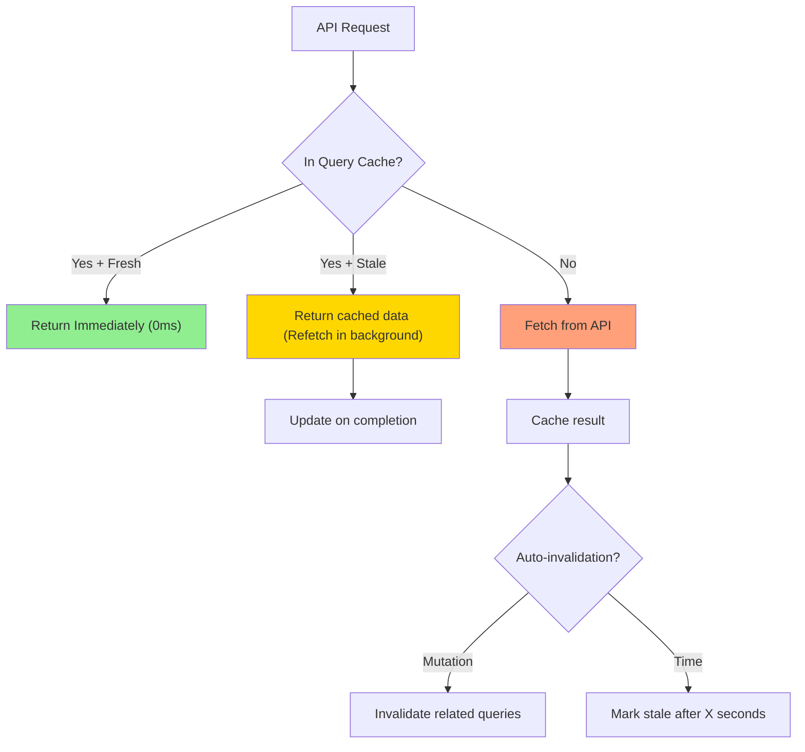

**Key Optimizations:**
- Query cache reduces API calls by 80%+
- Stale-while-revalidate provides instant UI updates
- Background refetching keeps data fresh
- Mutation invalidation ensures consistency

### Connection Pooling

The MCPClientManager maintains a pool of connections to avoid repeated handshakes:

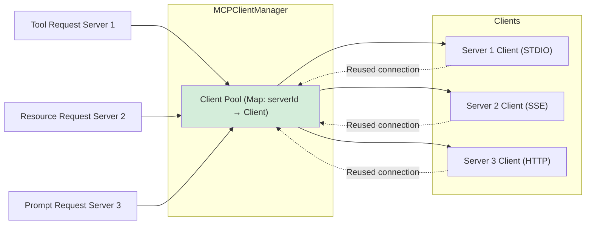

## Security Architecture

<Warning>
  The application handles sensitive data including API keys, OAuth tokens, and MCP server access. Security is a top priority.
</Warning>

### Security Layers

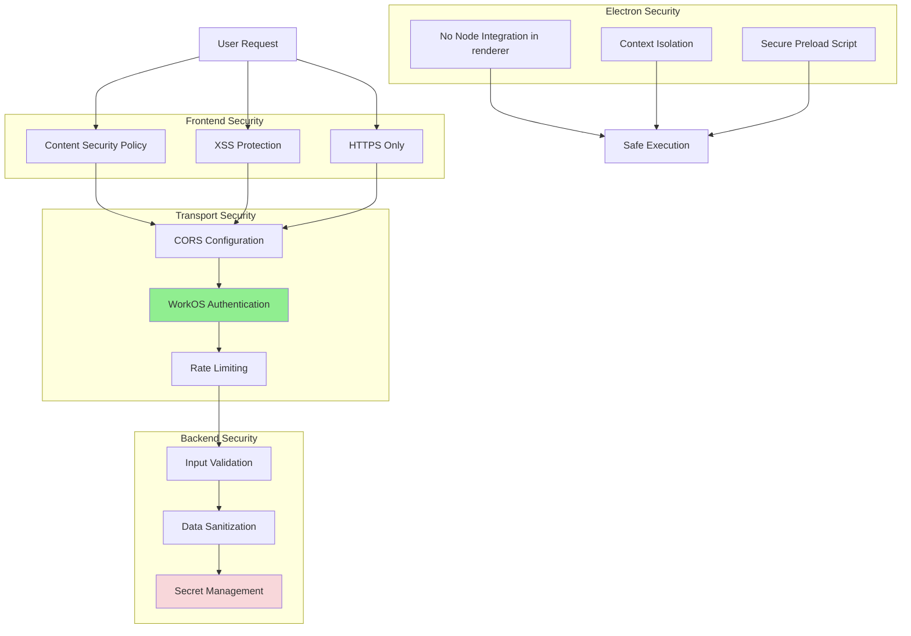

<AccordionGroup>
  <Accordion title="Electron Security" icon="shield">
    **Context Isolation:** Renderer has no direct Node.js access

    **Secure Preload:** `src/preload.ts` exposes only safe APIs

    **No Remote Module:** Disabled for security

    **Protocol Registration:** Custom `mcpjam://` protocol for OAuth
  </Accordion>

  <Accordion title="Authentication" icon="lock">
    **WorkOS AuthKit:** Enterprise-grade OAuth 2.0

    **Token Storage:** Secure localStorage with expiration

    **PKCE Flow:** Proof Key for Code Exchange in Electron

    **Convex Integration:** Server-side token validation
  </Accordion>

  <Accordion title="Input Validation" icon="check">
    **Zod Schemas:** Runtime type validation

    **Sanitization:** All user inputs cleaned

    **Rate Limiting:** Prevent abuse

    **Error Handling:** No sensitive data in error messages
  </Accordion>
</AccordionGroup>

## Monitoring & Observability

### Telemetry Pipeline

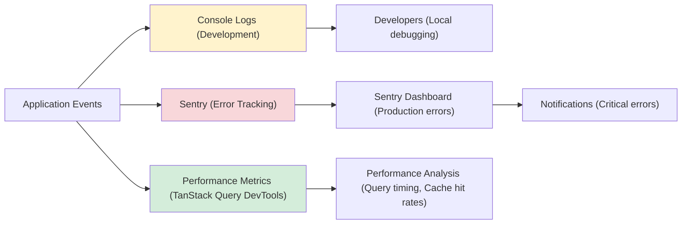

**Error Tracking:**
- Sentry integration in both main and renderer processes
- Automatic error reporting in production
- Source maps for stack traces
- User context and breadcrumbs

**Performance Monitoring:**
- React Query DevTools for cache inspection
- Browser DevTools for profiling
- Network tab for API timing
- Electron process manager for memory

## Next Steps

<CardGroup cols={2}>
  <Card title="MCP Client Manager" icon="network-wired" href="/contributing/mcp-client-manager">
    Deep dive into MCP protocol implementation
  </Card>

  <Card title="OAuth Architecture" icon="lock" href="/contributing/oauth-architecture">
    Learn about authentication and OAuth flow
  </Card>

  <Card title="Playground Architecture" icon="messages" href="/contributing/playground-architecture">
    Understand the LLM playground system
  </Card>

  <Card title="Evals Architecture" icon="chart-line" href="/contributing/evals-architecture">
    Explore the evaluation framework
  </Card>
</CardGroup>

<Check>
  Now you understand the complete system architecture! Ready to contribute? Check out the [Contributing Guide](/CONTRIBUTING).
</Check>
