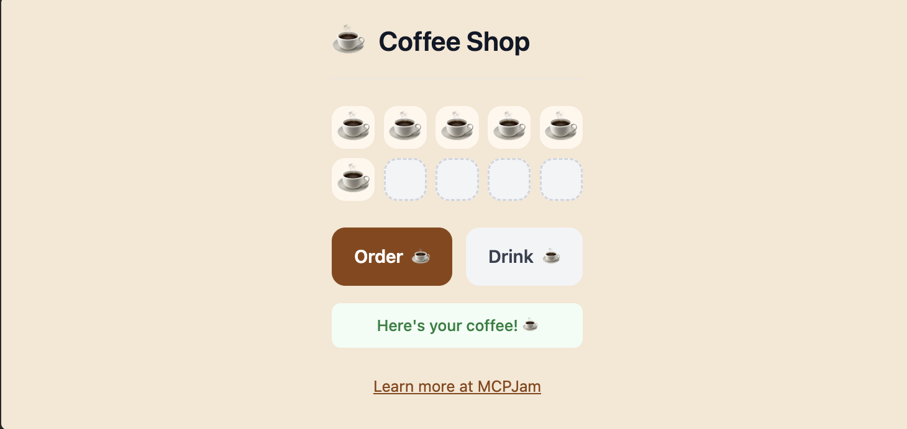

# Coffee Shop

A beginner-friendly ChatGPT App example built with React.



## Quick Start

```bash
npm install
npm start
```

This builds the React widget and starts the server at `http://localhost:8787/mcp`.

## Testing with MCPJam Inspector

1. Run `npx @mcpjam/inspector@latest`
2. Enter URL: `http://localhost:8787/mcp`
3. Try the app in Chat or App Builder

## Connecting to ChatGPT

1. In MCPJam Inspector, click **Create ngrok tunnel** with your server connected
2. Use the tunnel URL as your connector endpoint in ChatGPT

## Learn More

See the full guide: [My First ChatGPT App](https://docs.mcpjam.com/guides/first-chatgpt-app-react)
