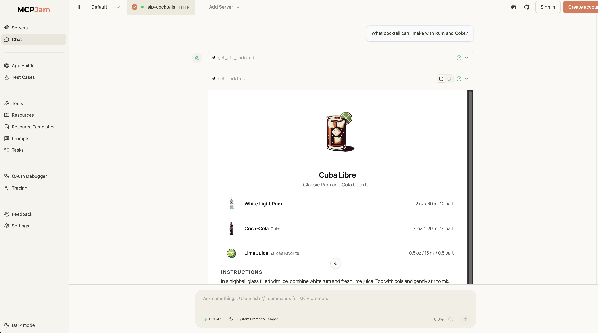

# Sip Cocktails MCP App



An MCP App that serves cocktail recipes with a React UI widget and Convex-backed data.

## Overview

- Interactive cocktail recipe widget with images, instructions, nutrition, and ingredient measurements
- MCP tools for fetching a single cocktail and listing all cocktail ids/names
- Convex queries/mutations for cocktails, ingredients, and image storage
- Seed scripts for uploading images and populating data

## Key Files

- `server.ts` - MCP server with tool and UI resource registration
- `src/cocktail-recipe-widget.tsx` - React widget UI
- `convex/cocktails.ts` / `convex/ingredients.ts` - Convex queries and mutations
- `scripts/seed-cocktails.mjs` / `scripts/upload-images.mjs` - Data seeding utilities
- `scripts/data/cocktails.mjs` / `scripts/data/ingredients.mjs` - Seed data

## Getting Started

```bash
npm install
npm run dev
```

## How It Works

1. The server registers MCP tools for cocktail lookup and list retrieval.
2. When `get-cocktail` is invoked, the host renders the cocktail recipe widget UI.
3. The UI calls back into the server to fetch a cocktail and render its details.
